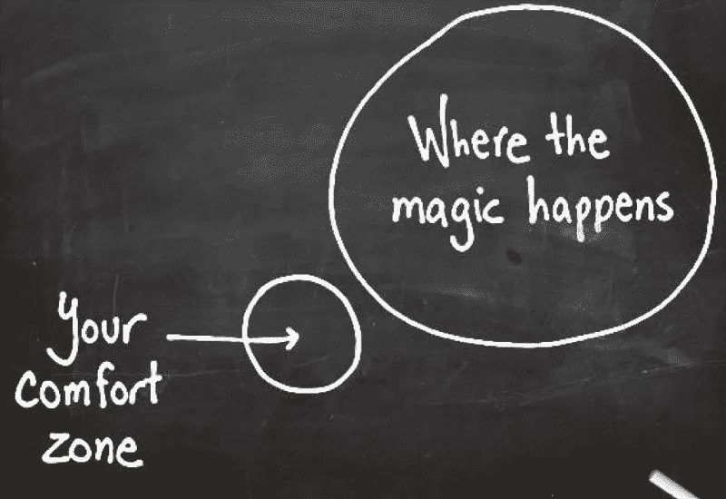
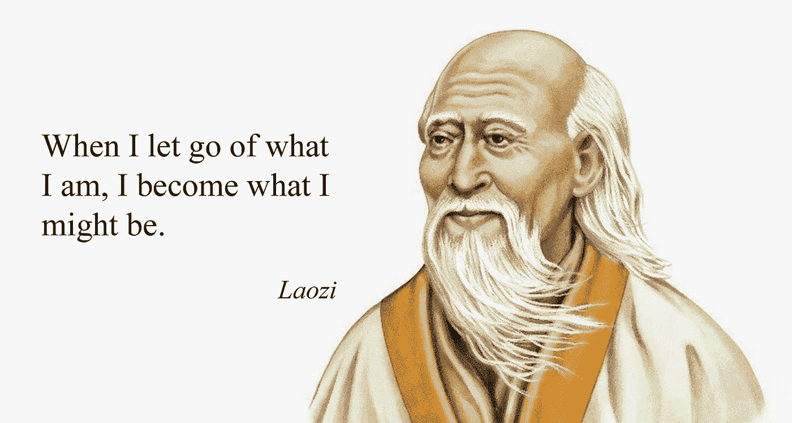

# “走出你的舒适区”是个糟糕的建议

> 原文：<https://medium.datadriveninvestor.com/get-out-of-your-comfort-zone-is-bad-advice-2058dc52ed65?source=collection_archive---------8----------------------->

前几天，我读了一篇文章，推荐了不同的方法来“走出我的舒适区”它的大部分建议都是毫无理由的自我折磨，比如设置 10 点的闹钟！)比平时早了几分钟，除了让你不舒服之外，没有什么好的理由。

我认为，媒体文章、社交媒体帖子甚至购物袋中“走出舒适区”这类建议的泛滥，是为了防止我们屈服于惰性。它希望我们可以通过克服对不舒服的天生恐惧来实现我们想要的，击败史蒂文·普雷斯菲尔德在《艺术之战》中所说的“阻力”:“经验法则:一个号召或行动对我们灵魂的进化越重要，我们对追求它的阻力就越大。”

> 无论什么更接近你的“灵魂进化的愿望”，都会找到最少的内在阻力。

但是我相信事实恰恰相反。无论什么更接近你的“灵魂进化的愿望”，都会找到最少的内在阻力。快乐比恐惧能让你成就更多。米哈里·契克森米哈创造了术语*来解释一种让你忘记除了手头活动之外的一切的精神状态。根据他的说法，幸福不是寻找禅，成功，甚至是爱。这是关于尽可能频繁地实现*流*。*

*Csikszentmihalyi 的*流*与[老子](https://www.amazon.com/Tao-Te-Ching-Lao-Tzu/dp/014044131X/ref=sr_1_3?ie=UTF8&qid=1537188982&sr=8-3)的中国古代哲学原理*无为*有一些共同的理想。无为，作为一个概念，比心流更深入，很难翻译，但你可能听说过它被称为“不做”或“不行动”并不意味着昏睡或被动。这是关于当你的头脑清晰时，当你没有因为想得太多或做得太多而阻碍自己的时候，找到自然的力量。*

**

*艾伦·沃茨在《道是什么》中用一个很好的例子解释了 T2 和吴伟，这个例子说明了我们从小就习惯于按照自己的方式行事。当孩子们在学校必须集中注意力时，他们的思想会经常走神。如果老师意识到这一点，他们通常会生气，命令他们“注意！”然后，孩子们会非常努力地集中注意力听课，以至于不再听老师在讲什么。他们将专注于保持专注，而不是实际教授的内容。*

*让隐藏在自我背后的内在自我不受干扰地流动，是一种深刻的智慧。这并不意味着不努力或者坐以待毙。它是找到你真正的道路，然后带着全部的能量和热情走完它。*

*成功的企业家通常认为他们作为创始人的早期是最快乐的时光，即使表面上那是企业最艰难的日子。让一家公司起步需要做大量的工作，而且通常报酬很少或没有报酬。但是如果这是你真实身份的一部分，如果这是一个需要向世界展示的想法，你会带着快乐和专注去做。当你深深地沉浸在工作中，以至于忘记去洗手间时，你是在舒适区的深处航行，而不是在舒适区之外。*

*我们所知道的许多伟大的创新者和成功人士都是在他们的舒适区内取得大部分成就的。爱因斯坦会坐在湖边的长椅上几个小时，幻想着宇宙。史蒂夫·沃兹尼亚克是苹果公司早期的计算机天才，他多次拒绝苹果公司的高级职位，因为他喜欢成为一名工程师。埃隆·马斯克同时管理着 6 家公司——他很可能会因此损失所有的钱——但我们没有听到他对工作有任何抱怨。*

*多年来，我一直坚信“走出你的舒适区”这个想法。我相信通往成功的道路，不管那意味着什么，是由艰难和不舒服铺成的。直到写了我的第一本书，我才开始理解*和*到底代表了什么。*

*当我写作时，坐在电脑前的时间过得飞快。虽然这不是一种新的感觉，但我终于能指出坐下来写作的乐趣所在。即使是最具挑战性的部分。*

*但直到我为这本书采访了成功的电子商务企业家后，我才发现最令人信服的保持舒适区的灵感。我的目标是了解成功的网店店主与众不同的地方。我学到了很多关于顶尖高手如何管理成功的在线业务的知识，这是本书的主要内容，但我也学到了一些更深刻的东西。*

*我问他们，在他们的旅程中是否有一段时间感觉自己熬不过去；或者有一段时间，困难是如此难以估量，以至于不再值得努力。我在寻找一个决定性的时刻，他们需要额外的意志力来度过困难时期。答案几乎总是“不尽然”的某种变体(如果不是实际的话)*

> *增长最快的商店是那些报告轨迹最平滑的商店，每一步都自然地流向下一步。*

*在研究过程中，我发现在我们的样本中，大多数成功的网上商店在其公司生命周期的早期就已经拥有了最重要的业务，并且运作良好。几乎所有接受调查的成功企业家(89%)都表示，他们用了不到一年的时间就实现了 10 万美元的收入。超过一半的人(63%)在不到六个月的时间里就达到了目标。增长最快的商店是那些报告轨迹最平滑的商店，每一步都自然地流向下一步。*

*以乔希·威拉德(Josh Willard)为例，他童年时最喜欢的消遣是在附近的沼泽地收集青蛙，后来逐渐变成了一家大型电子商务公司[乔希的青蛙](https://medium.com/@ramonbez/why-do-a-few-entrepreneurs-have-an-easier-path-to-success-than-most-ada5e3fb50a6)，在网上出售奇异的宠物和用品。乔希是这样描述他决定把当时的副业变成全职工作的那一刻的:“有一次我想，‘嘿，我要试一试。’我在我所做的事情上看到了一些显著的增长，所以这不是一个转折点，而是一个增长点，你知道吗？这个决定在我到达时就已经为我做好了。"*

*特拉维斯·皮特曼，一个不可救药的旅行者，在他的一次旅行中遇到了他未来的妻子，带着[和他的公司](https://www.tourradar.com)来到奥地利，这样他就可以和她在一起，现在他经营着一个价值数百万美元的多日游市场。罗里·威斯布鲁克(Rory Westbrook)结合他对复古服装的热情和对社交媒体的了解，在[创办了一家快速增长的在线复古时装店](https://medium.com/@ramonbez/how-a-vintage-clothing-online-store-built-a-7-figure-business-on-instagram-without-spending-a-486bcad4a46d)，当时他只有 19 岁。我采访了几十个成功的网店店主，他们很少报道克服困难或把自己推出舒适区的故事。*

*然而，对于企业家来说，听到关于毅力的史诗般的故事是很平常的。Airbnb 的布莱恩·切斯基(Brian Chesky)的名言“我们一夜成功花了 1000 天”成为“努力征服一切”的口头禅但我认为这只是故事的一半。这个故事告诉人们，无论他们的想法有多糟糕，或者他们的业务与他们的真实价值观有多脱节，只要走出舒适区，更加努力地工作，任何事情都可以完成。*

*“努力工作”这一表达方式往往意味着，唯一可能的成功是在经历了多年的痛苦和心痛之后。是的，写一本书，创办一家公司或开始一个新的职业生涯需要很多工作，但如果它是从你身上流出来的，就不一定很难。很过瘾。*

*困难的部分是到达*无为*，心流，你的舒适区，或者你想怎么称呼它。也许真的需要去外面走几趟才能意识到是什么让你的创意之舟漂浮不定。你可能需要剥去许多层自我和局限，才能找到你真正的使命。也许走出舒适区，每天与阻力斗争对一些人来说是有效的，但我最好生活在心流状态而不是战争状态。*

****关于作者:*** *拉蒙·贝兹(Ramon Bez)是一名成长型营销人员，在 Compass(前创业公司 Genome)工作了两年。他将他们两项研究的数据结合到了他即将出版的新书中，该书名为* [*【电子商务基因组*](https://ramonbez.com/ecommerce-genome) *】，将于 2019 年发行。**