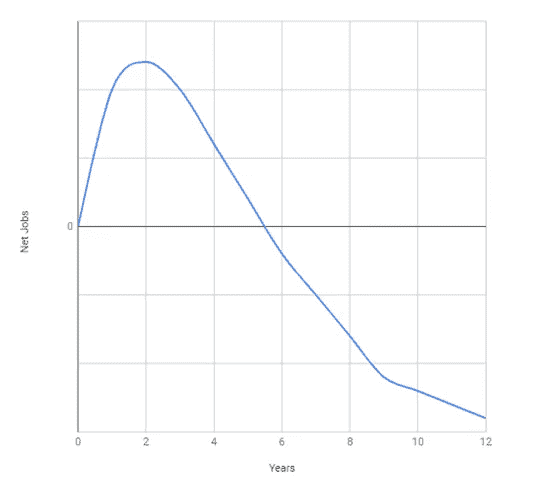

# 为负失业率做好准备

> 原文：<https://medium.datadriveninvestor.com/get-ready-for-negative-unemployment-rates-972a5d5b1230?source=collection_archive---------8----------------------->

*这篇文章也发表在我们的* [*医学科学院博客*](https://meddic.academy/get-ready-for-negative-unemployment-rates/) *上。*

# 为什么每个人都错误地认为自动化扼杀了工作

我们从来没有像今天这样担心或悲观，担心我们的经济创造新的就业机会的能力比其他人消失得更快。每周，我们都会看到基于新研究的新文章，这些文章告诉我们，无人驾驶汽车将在五年内让所有职业司机失业。

他们的理由是，由于自动驾驶汽车程序员的数量比司机的数量少得多，这对就业总数来说是一个巨大的净负面影响。使用同样的推理，他们告诉我们，人工智能甚至会消灭计算机程序员自己的工作。他们甚至告诉我们，农民将不再有工作可做。

正如《麻省理工科技评论》指出的那样，没有人同意将会发生什么。因此，作为一个结果，每个人，或者至少几乎每个人，都将是错误的。

这种趋势和我们对这个问题的焦虑一样古老。早在 20 世纪 80 年代，随着办公自动化和制造自动化软件的出现，我们有非常相似的担忧。但是我们的国内生产总值持续增长，失业率却没有增加。在 20 世纪 90 年代，随着导致网络时代的万维网的诞生，我们有着非常相似的担忧。那个时期产生了一个巨头，我们现在知道的亚马逊，但杀死了几十个现有的巨头，如巴诺、西尔斯、梅西百货和百思买。今天的焦虑也没有什么不同。我们总是想告诉自己，这次不一样了。但这并没有什么不同，原因如下:

# 1)我们向前跃进！

由于新的和颠覆性的产品和服务，我们在以前的创新有时间有效地扼杀就业机会之前，不断创造新的就业机会。每个周期都以正的工作岗位净余额开始，这是创造的工作岗位和消灭的工作岗位之间的差额，然后在负区域结束。

例如，当 John Deere 与他们的经销商和服务网络一起制造最新的联合收割机时，他们在工程、制造、销售和服务领域雇用了数千人达三到五年之久，然后才开始扼杀第一份工作。或者，如果我们看看自动驾驶汽车的净就业周期，它们已经在谷歌、特斯拉、优步和许多其他公司创造了就业机会。在未来几年开始扼杀第一个司机工作之前，他们将继续创造就业机会。

现在，当循环发生时，我们不会坐下来等待循环的结束；我们在上一个周期结束之前开始一个新的周期。我们没有等到物联网周期结束才开始研究自动驾驶汽车。旧工作的消失需要时间，而新的颠覆性技术创造的工作却是立竿见影的。

大量资金可用于投资新技术。目前，我们正在人工智能领域投资数十亿美元，从而创造了大量就业机会。然而，对这些新行业的影响只有在几年后才会显现出来，在这些行业中，我们理应看到就业岗位的消失。的确，对于一个给定的自动化任务，在 20 年的分析中，我们将需要比以前更少的人来完成这项任务，但是，由于企业倾向于向前跳跃，我们不会坐下来等待这种平衡的出现。

我们将进入下一个“问题”我们将解决这个问题，并在那里创造新的就业机会。我们会一直这样下去，直到永远。

当然，在此期间，社会有时间适应这些变化。我们有时间改变我们的教育培训方法，特别是对年轻一代，他们在我们触底之前就进入了就业市场，对这些新的需求做出了回应。

每次我们预测就业结束时，我们都会错过这一关键点。有趣的是，我们也忘记了这一点！从 80 年代初开始，我们就一直在重复这句话，而且我们已经加快了用需要教育的工作来取代艰苦乏味的工作的步伐。此外，尽管婴儿潮一代尚未退休，但我们的经济创造的就业机会仍多于他们扼杀的就业机会。

# 2)有时改变是缓慢的

有时，中断发生得非常快。例如，我在 1998 年得到了我的第一台数码相机，而当时其他人还在使用胶片相机。然而，到了 2005 年，分裂发生了。那时，已经很难找到卖相机胶卷的商店了。这场革命发生在不到 10 年的时间里。佳能是这一领域的先驱，他们仍然活着，尽管他们现在正在与另一场破坏作斗争，柯达错过了火车，很快就死了。

另一方面，有时候，变化会比较慢。仍然有一些管理部门使用传真号码。还有一些工作，如电话调度员或旅行社，本应在十几或二十年前消失，但它们仍然存在。

# 3)错误的预测

有时候，我们的预测完全错误。自 20 世纪 80 年代末以来，我们就预测，由于电子通讯，我们将很快减少纸张的消耗。截至 2018 年，这还没有发生，实际上也可能永远不会发生。世界纸张产量和纸张消费量竟然[保持增长](https://www.statista.com/topics/1701/paper-industry/)！

一个相关的预测是电子书将取代纸质书。然而，到今天为止，没有证据表明纸质书的消费会在可预见的未来减少。

未知总是焦虑的来源。不确定的未来让我们担忧。但是我们的恐惧并不是真正合理的；未来是美好的。让我们放轻松，享受生活在这个人类历史上独一无二的时代。

# 我们严重缺乏软技能人才

据我们所知，实际趋势是失业率正在下降，许多人认为我们实际上正在接近零。根据定义，失业率不能为负。负失业直观上指的是空缺职位在很长一段时间内无法填补的情况)。

尽管劳动密集型工作和那些不需要决策的工作风险更大，但需要软技能的工作，如销售，将越来越受到重视。原因是它们是不可自动化的。至少短期内不会。优秀的沟通、积极的态度、同理心、自信、信任等技能属于软技能，几乎在任何优秀的销售人员身上都能找到，人工智能很难处理这些技能。

销售是第一份人工工作，也将是最后一份自动化的工作。尤其是高端复杂的企业销售，比如与 [MEDDIC](https://meddic.academy/benefits-of-meddic/) 相关的。所以，抓住每一个机会发展你的软技能、销售技能和[医学技能](https://meddic.academy/definition-meddic/)，享受成功。

新年快乐