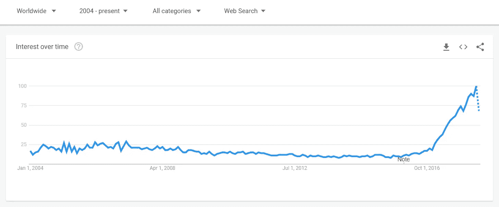
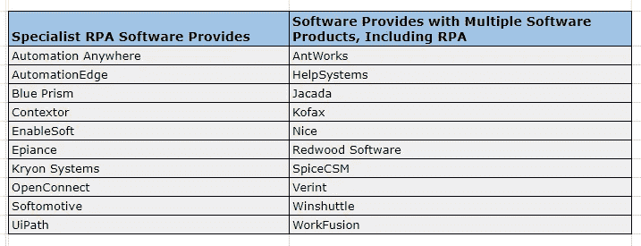

# RPA 入门—机器人流程自动化及其工具

> 原文：<https://medium.datadriveninvestor.com/get-started-with-rpa-robotics-process-automation-and-its-tools-e5bfa03044ff?source=collection_archive---------2----------------------->

机器人过程自动化(RPA)是使用具有人工智能(AI)和机器学习功能的软件来处理以前需要人类执行的大量可重复任务。这些任务可以包括计算、查询以及交易和记录的维护。

RPA 从三项关键技术发展而来:屏幕抓取、工作流自动化和人工智能。

[Google Trends](https://trends.google.com/trends/) (Robotics Process Automation)

## 使用 RPA 的优势—

*   允许流程更快地完成，节省人力
*   为手动和重复性任务创造成本节约
*   让员工更有效率
*   更好的客户服务
*   减少手动数据编辑，提高数据质量并降低合规风险

## RPA 的应用—

1.  **数据迁移和录入-**
    有许多公司的关键功能仍由遗留系统执行。假设传统计费系统需要执行一些使用 API 无法完成的任务，而不是由员工手动迁移数据，RPA 可以防止此类手动劳动和潜在的文书错误。
2.  **从扫描文档、pdf 和其他格式中提取数据-**
    光学字符识别、屏幕抓取技术能够从几乎任何格式中提取数据。
3.  **客户服务-**
    通过自动化联络中心任务(包括扫描文档),验证信息 RPA 可以帮助公司提供良好的客户服务。
4.  **人力资源-**
    RPA 还可以自动化许多人力资源任务，包括员工入职和离职、更新员工信息等
5.  **医疗保健-**
    RPA 可以处理患者记录、客户支持、索赔、报告、账单等，为患者提供更好的体验
6.  **金融服务-**
    外汇支付、管理审计、处理索赔、开立和关闭账户是该行业的一些使用案例
7.  **供应链管理-**
    在这个部门，RPA 可以帮助自动化订单、处理和支付，生成不同部门的报告。

## 可用于 RPA 的工具—

Different Tools providing RPA solutions

> ***所以*我对不同工具的链接** —
> 注意，名称是基于字母顺序的。

ant works([www . ant . works](http://www.ant.works))

自动化随处可见([www.automationanywhere.com](http://www.automationanywhere.com))

自动边缘([www.automationedge.com](http://www.automationedge.com))

蓝色棱镜([www.blueprism.com](http://www.blueprism.com))

语境( [www.contextor.eu](http://www.contextor.eu)

EdgeVerve 系统公司(【www.edgeverve.com】T4)

启用软件([www.enablesoft.com](http://www.enablesoft.com))

意外事件([www.epiplex500.com](http://www.epiplex500.com))

哈卡达([www.jacada.com](http://www.jacada.com))

吉多卡( [www.jidoka.io](http://www.jidoka.io) )

科法克斯([www.kofax.com](http://www.kofax.com))

克里昂系统公司([www.kryonsystems.com](http://www.kryonsystems.com))

尼斯([www.nice.com](http://www.nice.com))

open connect([www.openconnect.com](http://www.openconnect.com)

佩加斯系统公司([www.pega.com](http://www.pega.com)

雷德伍德软件([www.redwood.com/robotics](http://www.redwood.com/robotics))

柔动([www.softomotive.com](http://www.softomotive.com))

辛特尔([www.syntelinc.com](http://www.syntelinc.com))

思想经济学([www.thoughtonomy.com](http://www.thoughtonomy.com))

ui path([www.uipath.com](http://www.uipath.com))

维林特([www.verint.com](http://www.verint.com))

工作融合([www.workfusion.com](http://www.workfusion.com))

> 总之，鉴于 RPA 提供的众多优势及其在许多行业中的应用，RPA 不容忽视。RPA 是自动化重复任务的未来。

