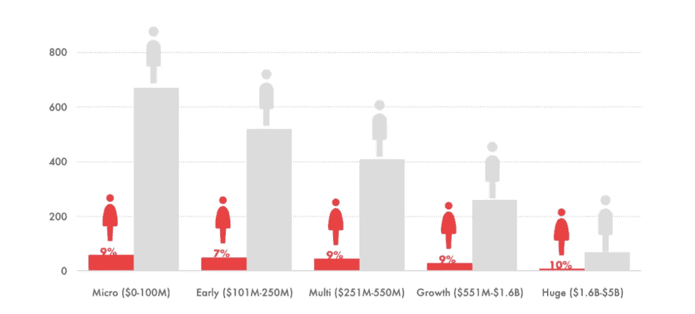
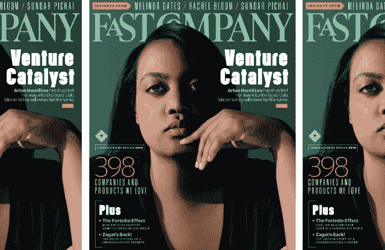
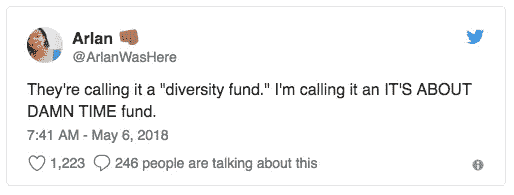

# 让更多的女性参与到风险投资聚会中来

> 原文：<https://medium.datadriveninvestor.com/get-the-vc-party-started-with-more-women-in-the-room-eae5900577c6?source=collection_archive---------7----------------------->

今天的风险投资公司就像我们宁愿忘记的高中舞会。你知道，在学校体育馆里一群人靠在墙上的那种。现在，去掉女生，加上毛绒皮椅和中年男人，你就到了风投的董事会会议室。

# 风险资本主义:兄弟俱乐部

男性和女性都声称筹集风险资本是创业成长中最具挑战性的部分，但对于女性创业者来说，这似乎几乎是不可能的。根据 Pitchbook:

> 去年，女性创办的公司只获得了美国全部风险资本的 2.2%，投资者也没有多种多样:美国风险投资公司中只有 11.3%的合伙人是女性。'

到 1999 年，[女性仅占风险投资公司合伙人的 10%。在接下来的 15 年里，这个数字下降到了 2014 年的 6%。但这并不奇怪，因为 19 世纪后期美国的第一批风险投资家——洛克菲勒家族、范德比尔特家族、盖蒂家族等——也是男性。](http://www.babson.edu/news-events/babson-news/Pages/140930-venture-capital-funding-women-entrepreneurs-study.aspx)

## 雇佣女性并“降低标准”

风投们获得了如此大的成功，赚了数十亿美元，没有什么动力去改变他们在男孩俱乐部的运作方式。如果你是硅谷顶级风险投资公司红杉资本(Sequoia Capital)的迈克尔·莫里茨爵士，早年投资雅虎(Yahoo)和谷歌(Google)等科技公司而发家，你可能会认为很难找到有才华的女性风险投资家。

Brotopia author and Bloomberg TV reporter Emily Chang interviews Michael Moritz of Sequoia Capital

当记者 Emily Chang 在 2015 年在电视台采访 Moritz 时，正如 Chang 的书 [*Brotopia*](https://www.amazon.com/Brotopia-Breaking-Boys-Silicon-Valley/dp/0735213534) *:解散硅谷的男孩俱乐部*中提到的，问他为什么红杉不能招募一名单身女性投资合伙人，Moritz 的回答是，选择学习科学的女性太少，所以招聘的人数比男性少得多。(莫里茨在牛津大学获得了历史学位)

当 Chang 暗示红杉资本可能没有努力寻找成千上万在技术领域工作的杰出女性时，Moritz 回答说，“哦，我们正在非常努力地工作。”

> 在注意到他们刚刚聘用了一名斯坦福大学的女毕业生担任初级职位后，他补充道，“如果有更多像她一样的人，我们会聘用他们。我们不准备做的是降低我们的标准。”

像红杉这样的公司从来没有雇佣过女性，因为它从来没有找到一个符合其高标准的女性，这种想法是荒谬的。甚至莫里茨也意识到了这一点。当后来被要求澄清他“降低标准”的言论时，他说:

> 将拥有最聪明头脑的 50%的人类排除在外毫无意义……越多越好。

## 数字的疯狂

这毫无意义，但女性在风险投资高管中的比例仍保持在个位数。今天，[在美国的风险投资公司中，只有 9%的决策者是女性，74%的美国公司没有一个女性合伙人。在 89 家有女性代表的美国公司中，78%的公司只有一名女性合伙人(不包括仅从事生命科学和医疗保健的公司)。](https://www.allraise.org/data)

Female representation across fund size is consistently low. Source: [Allraise.org](https://www.allraise.org/data)

## 女性领导的公司日益增多

很有可能，风险资本中的女性人数不会像第一批女性风险投资家之一、[基金会资本](https://foundationcapital.com/)的创始人、[凯瑟琳·古尔德](https://www.strictlyvc.com/2015/02/23/kingmaker-background-kathryn-gould/)所建议的那样，通过主流公司雇佣女性的传统途径而增加。但是像牛仔投资公司这样由女性领导的公司将会围绕着她们成长。

虽然男性主导的公司雇佣更多女性很重要，但随着女性领导的公司如加州门洛帕克的 Portfolia 公司的兴起，增加女性风投数量的更有可能和更快的途径可能会到来，该公司有一个专门的 FemTech 基金，其使命是在五年内让超过 100，000 名女性(及其同事和朋友)投资 Portfolia 基金。

另一个这样的使命驱动的公司是[后台资本](https://backstagecapital.com/)。管理合伙人阿尔兰·汉密尔顿表示:“我们投资于那些在美国被认为是女性、有色人种或 LGBT 的最优秀的创始人。我个人认为这三种人都是。”

鉴于政治动荡，许多人感到有必要采取行动，投资于对他们个人重要的事物，这可能是这种利基、使命驱动型投资的最佳时机。

传统风险投资公司的变化要慢一些。招聘是悄悄地通过个人关系网进行的，这会导致团队缺乏多样性。由此产生的同质性导致了群体思维，这使得人们很难看到存在于他们狭隘世界之外的想法的潜力。

## 逃脱的鱼:缝合修复

如今，Stitch Fix 是一家价值 30 亿美元的企业，Katrina Lake 是有史以来最年轻的上市公司女性创始人，也是 2017 年唯一一家女性主导的科技 IPO 的首席执行官。(充分披露:作者是 Stitch Fix 的忠实客户。)

但回到 7 年前的 2011 年，当时投资者还不知道初创公司 Stitch Fix 的概念。只能筹集到区区 4200 万美元的风险投资(很少以风险投资的方式计算)，莱克的商业理念被持怀疑态度的投资者低估了，他们看不出 Stitch Fix 与在萨克斯百货帮助妻子的个人购物者有什么不同。

莱克知道，她的想法将在普通风险投资人生活的泡沫之外的大众市场上蓬勃发展，在那里，女性不会经常在内曼马库斯购物，但希望有机会成为私人购物者。

“普通的风险投资家无法在情感上认同缝针修复的概念，”[她说。](https://www.forbes.com/sites/moiraforbes/2018/08/09/katrina-lake-billion-dollar-business/#10ba11cb727f)“如果我听了每个不喜欢这个想法的风险投资家的话，我今天就不会在这里了。”

# **赋予其他女性创始人权力**

莱克提到了拥有社区和指导是多么重要，但由于她的家庭责任，很难腾出时间获得自然的指导机会，如出去喝鸡尾酒，她现在通过像 [All Raise 的](https://www.allraise.org)女性创始人办公时间这样的项目来指导下一代女性创始人。

## 赫拉实验室

针对女性创业者的指导和商业加速器项目正在全国范围内兴起。在圣地亚哥，加速器[赫拉实验室](https://www.heralabs.com)，为女性创始人提供教育项目，指导&资金，这已经授权 132 名女性创始人启动他们的创业。

Hera Venture Summit Panelists (left to right) [Alicia Robb](https://www.linkedin.com/in/alicia-robb-a888228/), CEO New Wave Impact, [Juanita Lott](https://www.linkedin.com/in/juanita-lott-9495454/), Investment Partner, Portfolia Investment, [Lolita Taub](https://www.linkedin.com/in/lolitataub/), Prinicipal Backstage Capital, share their advice with female entrepreneurs.

在执行董事 [Silvia Mah](https://www.linkedin.com/in/silviamah/) 的领导下，赫拉实验室已经筹集了超过 100 万美元的天使基金，其年度[赫拉风险峰会](https://www.heraventuresummit.com/)通过研讨会、网络和小组讨论将天使投资人与女性创始人联系起来。Mah 主要致力于扶持、培育和创办女性拥有的企业，她正在投资新的企业，帮助女性突破障碍，实现卓越。

## #这是该死的时间

时代在变。如今，女性不仅在支持其他女性方面做得更好，而且在女性身上也投入了更多。

根据新罕布什尔大学[风险研究中心](https://paulcollege.unh.edu/cvr)的数据，在过去十年中，女性天使投资者(在早期阶段或初创公司中以股权交换的个人)的数量从 5%增长到了 26%。

此外，美国黑人女性创办的创业公司在 2017 年筹集了近 2.5 亿美元的风险投资资金，高于 2016 年的不到 5000 万美元。

风险投资基金 [Backstage Capital](https://backstagecapital.com/) 的创始人兼管理合伙人[阿尔兰](https://medium.com/u/8601b269d0e6?source=post_page-----eae5900577c6--------------------------------)汉密尔顿准备将这个数字推得更高，他最近宣布了一个[3600 万美元的基金](http://www.blackenterprise.com/investor-choosing-invest-founders/)将专门投资于黑人女性领导的创业公司。在 twitter 上@ [阿尔兰](https://medium.com/u/8601b269d0e6?source=post_page-----eae5900577c6--------------------------------)澄清事实，给她的“多元化”基金取了一个更贴切的名字。

阿尔兰，我完全同意。女人们已经到了。派对开始了，也该是时候了。

[*克里斯汀·盖洛普*](https://www.linkedin.com/in/christinefuentesgallup/) *是一位科技专家、作家、演说家，也是 www.busygirltech.com*[*、*](http://www.busygirltech.com,) *网站的创始人，该网站致力于通过科技让你的生活更轻松。*