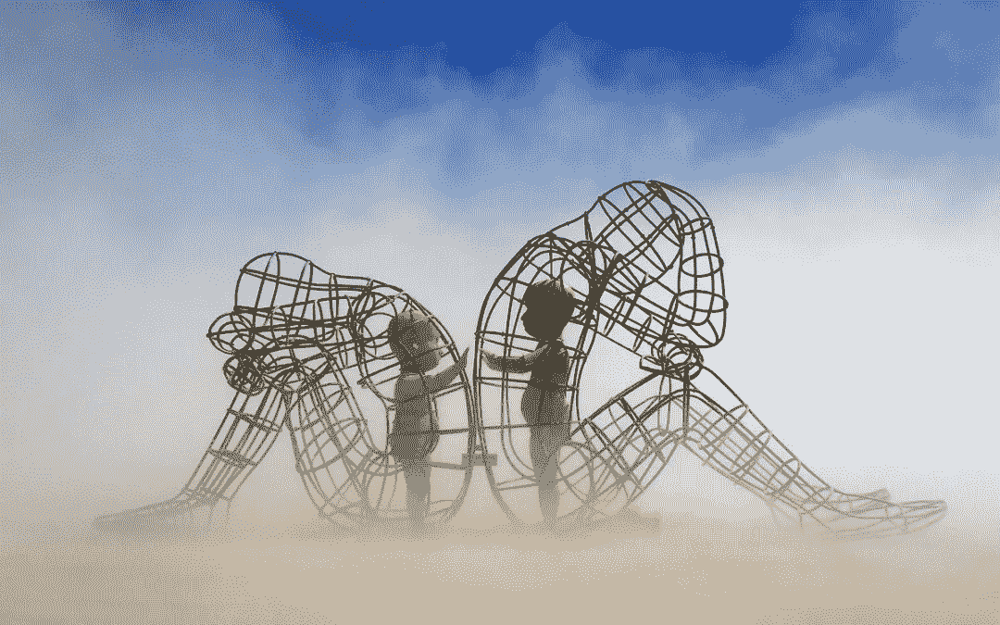
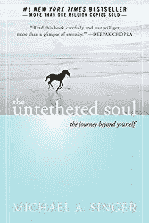
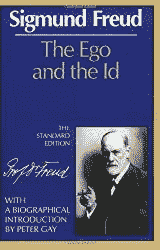
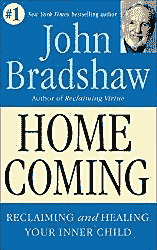
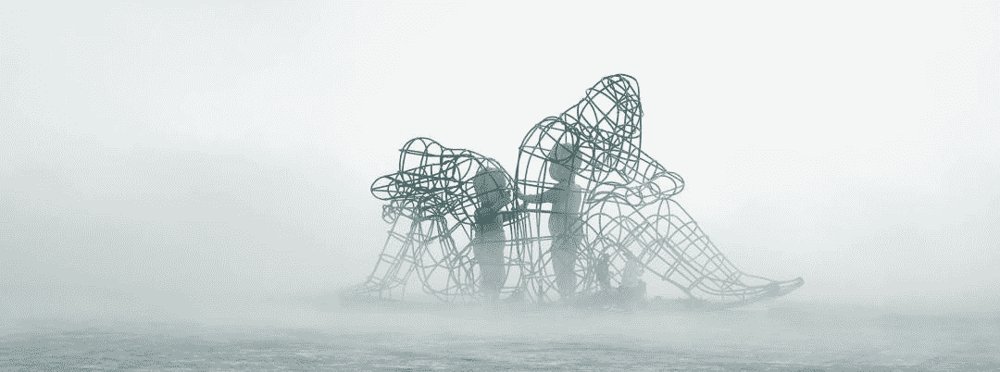

# 了解你的潜意识

> 原文：<https://medium.datadriveninvestor.com/get-to-know-your-unconscious-9bef364fc0ba?source=collection_archive---------12----------------------->

Inner Child Sculpture by Alexander Milov

# 谁是无意识的？

在各学科中，人类的心理大致分为两部分——一部分是有意识的，一部分是无意识的。有意识的部分是心灵的理性和文明的一面，而无意识的部分是原始的，本能的，本质上更野蛮。不管我们喜不喜欢，我们两者都有。它们是人类经历中不可分割的一部分，并且与身体同在。

所以这就是我们，一个分裂的存在，一方面，理性和计算，另一方面，本能和兽性。正如在我之前的人已经说过的，我们生活中最大的挑战，也是获得幸福的唯一途径，就是在这两种对立的力量之间找到平衡。

如果实现这种内在平衡是你认真对待的一个挑战，让我与你分享一些关于我们隐藏的自我的重要信息。

这篇文章将探究迈克尔·辛格、艾克哈特·托尔、西格蒙德·弗洛依德和约翰·布拉德肖提出的关于生活在我们每个人内心的黑暗乘客的不同假设，试图最大限度地了解这个隐藏的实体。

# 迈克尔·a·辛格——令人讨厌的室友

我选择从迈克尔·a·辛格开始，他是《不受束缚的灵魂》的作者。在他的书中，辛格把**这个无意识者称为一个你碰巧和**分享你的脑袋的疯狂室友。一个永远不会闭嘴的内在声音，不断试图用糟糕的建议毁掉你做的任何事情，然后批评你的行为。

辛格处理无意识的策略是简单地忽略它，声称幸福的公式就是简单地摆脱你自己令人讨厌的那部分。从他的经历来看，*的内部室友*唯一的愿望就是给我们带来痛苦和不幸，因此，没有必要与之互动。

尽管这种描述听起来极端而可怕，但这是一种极其普遍的信念。许多人将自我的无意识方面视为某种干扰或害虫，他们应该拒绝、忽视并推开它们。

# 艾克哈特·托尔——痛苦体

> 有一种看不见的力量使我们无意识地一遍又一遍地寻找痛苦
> 
> ~ *艾克哈特·托尔*

艾克哈特·托尔保持现状，并将无意识描述为一个犯罪者。你心中只有一个单一的兴趣，那就是制造痛苦。因此，他干脆把它命名为‘痛苦体’。

他把痛苦体描述成一种“精神寄生虫”,它占有你，以你为食，并假装成你。一种看不见的力量，使人一遍又一遍地强制寻找痛苦。一种生物，它的唯一目的是维持我们痛苦和苦难的不适应模式。

根据托尔的说法，我们都必须抵制痛苦体，压制它，使它沉默，并阻止它接管我们。像辛格一样，他也采取了将自己从无意识中分离出来的方法，命名它，责备它，并摆脱它。就 Tolle 而言，拒绝无意识，忽视，抛弃它，才是从苦难中解放出来的自由生活之道。

# 西格蒙德·弗洛伊德——本我

> *…一种消极的* ***性格*** *而只能被描述为一种自我的对比…有* ***没有组织*** *，产生* ***没有集体意志*** *，而只是一种力求带来* ***满足感的本能***
> 
> **~西格蒙德·弗洛伊德**

****

*弗洛伊德告诉我们，我们所有的心灵都是部分无意识的，但他确实认为有一部分是完全无意识的，他称之为 *id* (das Es，“它”)并将其称为人类心灵的*黑暗*部分。*

*本我是人类人格的固有部分，他将其描述为冲动的、不合逻辑的和非理性的。此外，弗洛伊德将本我描述为妄想的、幻想导向的、自私的，只对满足自身原始和本能需求感兴趣，完全无视社会规范和集体意志。使它成为我们自身愚蠢而原始的一部分，如果暴露给别人，会引起极大的尴尬。*

*尽管弗洛伊德、托勒和辛格似乎在无意识实体的本质上意见一致，**弗洛伊德告诉我们，我们不能忽视无意识及其欲望，相反，他敦促我们尝试驯服它**。压制我们自己自私、冲动和不负责任的一面，只允许它以社会可接受的方式表达自己。*

# *约翰·布拉德肖——找回受伤的内心*

> **整理过去，找回内心的童真，在这个过程中成为我们自己的看护者，我们自己的父母**
> 
> **~约翰·布拉德肖**

****

*约翰·布拉德肖远不如上面的其他三个人出名，但他对潜意识的观点是迄今为止最完整的。布拉德肖的受伤的内心孩子理论脱离了现状，采取了完全不同的角度。布拉德肖不是一遍又一遍地告诉我们无意识是什么，它对我们有多坏，而是试图更深入地帮助我们理解为什么。*

*布拉德肖将无意识描绘成一个无辜的孩子，而不是犯罪者。一个简单地用他们在整个童年时期吸收的不适应模式对环境做出反应的孩子。使它以消极的方式行动，不是因为它是邪恶的，而是因为它受伤了。*

*根据布拉德肖的说法，我们所有无意识的不当行为都可以追溯到一些功能失调的童年经历。我们小时候所经历的情感上，有时是身体上的虐待。从那时起，我们的潜意识就像一个受伤的内心小孩，被困在这些模式中，不断地寻求结束。无意识地延续它所接触到的虐待行为，直到它最终能够理解它，治愈并完成过去。*

*因此，从布拉德肖的角度来看，无意识应该被区别对待。不是像我们被教导的那样被拒绝和忽视，而是被接受和爱。声称**健康的成年生活只有在我们设法恢复内心的童真并赋予它力量之后才有可能。也就是说，成为自己的照顾者，停止虐待，用爱、同情和理解对待自己。***

**

# *将它整合在一起*

*正如所有人都通过无意识做什么以及如何对它们做出反应来描述无意识一样，布拉德肖是唯一一个能够让我们一瞥这些无意识行为背后的动机的人。不仅要解释表面的行为，还要解释背后发生的过程。这样，提供一个建设性的解决方案，而不是被动的解决方案。反过来，**给了我们一个模型，让我们更深入地审视自己的过去，并真正改变我们不适应的模式。***

*另一件有趣的事情是，内在儿童模型让我们理解了所有其他理论是如何形成的。由于我们将照顾者内化，并像父母对待我们一样对待我们的内在孩子，我们可以将这些模式追溯到童年。*

*那些被父母视为讨厌的害虫、试图破坏他们计划的人，会发现辛格版的《内心室友》最有吸引力。那些在不赞成的父母身边长大的人，他们谴责自己所做的一切，只把你当作痛苦的原因，他们会发现托勒版的痛苦体最有吸引力。而那些在严格的管教下长大，但在被社会接受时被给予表达自己的机会的人，他们会是弗洛伊德版本的最令人愉快的本我。*

*然而，所有这些仅仅是布拉德肖受伤的内心孩子的不同类型。所有人都受到伤害、恐惧和情感上的虐待。*

*现在你知道了这一点，你不再需要惩罚你的无意识自我。你不再需要约束、拒绝、忽视或憎恨它。不要像父母对待你那样对待你内心的孩子。相反，控制你的行为，像你希望你的父母对待你那样对待你内心的孩子。用爱同情、接纳和理解，像对待孩子一样对待。*

*最初发布于 emotionalintelligenceproject.com 的*

* [## 了解你的潜意识

### 在各学科中，人类的心理大致分为两部分——一部分是有意识的，一部分是无意识的。的…

emotionalintelligenceproject.com](https://emotionalintelligenceproject.com/how-to-trust-yourself/how-to-relate-to-your-unconscious)*