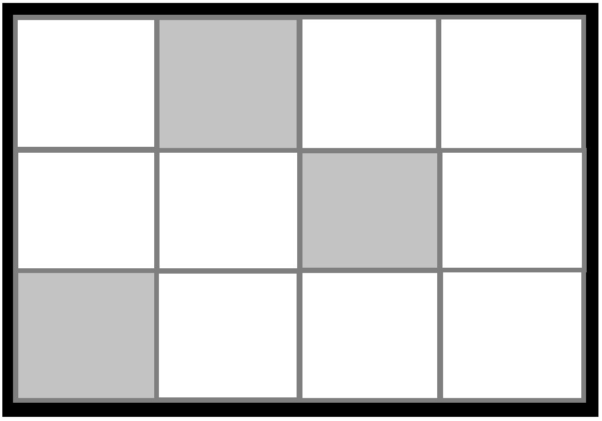
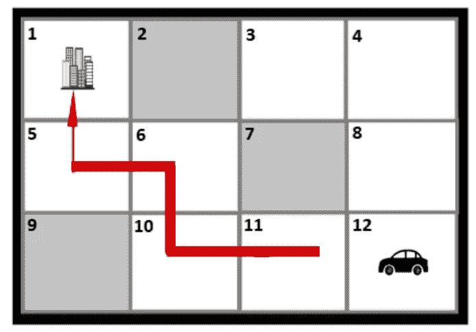
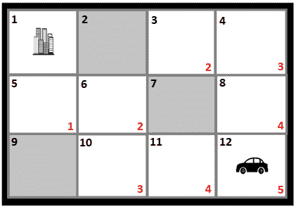
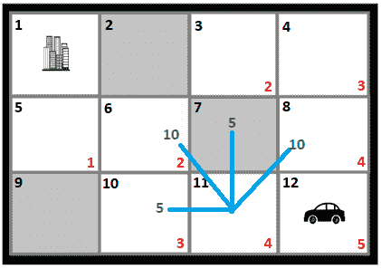
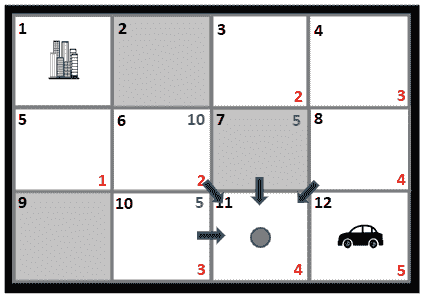
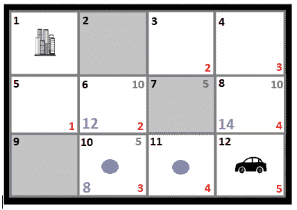
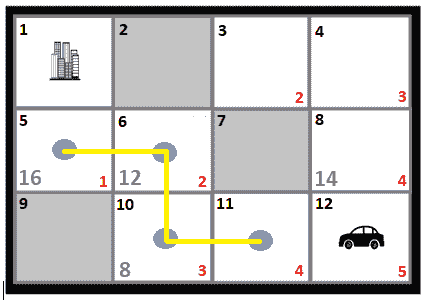

# 借助*获得额外的效率

> 原文：<https://medium.datadriveninvestor.com/getting-extra-efficient-with-a-6a40c270326d?source=collection_archive---------10----------------------->

作者:帕特里克·杰罗姆·维多利亚

你有没有被困在一个位置，不知道还能去哪里？假设你遇到了交通堵塞，而你离工作地点还有几公里远。你准时到达办公室的唯一方法是绕道而行。这种场景是非常需要寻路算法的例子之一。诸如 **Dijkstra** 、**广度优先搜索**和**深度优先搜索**、**最佳优先搜索**和 **A* (A-star)** 算法的寻路算法被创造出来帮助解决我们的寻路问题。这些算法计算出从源节点到目的节点的最短路径，同时防止沿途阻塞。在大多数情况下，这些算法通常在游戏中实现，其中玩家必须从其当前位置向指定的目的地移动。此外，这些算法还被流行的位置感知应用程序所使用，引导我们到达目标目的地。

考虑分析下图。假设我们被困在一个不知名的地方，那些灰色的盒子就是我们需要避开的障碍。

要回答这个问题，“我们如何从多条路径中选择我们的最短路径？“我们需要使用我上面提到的算法之一。

 [## 算法诱人的商业逻辑|数据驱动的投资者

### 某些机器行为总是让我感到惊讶。我对他们从自己的成就中学习的能力感到惊讶…

www.datadriveninvestor.com](https://www.datadriveninvestor.com/2019/03/22/the-seductive-business-logic-of-algorithms/) 

我选择使用 **A*算法**来解决我们的情况。A*执行速度更快，在解决大多数寻路和图形遍历问题时获得认可。与早期算法和其他算法不同的是，它试图通过启发式函数来寻找更优的路径，并且它只探索可接受的节点。它寻找在通过源节点到目的节点的过程中使用最小成本的路径。每条路径的成本基于状态而变化，并通过试探法进行评估。

## **a*是如何工作的？**

在我们给定的场景中，目的节点是我们的办公室，我们汽车的位置是我们的源节点。该图用作我们的 A*算法的图形。

首先，我们需要创建两个单独的列表:**开放列表**和**封闭列表**。开放列表包含仍然需要探索的节点，而封闭列表包含已经探索的节点。

A*使用以下成本函数评估路径:

> ***f = g + h* ，**

其中 ***g*** 是从源节点到目的节点的路径的移动代价，而 ***h*** 是当前节点到目的节点的距离值。有许多方法可以解决启发式价值；常见的是使用欧几里德距离或曼哈顿距离。

为了便于计算，我选择使用曼哈顿距离。每个节点都由一个编号框表示，以便于跟踪。我将计算节点 12 中的汽车到节点 1 中的办公室的曼哈顿距离。

我开始计算节点 11 的曼哈顿距离。因此，通过从节点 10 计数到节点 1，我们将得到节点 11 的 ***h*** 值为 4。在计算曼哈顿距离时，灰色方框仍然被计算在内。然后，我对所有的白色方块重复这个过程，每个方块的曼哈顿距离用红色数字表示。

接下来，我将计算 ***g 成本*** *，*这是从一个节点到另一个节点的移动成本。比方说，所有对角线移动的移动成本值为 10，所有水平或垂直移动的移动成本值为 5。

我现在将使用我创建的开放列表和封闭列表。最初，它们都是空的。我将从节点 11 开始，并将它存储在封闭列表中，因为这是我们当前正在检查的。同时，开放列表将包含节点 11 的子节点，编号为 6、7、8 和 10。这是最重要的部分，因为从这里，我们将确定最短的路径。

在这一部分，我们现在将计算移动成本。对于这个例子，我将从节点 11 开始。由于节点 11 是父节点，我们将把它的 *g 成本*设置为 0，水平移动到节点 10 将花费 5。因此，节点 11 的 g 成本将为 5。我们现在可以通过使用 ***f = g + h*** 公式，使用所有这些值来评估我们的成本函数。因此，节点 10 将具有为 8 的 *f* 值。重复相同的过程，我们将得到每个节点的 *f 成本*，用紫色数字表示。

我们将选择节点 10 作为下一条路径，因为 A*选择了开销最小的节点。在本例中，节点 10 的成本最低，为 8。节点 10 现在将被添加到封闭列表中，因为它的节点评估已经完成。这个过程一直持续到我们确定从源节点到目的节点的最短路径。

执行完算法后，我们现在有了节点**12–11–10–6–5–1**作为最短路径。

在我的结论中， **A*是一个很好的选择，当你有一个复杂的地图，你想计算最便宜和最短的路径**。此外，使用一个好的启发式算法会对 A*的性能产生重要影响。所以，我认为 A*的表现要好得多，因为它不会盲目地猜测路径，而是评估扩张的最佳方向。

**立即获得免费的机器人流程自动化工具！**

[下载这里](https://www.raxsuite.com/freedownload?utm_source=Medium%20Post&utm_medium=medium&utm_campaign=medium_footer)

**参考文献:**

 [## A*寻路简介

### 这是 iOS 教程团队成员 Johann Fradj 的博客帖子，他是一名软件开发人员，目前全职致力于…

www.raywenderlich.com](https://www.raywenderlich.com/3016-introduction-to-a-pathfinding)  [## 搜索|卓越的数学和科学维基

### A*(读作“A star”)是一种计算机算法，广泛用于寻路和图形遍历。的…

brilliant.org](https://brilliant.org/wiki/a-star-search/)  [## 策略游戏中的寻路和使用 A*搜索算法的迷宫求解

### 寻路算法解决了寻找从源到目的地的最短路径和避免…

www.scirp.org](https://www.scirp.org/journal/PaperInformation.aspx?PaperID=70460)