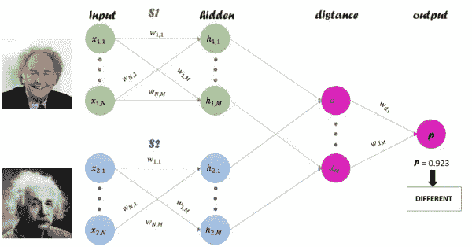
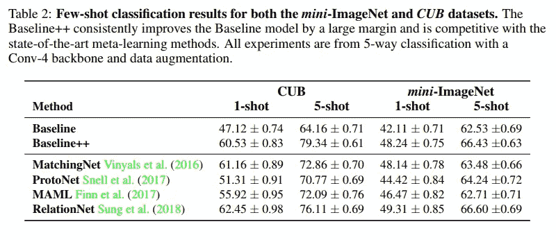
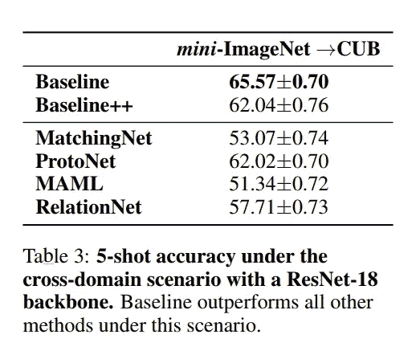

# 熟悉少量学习

> 原文：<https://medium.datadriveninvestor.com/getting-familiar-with-few-shot-learning-775f0d90dc43?source=collection_archive---------5----------------------->

今天，我们将看看几种方法，允许训练这样一个模型，它可以推广到新的以前没有见过的类，只给少量的例子。

# 动机

通常，当涉及少量学习任务时，我们会听到神经网络现在有多复杂，以及它们需要训练多少数据(即，每个新类都有数千个示例，即使网络是在具有基类的大规模数据集上预先训练的)。此外，我们还必须考虑人工注释的成本以及某些类别(例如，稀有动物物种或一般事件)的数据稀缺。这一切都极大地限制了当前深度学习系统有效学习新概念的适用性(正如我们将进一步看到的那样，在具有有限标记数据的情况下，仍有可能以经典方式训练神经网络)。

但是，即使有大量标记数据，经典方法也无法处理其他特定任务。我说的是需要动态可伸缩性的系统。比如我们来考虑人脸验证问题。想象一下，你想建立一个智能通行证系统，只有当人们的照片在数据库中时，才允许他们进入(通过扫描他们的脸)。显然，您不希望每次更改数据库时都重新训练模型。你想要的是只训练一次，然后不管你有多少个类或者多少张脸，都应用它。这种类型的任务适合少量学习。

> [DDI 编辑推荐 OpenCV 的机器学习:使用 Python 的智能图像处理](http://go.datadriveninvestor.com/dmlb02/matf)

# 方法

在本文中，我们将只考虑基于距离度量学习的方法。这些方法的总体思想是训练一个创建特殊向量空间的模型。一旦创建了这样的向量(嵌入)空间，就可以使用嵌入作为特征向量的标准技术来容易地实现诸如人脸识别、验证和聚类的任务。

训练这种模型的方法之一是使用三重损失:

Triplet loss on two positive faces (Obama) and one negative face (Macron). [Source](https://github.com/omoindrot/tensorflow-triplet-loss)

三联体损失的目标是确保:

*   具有相同标号的两个例子在嵌入空间中具有紧密的嵌入。
*   两个标签不同的例子，嵌入的距离很远。

如果你想了解更多关于三重丢失的信息，我们可以在[的文章](https://medium.com/datadriveninvestor/multiple-object-tracking-using-person-re-identification-f9b7360cda1a)中找到。

另一种方法是使用连体网络:

暹罗网络([)布罗姆利，简，等.〈使用“暹罗”时间延迟神经网络的签名验证.〉神经信息处理系统进展。1994.](http://papers.nips.cc/paper/769-signature-verification-using-a-siamese-time-delay-neural-network.pdf))是具有两个相同子网的网络，它们共享相同的参数和权重。

Siamese neural network architecture. [Source](https://computervision.tecnalia.com/en/2018/07/siamese-neural-networks/)

这些网络的目标是预测两幅图像是否属于同一类别。总的来说，我们通过使用连体神经网络的监督的基于度量的方法来学习图像表示，并进一步重用该网络的特征用于少镜头学习，而无需任何再训练。

# 分类问题

尽管这个概念很吸引人，但是并没有很多任务需要动态可伸缩性。经典的图像分类任务呢？如果我们只有少量的标记数据或者根本没有标记数据怎么办？这些问题由[细看少拍分类](https://openreview.net/pdf?id=HkxLXnAcFQ#page=4&zoom=100,0,726)文章的作者回答。

他们将遵循网络预训练和微调的标准迁移学习程序的简单基线模型与三种基于距离度量学习的方法(匹配网 [Vinyals 等人(2016)](https://papers.nips.cc/paper/6385-matching-networks-for-one-shot-learning.pdf) 、质子网 [Snell 等人(2017)](https://papers.nips.cc/paper/6996-prototypical-networks-for-few-shot-learning.pdf) 和关系网 [Sung 等人(2018)](https://arxiv.org/pdf/1711.06025.pdf) )和一种基于初始化的方法([MAML·芬恩等人(2017)](https://arxiv.org/pdf/1703.03400.pdf) )进行了比较。结果表明，他们的基线模型在 mini-ImageNet 和 CUB 数据集上都取得了与最先进的元学习方法相媲美的性能。

最意想不到的结果与跨域场景(使用 mini-ImageNet 作为基类，并使用 CUB 中的 50 个验证类和 50 个新颖类)相关，这在现实中最有可能发生。

> “我们用 ResNet-18 特征主干进行实验。如表 3 所示，在这种情况下，基线优于所有元学习方法。虽然元学习方法在元训练阶段学习从支持集学习，但是它们不能适应差别太大的新类，因为所有的基本支持集都在同一个数据集中。相比之下，基线只是基于少数给定的新类别数据来替换和训练新的分类器，这使得它能够快速适应新的”

因此，在缺乏数据的情况下，经典的简单解决方案仍然有效。

# 有用的链接

弄清楚某事的一个好方法是尝试应用它。Kaggle 座头鲸识别挑战赛最近刚刚结束。在这场比赛中，你必须根据鲸鱼的爪印来辨认鲸鱼。分析它的公共内核是从连体网络和三联体丢失开始的好方法。

此外，关于三重态丢失的一些棘手的实现细节可以在 TensorFlow 的博客文章[三重态丢失和在线三重态挖掘中找到。](https://omoindrot.github.io/triplet-loss)

*撰稿* [*康斯坦丁*](https://www.linkedin.com/in/konstantin-krois/) *校对* [*伊利亚·斯特列尼科夫*](https://www.linkedin.com/in/ilya-strelnikov/)

*原载于 2019 年 3 月 5 日*[*www.quantumobile.com*](https://www.quantumobile.com/getting-familliar-with-few-shot-learning/)*。*