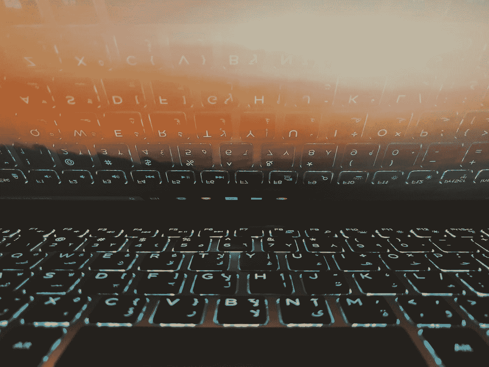

# 从你的内容中获得更多:从我的暂停介质帐户中得到的教训

> 原文：<https://medium.datadriveninvestor.com/getting-more-out-of-your-content-lessons-learned-from-having-my-medium-account-suspended-67f8354f2670?source=collection_archive---------11----------------------->

## 被迫脱离这个平台让我对这个内容共享网络有了非常宝贵的了解

Photo by [Ishtiaque G2](https://unsplash.com/@ishtiaque_jpg?utm_source=medium&utm_medium=referral) on [Unsplash](https://unsplash.com?utm_source=medium&utm_medium=referral)

> ***我认为个人发展(有形的而非熟练的)可能受到媒体的危害，媒体夺走了我们创造的有价值的内容，说实话，并没有真正利用它……***

整整 30 天，由于我发布了重复的内容，我的媒体账户被暂停了。我是故意发布重复的内容吗？不完全是——但这不是重点。

重要的是我从外面向内看学到了什么，就好像能够在一堵玻璃墙后面看着一切发生的事情，而我不能被看到也不能被听到。

 [## 幸福的算法？数据驱动的投资者

### 从一开始，我们就认为技术正在使我们的生活变得更好、更快、更容易和更实用。社交媒体…

www.datadriveninvestor.com](https://www.datadriveninvestor.com/2019/03/08/an-algorithm-for-happiness/) 

我学到了什么？

用 Medium 很容易陷入套路。就像一种奇怪的关系，眼罩升起，内容不断被创造出来——看不到尽头。这就是它的全部——内容创建和内容消费的反馈循环。

人们很容易陷入这种循环——花大量时间阅读和写作，一小时又一小时地投入到这个嘈杂的有组织的聊天论坛中。对我们中的一些人来说，这是表达自我和创造力的完美爱好。然而，对其他人来说，这是时间和精力的完美陷阱，可以更好地用在其他地方。

我以前写过关于我们文字的内在[价值](https://medium.com/writers-guild/the-reverberation-of-our-words-fa79d9d62f15)，关于[成功的写作真正意味着什么](https://medium.com/@mmworonko/redefining-successful-writing-ca962e697039)，以及关于[媒体如何在它自己雄心勃勃的冒险](https://medium.com/datadriveninvestor/biting-the-hand-that-feeds-is-the-window-closing-on-medium-566da5b5a614)的重压下缓慢但肯定地崩溃。

问问你自己:如果 Medium 突然从地图上消失了会发生什么？

不要误解我——我喜欢媒介，并且完全相信有了媒介，世界会变得更好。我认为这是一个很棒的平台，让人们可以表达他们的创造力，尽管它的缺陷越来越多，标准越来越低，但它仍然是比大多数(如果不是全部)其他社交网络更好的消磨时间的地方。【请不要再让我停职了】。

对于某些出版物来说，这也是一个很好的平台，可以宣传他们各自的企业，培养有才华的作家和小众读者。

但是，尽管媒体是团结志同道合者的巨大跳板和场所，但其个人成长的前景却相当停滞。我认为是个人发展(有形的，而不是有技巧的)被媒体潜在地破坏了，媒体拿走了我们创造的有价值的内容，说实话，并没有真的用它做那么多。

> “胜利的意志、成功的渴望、发挥全部潜力的冲动……这些是开启个人卓越之门的钥匙。”——孔子

承认吧，Medium 并不欠我们什么。它对我们来说已经足够了。如果我们觉得我们的内容背后的潜力从未被最大化，那么，这最终是我们自己的问题。

对我来说，还有一个月就是我在 Medium 的一周年纪念日了。在这段时间里，我发表了 148 篇(非重复)文章。不算我一个月的消极惩罚，一个月差不多有 15 篇文章——差不多一周 4 篇文章。每篇文章平均 1000 字，这是我写的相当大的一篇文章。

你可以说我已经写了足够多的字来组成一本 700 字的书。

那么这张图有什么问题呢？这真的取决于我们如何珍惜我们的时间。如果我们真的把在媒体上写作看作是一种没有任何得失的爱好，那么这很好——恭喜你，你不必担心。

问题是，在我离开一个月之前，我也是这么认为的。

我觉得这比玩电子游戏、深入网飞、无所事事地闲荡要好。地狱——这个爱好发展了我的写作能力(它确实做到了),为我建立了一个文件夹，帮助我进行哲学思考，还还清了我的汽车贷款——有什么损失呢？

事实证明，有些东西可能不会失去，但至少会危及:我的潜力。

> “永远不要低估梦想的力量和人类精神的影响。在这个概念上我们都是一样的:伟大的潜力存在于我们每个人心中”——威尔玛·鲁道夫

回想起来，我不会做不同的事情。我在这里张贴的超过一半的内容将被回收成一本关于哲学的书，我现在已经完成了一半。我也很高兴拿着我以前赚的钱，数着我的祝福，甚至感谢灵媒给我这个机会。

但是这段时间让我意识到，花这么多时间和精力在内容创作的循环中可能并不令人满意，这些时间和精力本可以用来为自己建立一个更好的基础。

因为我愿意相信媒体上的大多数作家都像我一样，或者曾经像我一样。不仅仅是为了写作而写作，而是以这样或那样的方式自我提高。打下一些基础；增强技能；作为人类进化。

> "一旦写作成为你的主要恶习和最大乐趣，只有死亡才能阻止它."——欧内斯特·海明威

所以，如果有作家正在读这篇文章，我恳求你退后一步，想一想你是如何度过你的时间的。如果你愿意花尽可能多的时间在中等水平上，并且不打算扩展，那很好。但是，有没有什么方法可以开始为另一个项目建立基础，或者对您在这里创建的内容做更多的事情？

因为，真的，它总是归结为内容。内容是媒介的驱动力。内容是我们在这里的原因。所以我们必须问:有了我们创造的这些内容，我们能让它对我们更有效率吗？也许我们可以用它来营销我们的业务，也许我们可以以某种方式回收它，也许我们可以用它来进一步与他人联系或开始建立一个品牌或理解。

我知道我自己已经用它来理解哲学概念，启发他人，建立自己的投资组合和发展自己。我知道我们中的许多人已经这样使用它了，但不幸的是，我们中的许多人都陷入了试图写那些得到更多掌声的东西，在我们知道之前，几个月过去了，我们已经筋疲力尽，可能已经变得停滞不前，或者发现我们只是为了例行公事而写作。

这是关于进化、自我进步和自我价值。在一天结束时，它只是值得采取更深入的研究。因为我们在这里创作并在读者中热切分享的内容可能会渗透并发展成全新的东西，我们最终应该保持这种不断发展的意识。

[**继续读下去:咬食之手:媒体上的窗口关闭了吗？**](https://medium.com/datadriveninvestor/biting-the-hand-that-feeds-is-the-window-closing-on-medium-566da5b5a614)

Reminding all Medium writers that we’re in this for the word, not the dollar.