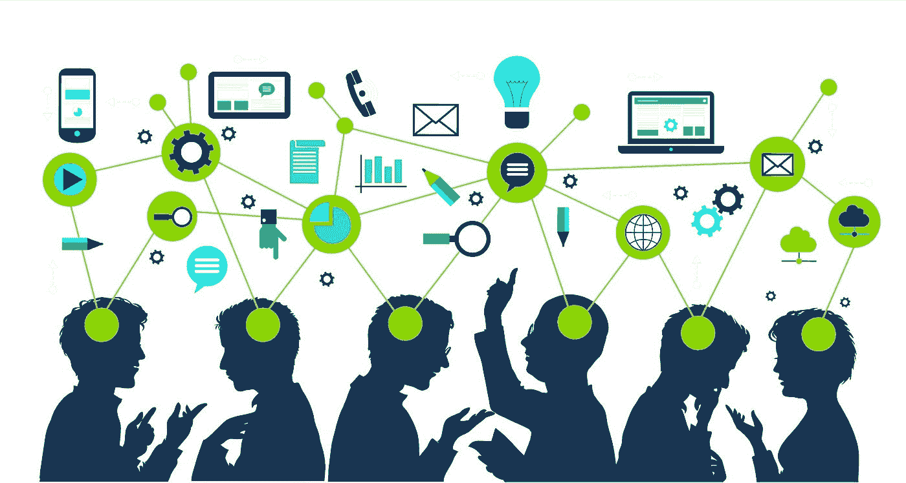

# 克服人工智能中的障碍

> 原文：<https://medium.datadriveninvestor.com/getting-over-the-hump-ofai-51f4160b2d79?source=collection_archive---------30----------------------->

有多少次你告诉自己“不行”或者“不可能”？无论是关于坚持节食还是开始一个新的 DIY 项目，你可能都至少想过这些话一次，但它们并不是真的。你告诉自己你不能，但实际上你还没有做到。这是我在开始探索人工智能的时候发现的。我一直认为人工智能是一件遥远的事情，也许当我‘长大’的时候我会知道，但最近我一头扎进了人工智能的世界，发现它比我想象的更接近可能。

我的第一个人工智能项目是通过创建一个可以对服装类型进行分类的神经网络开始的。你可能认为这是一个相当简单的任务，但它实际上需要大量的编码和思考。你不能只告诉网络去识别它们，你必须先教会它。

## 那么，你具体是如何做到这一点的呢？

我首先从时尚 MNIST 数据库导入服装数据，并给每种服装分配一个标签号。这使得结果更容易查看和理解。一旦他们每个人都有了一个标签，我就用 60，000 张带标签的图片来训练这个网络，这样它就可以学习每一种衣服的样子。就像在学校里一样，在它学会之后，它会接受测试。我用 10，000 张图片测试了这个网络，得出了正确分类服装的 88%的准确率。所有这些训练和测试只需几分钟就能完成，想象一下，一个人整理 60，000 张图片需要多长时间！

## 容易吗？不。值得努力吗？绝对的。

我意识到这可能看起来像一个无用的项目，但这并不是网络的积极成果使它有意义，而是我在做它时学到的一切。直到这个项目，我没有做太多的编码，我有一个非常基本的知识，如何编码。在做这个项目的时候，我在代码中有很多错误，但是，它们让我在这么短的时间内成倍地增长，并帮助我了解了更多关于编码和神经网络的知识。

> 失败只是一个重新开始的机会，这次会更聪明——亨利·福特

这个项目可能不容易，但绝对值得努力，因为我现在对神经网络和编码的了解比以前多了 100%。我了解到的一些关键细节包括:

*   神经网络如何使用数据
*   如何训练一个网络
*   如何在测试后改进网络

不仅要理解如何编码这个网络，还要理解**网络实际上是如何工作的**，这是我从这个项目中获得的一个非常有用的工具。了解它们是如何工作的意味着我可以在出现错误时更容易地修复我的网络，也意味着我可以在未来编写更多的网络。

## 想试试吗？

你对编码感兴趣吗？准备好开始钻研编码和人工智能了吗？如果你准备好了，我建议你参加一个简短的编程入门课程，学习 Python 这样的通用编程语言。一旦你理解了基础，你去做什么和编码都没关系，只要做你有热情的东西就行了。你会在你喜欢做的项目上付出 100%的努力。**感觉应该不像学校**。

如果你遇到困难，Youtube 上的教程和在线论坛总能帮到你。尽量避免那些只向你解释如何做项目的教程，而是尝试那些解释如何解决你遇到的具体问题的教程。如果你只是复制和粘贴文本，你可能不会像你自己奋斗一样理解编码。

总而言之，对于一般人来说，编码和人工智能似乎很难，也很遥远，但一旦你开始，你会发现**“我不能”的心理障碍实际上只是“我还没有”。**

> *在完成之前，似乎总是不可能的——纳尔逊·曼德拉*

如果你想检查我的神经网络，你可以在我的 [Github](https://github.com/Paige-Gugeler/Basic-Clothing-Classification) 上找到。如果你有兴趣了解更多关于人工智能的基础知识，请点击这里查看我的另一篇文章。