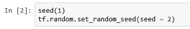
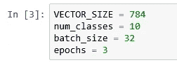
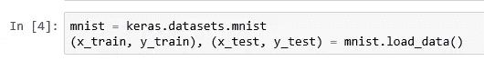
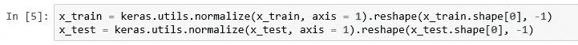
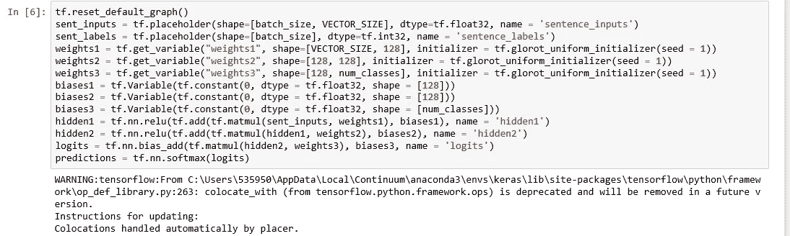
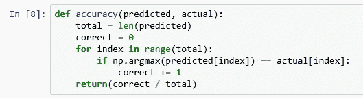
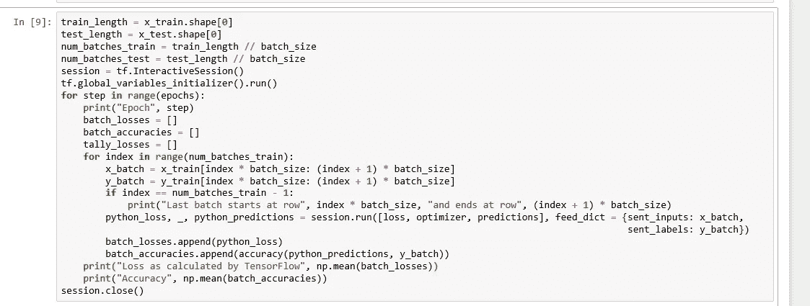

# 在 TensorFlow 中获得可重复的结果

> 原文：<https://medium.datadriveninvestor.com/getting-reproducible-results-in-tensorflow-3705536aa185?source=collection_archive---------0----------------------->

机器学习需要对你的权重、偏好和其他变量进行大量的随机初始化。因此，当您使用 TensorFlow 和 Keras 之类的库开发应用程序时，每次运行代码时都会得到略微不同的结果。这很好，因为您将知道您的应用程序使用不同的初始化值给出一致的结果。

同时，可能会有一些情况，主要是在调试期间，您希望获得可重复的结果—当您一次又一次地运行代码时，您应该获得相同的值。有一篇很好的[文章](https://machinelearningmastery.com/reproducible-results-neural-networks-keras/)告诉你在编写 Keras 代码时如何获得可重复的结果。

 [## 金融中的机器学习——数据驱动的投资者

### 在我们讲述一些机器学习金融应用之前，我们先来了解一下什么是机器学习。机器…

www.datadriveninvestor.com](https://www.datadriveninvestor.com/2019/02/08/machine-learning-in-finance/) 

如果你用 base TensorFlow 写代码呢？然后你在文章中提到的基础上做一些细微的改变。我从这篇[文章](https://pythonprogramming.net/introduction-deep-learning-python-tensorflow-keras/)中提取了 MNIST 培训的 Keras 代码，并在 TensorFlow 中重写，同时使代码可重复。

首先导入必要的库。

Import the libraries

Seed numpy 和 TensorFlow 在 [Keras](https://machinelearningmastery.com/reproducible-results-neural-networks-keras/) 文章中提到。

Seed the randomization

MNIST 数据集将其图像存储为 28 x 28 像素，矢量大小为 784。要预测的类别数是数字 0 到 9，总共 10 个类别。我们将使用 32 的批量大小进行训练，并运行 3 个时期的训练。

Initialize variables

从 Keras 获取数据。我知道我说过我们将在 TensorFlow 中编写代码，但是从 Keras 或其他任何地方获取数据并没有什么坏处。

Get data

接下来，我们将对数据进行规范化，使值介于 0 和 1 之间。由于我们还没有开始构建神经网络，我们可以使用 Keras 实用程序来完成这项工作。之后，我们将重塑数据，使每一行都是 784 个元素的向量，而不是 28 行 28 列的矩阵。

Normalize and reshape data

接下来，我们将构建神经网络。注意，在定义权重时，初始化器对于训练不是必需的，但是如果没有种子，运行将不可重复，并且将在下一次运行中给出不同的值。我们对隐藏层使用 relu 激活函数，在最后一层使用 softmax。

The network

现在定义损失和优化器。

Loss and optimizer

让我们将准确性定义为预测值和实际值相匹配的案例数占案例总数的比率。

Accuracy

最后，运行培训。

Training

Output

您在上图中看到的每个时期的损失值和准确度值—您将在每次运行代码时看到它们重复出现。这意味着通过设置 numpy 的种子、TensorFlow 的随机种子以及初始化变量的种子，您可以使 TensorFlow 训练值可重复。