# 自然语言处理入门:单词包& TF-IDF

> 原文：<https://medium.datadriveninvestor.com/getting-started-in-natural-language-processing-bag-of-words-tf-idf-b62e9354eb7e?source=collection_archive---------0----------------------->

拉斯·德洛斯·桑托斯

机器学习的一些应用，如图像和音频处理，从一开始就已经在分析矢量化数据。这些特定数据的值(幅度和方向)已经可以为算法提供有意义的信息，如音频信号的噪声水平或图像中像素的值和位置，从而使计算更容易。

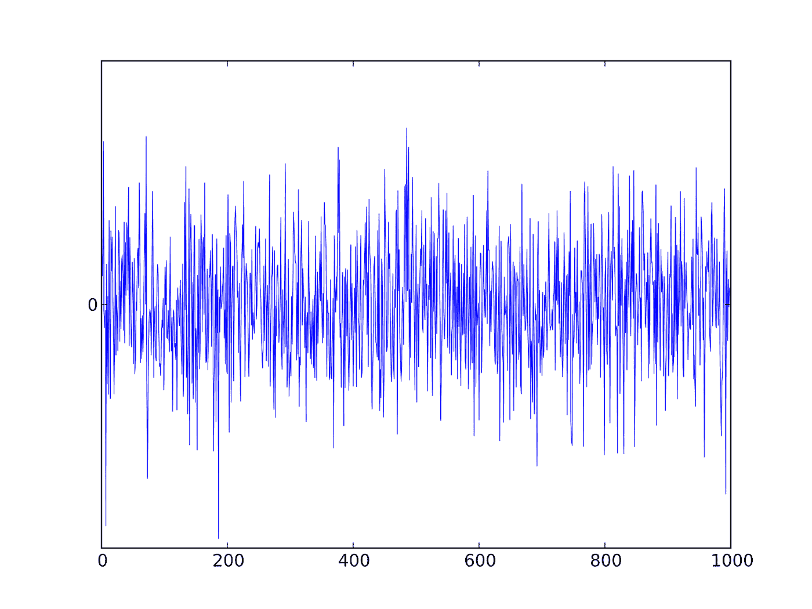

[Figure 1\. White Noise Signal](https://upload.wikimedia.org/wikipedia/commons/c/c1/White_noise.svg)

然而，对于文本，尤其是人类语言，情况就不同了。机器学习模型不能直接处理原始文本！这个问题现在提出了另一个难题——我们如何将文本转换成有意义的数字或向量，以便它们对 ML 管道有用？简单地将原始文本转换成例如二进制、十进制或十六进制表示，肯定不会给我们单词的函数表示，因为这些值不能捕获关于单词(例如“国王”和“王后”或“猫”和“狗”)之间的含义、上下文和相关性的信息。应用将一组文档表示为公共向量空间中的向量的模型可以解决这个问题。

**向量空间模型**是连续向量空间中单词的多维表示。在模型中，彼此紧密或语义相关的单词往往彼此更接近。

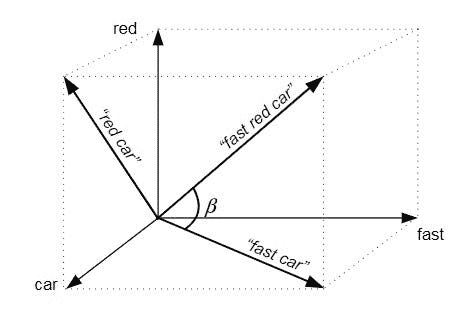

Figure 2\. VSM sample visualization. *Source: Polyvyanny & Kuropka, 2009*

有两种模型可用于将单词“转换”成向量:

1.  **基于计数的模型** —一种依赖于文档中单词频率的计算模型。
2.  **预测模型** —基于相邻词预测上下文或目标词的模型。

让我们首先使用基于计数的模型来处理矢量化，这种模型被称为词袋(BoW)和术语频率-逆文档频率(TF-IDF)。

## **词袋模型**

单词袋模型(BoW)是一种矢量化技术，它使用单词在文档或语料库中的出现次数，语料库本质上被定义为已知单词的数据集。以下面的一组文档为例。

*   “我是国王。”
*   “王国繁荣昌盛。”
*   “她是女王。”
*   “皇家皇后很漂亮。”

现在可以通过列出这组文档中所有独特的单词来制作语料库。通常，要阅读的第一个单词是语料库中列出的第一个单词。需要注意的是，BoW 并不关心单词的顺序。因此，我们的语料库现在将是:

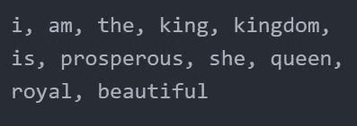

最后，为了使用 BoW 将样本文本转换成向量，对样本文本中语料库单词的每次出现进行计数，并输出为大小与语料库相同的整数计数的数组。例如，示例文本“国王和王后统治王国”将具有以下向量表示:

[ 0, 0, 3, 1, 1, 0, 0, 0, 0, 0, 0 ]

如下面字数所示:

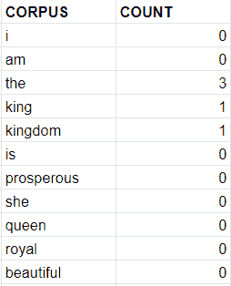

## **词频-逆文档频率**

TF-IDF 是 BoW 的一个高级变体，它根据单词在文档中的稀有性来考虑单词的重要性。然而，与 BoW 等离散计数的矢量不同，转换后的矢量现在包含连续的值。这个想法可以通过下面的等式得到最好的解释:

***tf weight*** 是归一化的字数统计。规范化基本上意味着获取单词的相对计数，以避免偏向较长的文档。它是从以下等式推导出来的:

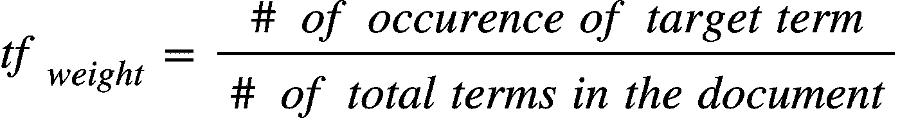

因此，假设我们有一个长度为 150 个单词的文档，目标术语为“狗”。如果“dog”在文档中出现 5 次，则“dog”的 tf 权重为:

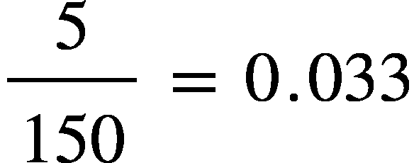

***idf 权重*** 通过给频繁出现的词赋予低权重来衡量该词在语料库中的重要性，对于很少出现的词反之亦然。它使用带有公式的对数函数:

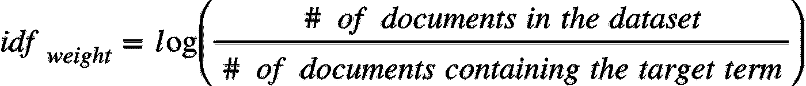

回到这个例子，如果在一百万个文档的数据集中，有 10，000 个文档出现了“狗”这个词，那么 idf 权重就是:

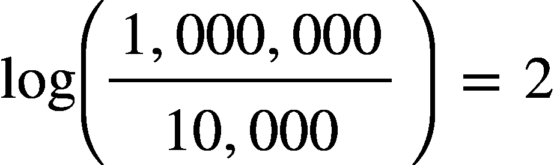

最后，术语“狗”的重量是

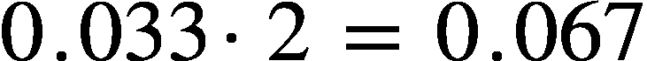

.

## **实施**

*使用的框架:。NET 4.7.2，Accord.NET v 3.8*

为了理解如何使用上述概念将单词转换成向量，我尝试使用 C#实现 BoW + tfiDF。具体来说，我使用了 Accord.NET 框架，因为它能够更容易地实现理论。

在深入编码之后，我安装了实现所需的必要包。我通过调用“using”指令导入了相关的名称空间。对于 Accord.NET，尤其是雅阁。MachineLearning 命名空间，我使用了 NuGet 包管理器。通常，最终包含的名称空间如下所示:

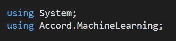

我创建了一个简单的文档集，如下所示。

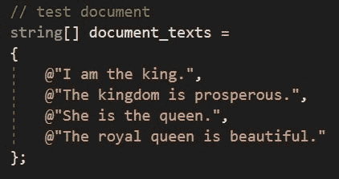

按道理，我应该有整个语料库的单词袋。因此，单词被“标记化”，并使用 Tokenize()方法将其保存到名为 document_words 的交错字符串数组中。我从语料库中找到了单个单词。

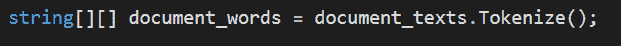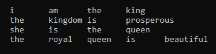

然后，我通过使用 new TFIDF()制作 tfidf 的实例，尝试学习上面的单词，如下所示。为了初始化前面讨论的数学，我选择了 TermFrequency。Default 和 inversedocumentfrequency . default

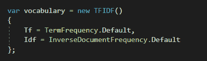

接下来，我调用了 Learn()方法，并将 document_words 作为其参数，将语料库转换为 tfidf 值。这也将删除重复的单词，因为我们只需要词汇表中每个单词的一个实例。

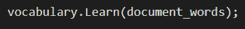

我们最终得到了一个包含 11 个值的向量:

[ tfidf_1，tfidf_2，tfidf_3，…。，tfidf_11 ]

在这个过程之后，我用不同于我们刚刚学习的数据集的文本(如下所示)对它进行了测试。

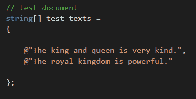

使用 Accord.NET，将新文本转换成基于先前学习的数据集的 tfidf 是相当容易的。首先，我对单词进行了类似于前面过程的标记，并将其用作调用 Transform()方法的参数。

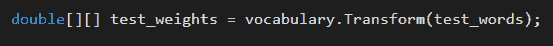

打印 test_weights 的值会给我们测试句子的向量表示。

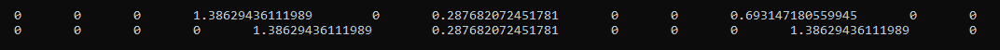

探索如何将单词转换成向量可以成为自然语言处理的一个很好的切入点，正如我在这个项目中所做的那样。选择像 BoW+tfidf 这样相当简单的数学转换可以让您深入了解文本中以及语料库本身中的单词是如何相互关联的。通过最终将数据输入机器学习管道进行分类或预测任务，您可以在这一步发挥更大的作用。

**参考文献:**

 [## 单词的向量表示|张量流核心|张量流

### 目标是对嵌入参数\(\theta\)进行更新，以改进(在这种情况下，最大化)这个目标…

www.tensorflow.org](https://www.tensorflow.org/tutorials/representation/word2vec)  [## Tf-idf::单页教程——信息检索和文本挖掘

### Tf-idf 代表术语频率-逆文档频率，常用于信息检索和文本…

www.tfidf.com](http://www.tfidf.com/) 

A.增强的基于主题的向量空间模型的定量评估。

立即获取您的 RAX 编辑器！这是一个免费的机器人过程自动化(RPA)软件:[免费下载这里](https://www.raxsuite.com)