# 使用 React 的上下文 API 入门

> 原文：<https://medium.datadriveninvestor.com/getting-started-w-reacts-context-api-f60aa9be758f?source=collection_archive---------2----------------------->

也许你听说过它，也许你知道它是什么和它有什么作用，但是不知道从哪里开始尝试它——让我们来为你解释一下！


# 什么是[上下文 API](https://reactjs.org/docs/context.html) ？

> “上下文提供了一种通过组件树传递数据的方式，而不必在每一级手动向下传递属性。”—反应文档


如果你熟悉 [Redux](https://redux.js.org/basics) 或者其他类似的状态管理系统，那么最容易把这当成 React 的最小版本。在 Redux 中，您可以通过使用 mapStateToProps 和 mapDispatchToProps 来访问通用存储或状态，这两个函数是通过将 React 和 Redux 连接在一起而获得的。

代替这两个函数，您只需要用上下文 API 将您呈现的组件和元素包装在一个消费者中。这只有在您已经用提供者包装了您想要访问存储的所有组件之后才能完成，就像 Redux 中一样——减去动作、类型和调度程序。

在 Redux 中，你可以用一个提供者来包装你的组件——在一个高层次上。然后使用这两个函数来访问和操作存储中的数据。有了上下文 API，您本质上也在做同样的事情。只需将消费者视为 mapStateToProps 和 mapDispatchToProps，并且基本上没有操作、调度程序或类型。

# 基本面

许多在线、博客和教程中的例子展示了这种创建上下文并在同一个文件中使用提供者和消费者的方法。

这里我们有这样的基本设置:

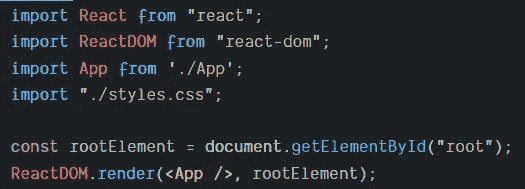

index.js

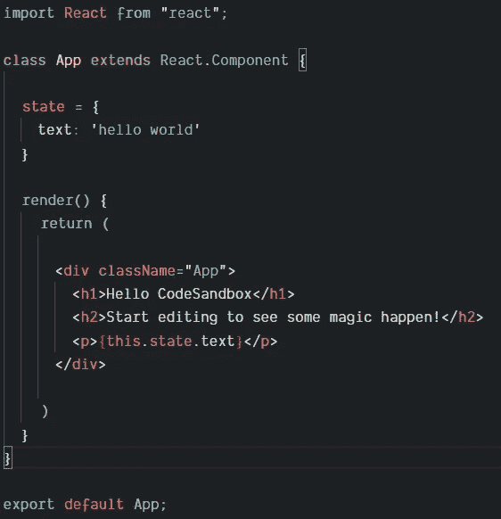

App.js

这是您的基本创建-反应-应用程序设置，这是它当前显示的内容:

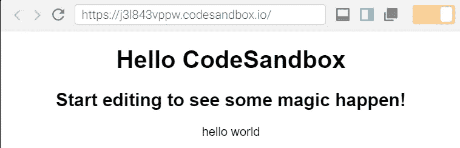

那是一些令人印象深刻的东西！

## 创建上下文

但是让我们创建一个上下文，并开始使用它来访问存储(因为 Redux 使用了这个术语，所以称之为 store)来呈现相同的文本。首先，我们将创建所述上下文:

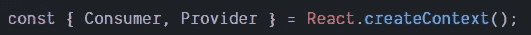

在这里，我们创建了一个要使用的上下文，并通过[析构](https://developer.mozilla.org/en-US/docs/Web/JavaScript/Reference/Operators/Destructuring_assignment#Object_destructuring)它来获得对消费者和提供者的访问，而不必为上下文创建一个变量名并以这种方式访问它。

## 供应商

接下来，我们必须用提供者包装组件，如果我们想让内部组件访问商店，提供者将允许内部组件访问商店。当你使用 Redux 时，你也必须这样做。

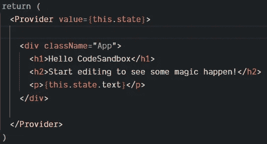

请注意，我们给出的值是应用程序的状态，您也可以在内嵌中构造一个对象，但这对性能不利，因为 React 会在每次渲染时继续重新创建该对象，这是不必要的，会影响应用程序的速度和性能。

```
Like this, a new object would be recreated each and every time:<Provider value={{ text: "hello world"}}>
```

## 消费者

现在，我们如何访问商店，而不是使用应用程序的状态？我们还必须将组件与消费者包装在一起——通过这样做，您可以让这个或那些组件直接进入商店。这听起来很像我们与提供商正在做的事情，所以有什么不同呢？简而言之，您需要用提供者和消费者包装组件。但是你有选择地让消费者进入商店。如果您希望这个组件能够从存储中读取，而另一个不需要，那么您可以这样做。

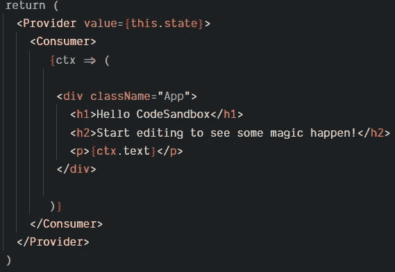

当您用消费者包装组件时，您必须返回一个回调。这是你可以成功渲染任何东西而不破坏应用程序的唯一方法。但是这样你就可以进入商店而不是国家。

请注意，我将所有内容都用括号括起来，如果您不熟悉它，请不要被它绊倒——它是一个箭头函数，隐式返回其中的所有内容，但允许您写在多行上。你也可以用花括号代替，然后用括号显式地返回元素。

## 解构

在不破坏提供者和消费者的情况下，您可以这样做:

```
Without destructuring:const StoreContext = React.createContext()...<StoreContext.Provider>
  <StoreContext.Consumer>
    ...
  </StoreContext.Consumer>
</StoreContext.Provider>
```

这就是实现上下文 API 的最基本方式。但是，在一个包含多个组件的大型应用程序中，这有什么好处呢？你问得好——让我们探索一下在应用程序中使用上下文的其他方法。

# 变得熟悉

让我们将商店从应用程序中完全分离和独立出来，让我们看看如何将信息从商店传递到其他组件，就像对状态一样。

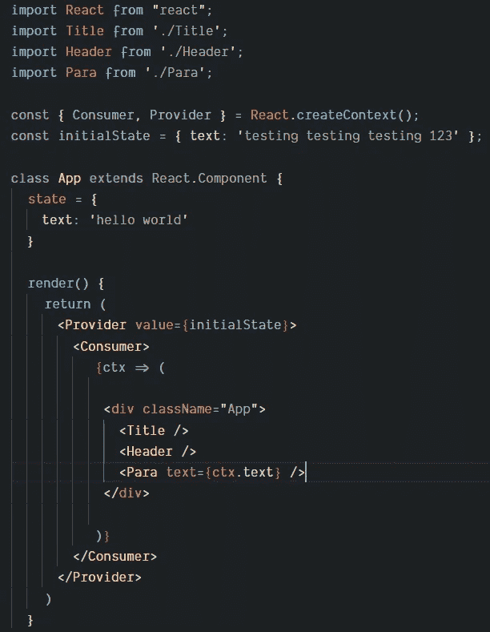

我创建了一个名为 initialState 的对象，并将其设置为提供者的值，这使得它现在完全独立于 App。我还创建了简单的[表示/显示组件](https://medium.com/@dan_abramov/smart-and-dumb-components-7ca2f9a7c7d0),呈现和之前一样的东西。Para 组件接受一个属性并呈现文本，而 Title 和 Header 组件只呈现相同文本。

您会注意到它呈现的是 initialState 文本，而不是应用程序的状态文本:

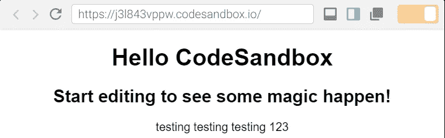

再次看看我们在 App.js 中呈现的内容——我们没有在标题或标题组件中传递或使用任何来自商店的内容。因此，我们显然根本不需要包装所有这些组件——我们只需要包装 Para 组件。这可以通过两种不同的方式实现:

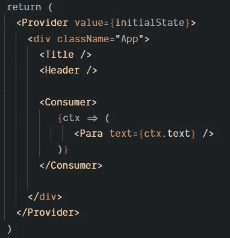

我们可以限制消费者的范围和 App.js 本身内部的组件，或者我们可以将消费者从 App.js 中取出，放入 Para 组件。为了做到这一点，我们需要对本例中的 App.js 稍加修改。我们不能再导出默认应用程序，因为我们也需要导出消费者。

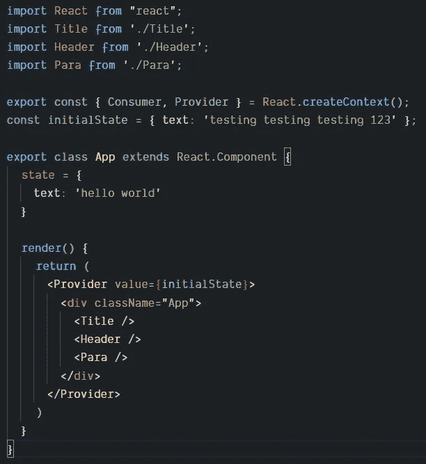

App.js

*请注意 App 的返回区域现在有多干净。

现在我们可以从 App.js 中[导出多个东西](http://parseobjects.com/imports-exports-javascript-es6/)，我们可以在不同的位置导入它们(如果我们选择，我们选择这样做)。

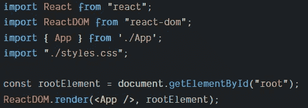

index.js

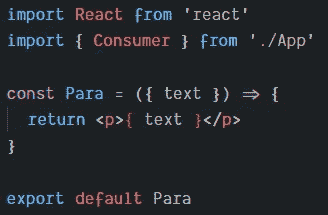

Para.js

既然我们已经解决了这个问题，那么让我们使用 Consumer 实现前面在 App.js 中看到的语法，但是在 Para 组件内部。

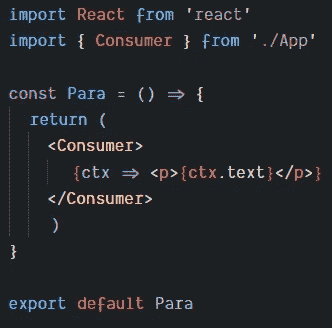

Para.js after using Consumer


太好了！我们将标题和标题组件与消费者隔离开来，只包含 Para，因为它是唯一需要来自商店的信息的组件。你会看到它仍然呈现相同的效果:

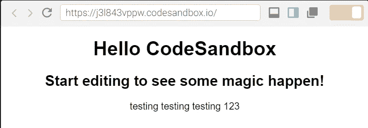

## 独立性ˌ自立性


再看一下 App . js——我们完全让商店独立于 App 组件。我们还不如把它单独放在它自己的文件里！

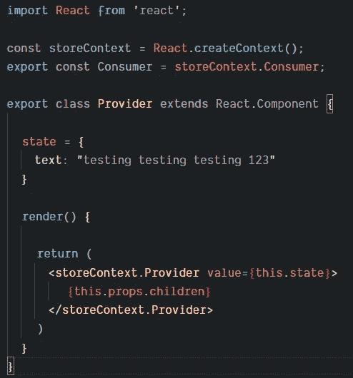

Context.js

我决定向你展示如何在不破坏代码的情况下做到这一点。我们导出了提供者和消费者，这样我们就可以导入并在其他组件和文件中使用它。

首先，我们将把提供者导入 index.js 来包围 App，让它位于应用程序的最顶层。这很好，因为以后当我们用越来越多可能需要访问商店的组件扩展应用程序时，我们不必费力地移动它。

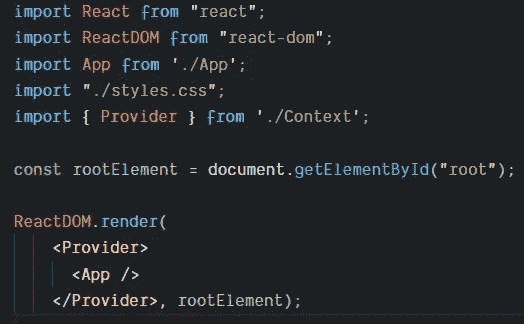

index.js

我们必须调整检索消费者的位置，因为我们已经将它移动到 Para 组件中自己的文件 Context.js 中。

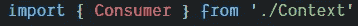

Para.js

还记得我们如何修改导出以允许从 App.js 中多次导出吗？让我们将它改回来，并调整我们将它导入 index.js 的方式。

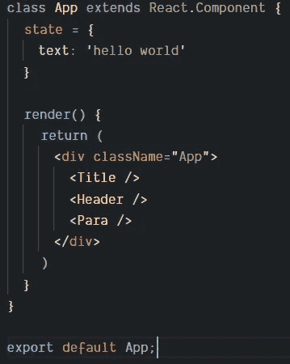

App.js with the export default again

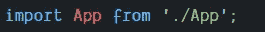

index.js with the original import accounting for export default

> 让我们回顾一下，我们设法分离上下文并使其独立于任何组件，战略性地将提供商置于最高级别以防止任何未来问题，并且我们已经限制了直接访问商店及其信息的组件的范围。

# 变得舒适

这一切都很美好，但我知道你渴望更多，更好的东西！目前，我们的商店中只有一条数据，让我们添加另一条，并使它成为一个用按钮更改商店信息的功能。

没有正确的方法来启动它，我认为这个任务很简单，可以可视化，所以让我们从更新上下文和存储开始，以拥有这个切换功能，它将在单击一个按钮时被调用。

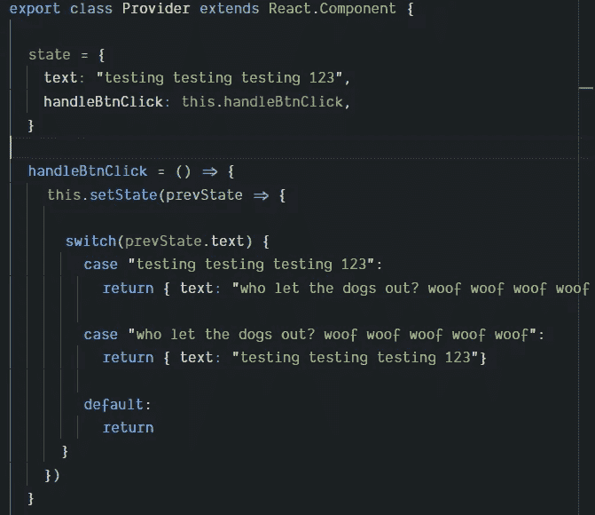

Context.js with a function to toggle the state/store

如果这个 setState 函数看起来有点不同，那是因为我们使用了一个回调函数作为参数，让我们可以访问之前的状态及其数据。 [React 可以捆绑状态变化](https://reactjs.org/docs/state-and-lifecycle.html)然后更新状态，所以仅仅传递 setState 给一个对象是不可靠的；如果您想要准确的状态更改/更新，这是实现它的方法！


这样一来，通常情况下，您只需要返回一个包含要改变状态的信息对象的语句，但是我想将状态切换为两个字符串中的一个，这就是我使用 switch 语句的原因。有趣的事实是， [switch 语句](https://www.geeksforgeeks.org/switch-vs-else/)据说比 if-else 语句更快！此外，它们读起来更干净整洁。

## 开始制作我们漂亮的小按钮吧！

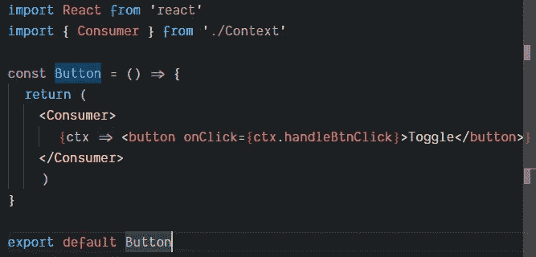

Button.js

你可能会注意到，仅仅为了进入商店，就不得不重复导入消费者并在其中包装一个组件——我们稍后也会谈到这一点，以保持我们的代码[干燥](https://en.wikipedia.org/wiki/Don%27t_repeat_yourself),并使我们的开发生活更容易！

那还有什么可做的呢？没错—我们必须将按钮导入到应用程序中，并在页面上呈现它！

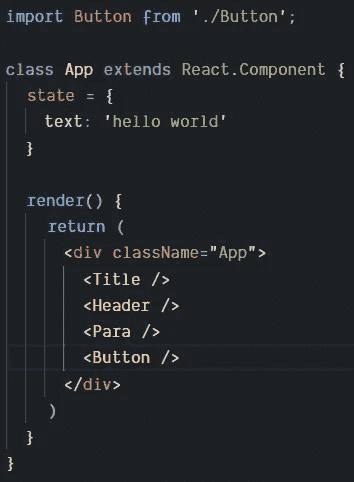

App.js with newly created Button component

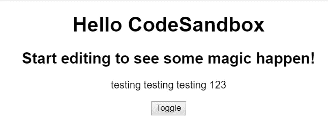

Updated web app with Button component and context with a function to change the store’s data

但是等等！如果我们点击按钮，什么都不会发生！实际上，我最近第一次摆弄上下文 API 时遇到了这个问题。你必须考虑我们如何制造功能，它在哪里，以及 React 中的组件生命周期。

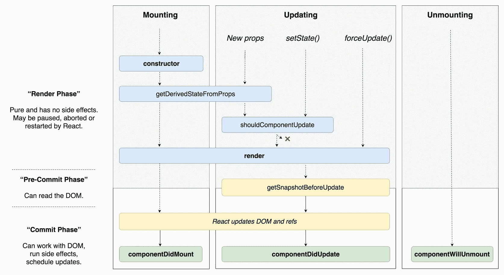

[https://cdn-images-1.medium.com/max/2000/1*cEWErpe-oY-_S1dOaT1NtA.jpeg](https://cdn-images-1.medium.com/max/2000/1*cEWErpe-oY-_S1dOaT1NtA.jpeg)

我们创建的提供者是一个类，我们将切换函数作为该类的一个方法。这个方法也包含在 state/store 中，那么当我们单击这个按钮时，为什么什么也没有发生呢？根据生命周期，组件首先被呈现，此时函数仍然为空。实际上，我们可以用几种方法来解决这个问题。

## 构造器

当我学习 React、state、props 和所有东西时，我总是从在类中定义构造函数并在构造函数中设置状态开始。如果您不熟悉它，让我们来看看它是什么样子的:

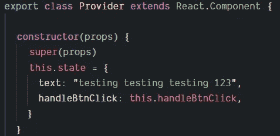

Context.js

通常的做法是总是在类构造函数内部调用 super。当我们声明状态时，你必须用关键字 *this* 将它链接到这个类。这现在起作用了，因为当应用程序运行时，JavaScript 首先运行函数和变量的声明——这不同于调用或操作函数。根据 React 生命周期，类中的构造函数是第一个被操作和调用的函数。

## 组件安装

这是另一种生命周期方法，我们可以用它来解决这个问题。这样做的原因是因为这个方法是在组件呈现在页面上之后调用的，并且我们定义的方法不再是 null。

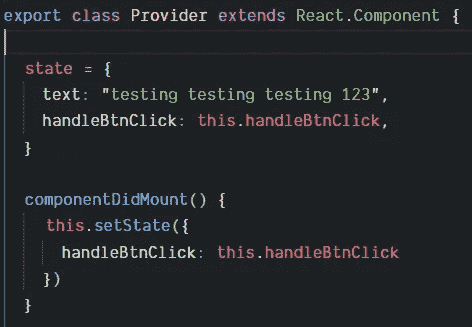

Context.js

我可以在这里打勾，但是因为生命周期不会改变，而且这个生命周期方法在渲染时只运行一次，所以基本上没有必要；我们知道状态的 handleBtnClick 的值为 null，它不会被多次调用。

现在成功了！哈利路亚！

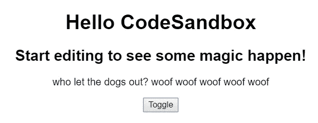

> 仅仅是向商店中添加一个功能，并使它对其他组件可用，然后用一个按钮触发它，这看起来就很麻烦！但是你做到了，或者你现在明白了！

# 变好

还记得我说过我们会研究如何让我们的 coe 变干，让我们的生活变得更轻松吗？好吧，我们现在就来看看！我们可以使用一个[更高阶的组件](https://reactjs.org/docs/higher-order-components.html)来设置一个组件来读写存储器。这样，如果您希望 20 个组件能够访问存储，您只需编写一次！

我认为，如果我们看看最终的结果，然后看看我们是如何做到这一点的，就会更容易理解。


Para.js

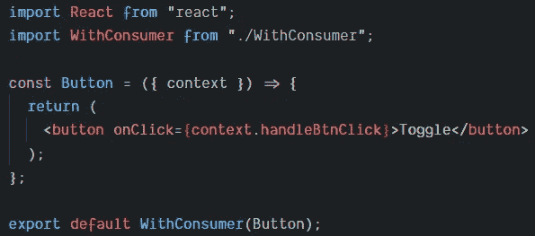

Button.js


看到这有多好了吗？！？！它要干净得多，而且你不必再重复写那些糟糕的消费者广告了！这对大型应用程序来说是理想的，因为你节省了大量的时间，当你有多个开发人员同时工作时，这将大大减少破坏应用程序的小错误和浪费时间修复它。

因此，让我们来了解一下什么是高阶组件，以及它的魔力是如何帮助实现这一点的！

> 简单地说，高阶组件是返回另一个组件的组件。这对于像这样的重复情况来说是非常好的——无论是关于方法、属性还是语法情况。

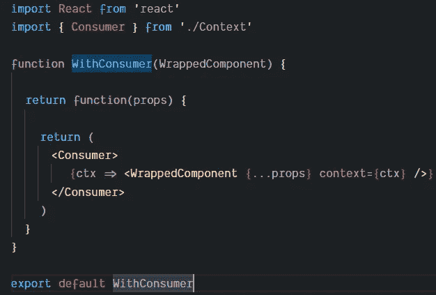

WithConsumer.js

就这样吧！如果你来自一个面向对象的背景，那么你可以认为这是一种类的继承。但是可以认为它包含了一个模块(我想是 Ruby ),而不是继承。

# 最近更新

以前，您只能从类/函数的呈现/返回范围区域内的存储中读取。但是现在你可以在它之外使用**上下文类型**！

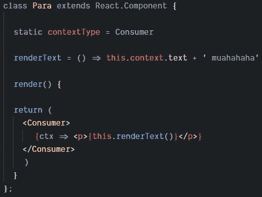

Para.js with contextType

如果你对什么是[静态](https://developer.mozilla.org/en-US/docs/Web/JavaScript/Reference/Classes/static)不熟悉，你可以认为它是一个类方法，但这真的没关系——重要的是，如果你看一看 renderText 方法，你会看到我可以通过 *this.context* 访问商店！它非常聪明，让我们的生活变得更容易，让我们可以更灵活地使用上下文 API。

*注意，在这个简短的演示中，我必须将 Para 从一个功能组件更改为一个类。

> 不幸的是，你不能用这个更新来代替以前的实现。我发现当商店被更新时，你没有订阅那些更新，组件也没有被重新呈现。因此，您必须将此更新与以前的实现结合使用。

幸运的是，如果你像我们之前那样使用一个 HOC，那么你已经可以访问函数/类的所有区域了。它订阅更新并相应地重新渲染！

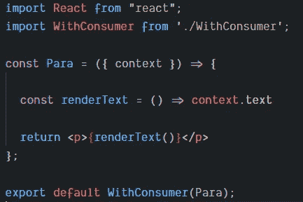

Para.js

# 演示

你可以在这里找到我用的沙盒。

*我必须更新 React 和 React-DOM 版本，以使上下文 API 的更新能够工作——以防您也在自己的沙箱上尝试它，但它不起作用。

