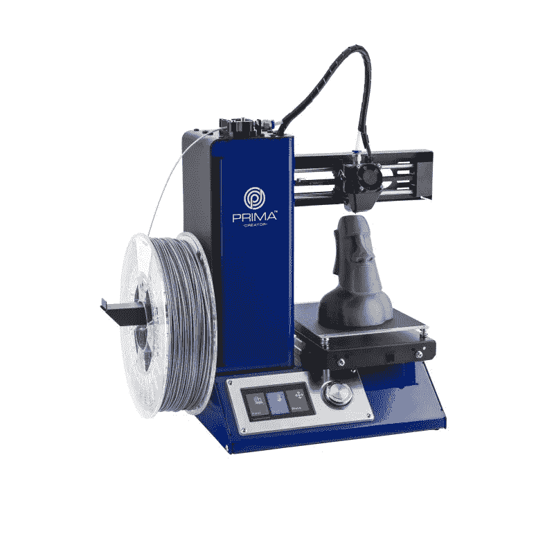
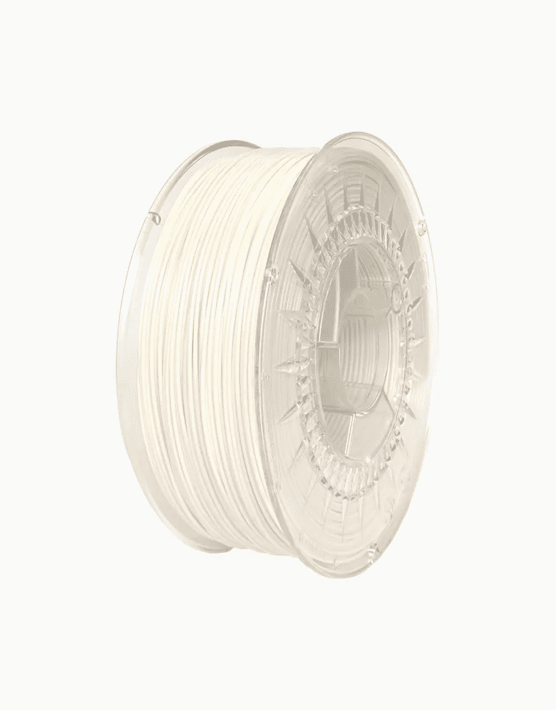
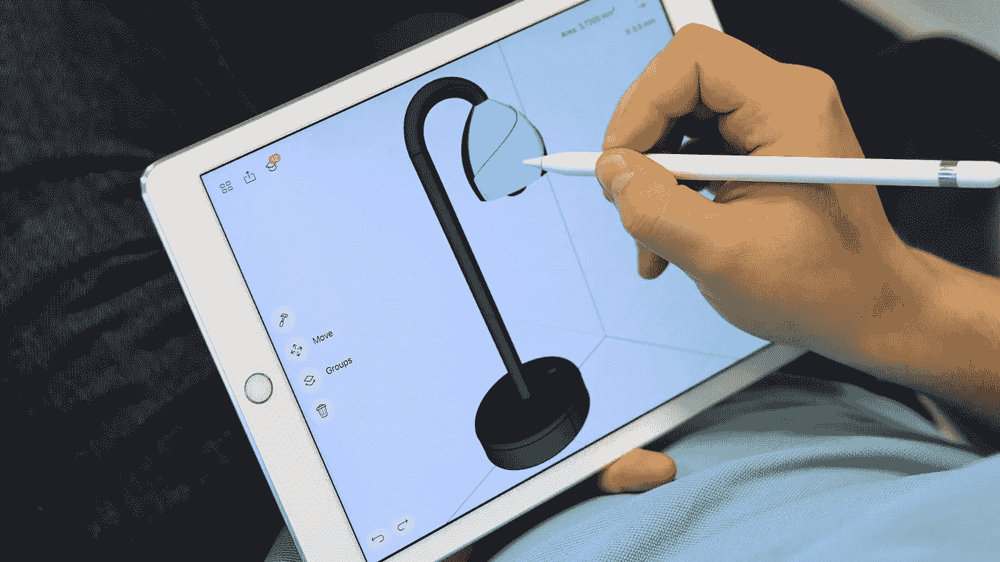
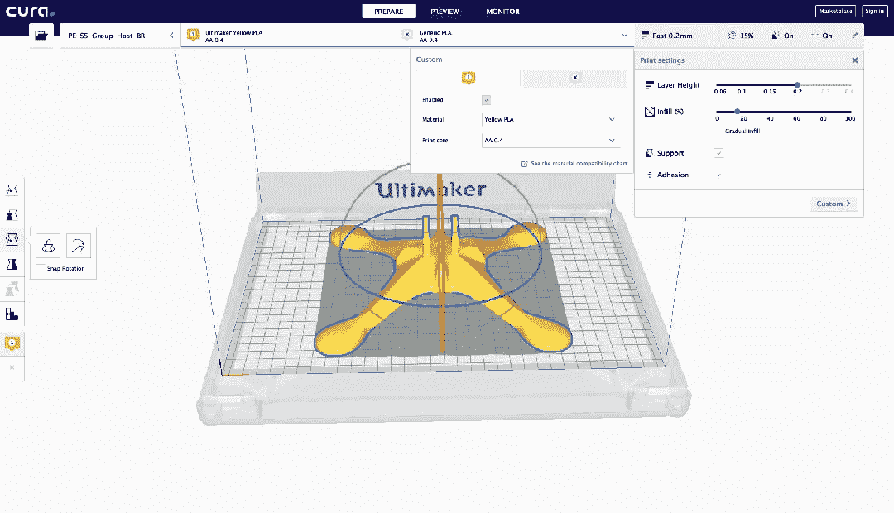
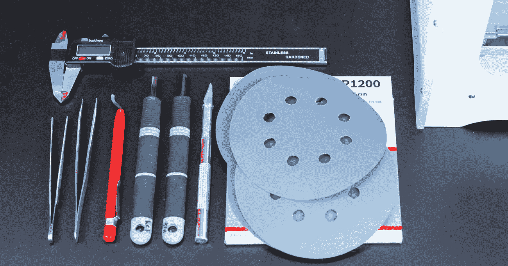
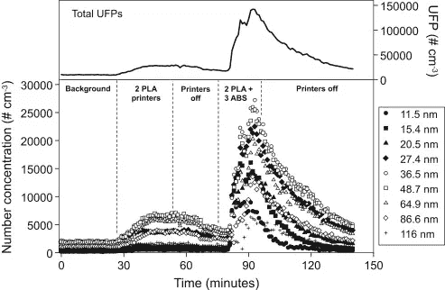

# 3D 打印入门

> 原文：<https://medium.datadriveninvestor.com/getting-started-with-3d-printing-7115f1aa87f8?source=collection_archive---------4----------------------->

我最近开始使用 3D 打印——“创客”文化让我越来越喜欢，我觉得能够为随机的物联网项目打印自己的外壳(或可爱的低聚动物)是在产生新想法时实现完全自主的必要步骤。

我买了一台便宜的打印机并做了一些研究，下面我将与你分享这些发现。

 [## 生活在算法社会——数据驱动的投资者

### 鉴于当今最新技术扩散到我们的日常生活中，毫不夸张地说…

www.datadriveninvestor.com](https://www.datadriveninvestor.com/2018/08/17/living-in-the-algorithmic-society/) 

# **获取打印机(或不获取)**

你可以通过像 [3D Hubs](https://www.3dhubs.com/3d-printers) 这样的服务让其他人在互联网上打印你的模型——然而，如果你经常这样做，这将变得相当昂贵，而且无论如何反馈时间在几天之内。

如果您自己拥有一台打印机，您可以轻松创建(或下载)您想要打印的模型，在几个小时内完成，并在您对结果不满意时快速改进和重复该过程。

3D 打印机仍然有点贵，但如果你的要求不是那么高，**你可以找到一台质量好的打印机，价格大约 200 或 300 欧元**。

我去买了一台 **Prima Creator P120 v3.1** ，在他们的[网站上只卖 219 欧元](https://primacreator.com/collections/3d-printers/products/primacreator-p120)——最大打印量很小(12x12x12)，但对我来说已经够用了，我仍然很满意这次购买——一台整体非常坚固的打印机。

3D Hubs 保留了一个索引，您可以通过价格比较 3D 打印机，并在此处查看。

# 灯丝

在选择你想要使用的细丝时，你确实有一些选择，通常这种选择是基于你的 3D 打印模型的最终用途(强度、耐热性等等)。

最常见的材料是 **ABS** 和 **PLA** 。ABS *(或丙烯腈丁二烯苯乙烯)*在抗冲击性能和韧性方面尤其出色，但它需要稍高的印刷温度(230°C)，并且需要加热床以避免翘曲。

**ABS 不环保，众所周知印刷时会产生致癌物质和超细颗粒**，因此我建议你为自己的爱好作品选择其他东西。

PLA *(或聚乳酸)*是由有机材料甘蔗和玉米淀粉制成的——这使它成为一种环保的选择，你很可能不会从中得到癌症(与 ABS 不同，它产生的烟雾不会太糟糕)。它可以在 180°C 到 200°C 的温度下熔化，虽然不需要加热床，但最好在 60°C 左右

**PLA** 不能用化学方法弄光滑(比如用丙酮)，但是如果你想给它上漆，可以用砂纸处理。最终产品通常在美学上更令人愉悦(但强度和柔韧性较差)。

1 公斤灯丝的价格约为 20 或 30 欧元——对我来说相当不错，因为我的大多数型号都使用克数范围内的量。确保你选择的品牌能生产出高质量的聚乳酸纤维，并且尽可能不使用颜色，因为这样更安全。另外，把你的卷轴存放在干燥的地方，可能的话用一些干燥剂来帮助。

# **建模**

Thingiverse 和其他类似的网站上有很多有用的模型，从 Arduino-enclosures 到任天堂 Switch 脚架和可爱的动物，你可以免费下载，然而，当你需要的东西在互联网上找不到时，你可能想开始自己创作一些设计。

SketchUp、TinkerCad、Blender、Umake、Shapr3D 和许多其他软件都是可行的解决方案，有些甚至是免费的或提供免费层。学习 CAD 是一个好主意，例如这里的，但除此之外，在设计 3D 打印时，还有一些规则要记住。

3D Hubs 再次列出了这些规则[和其他有趣的教程，如“](https://www.3dhubs.com/knowledge-base/key-design-considerations-3d-printing)[3D 打印的外壳设计:分步指南](https://www.3dhubs.com/knowledge-base/enclosure-design-3d-printing-step-step-guide)”和“[如何设计 3D 打印的搭扣配合接头](https://www.3dhubs.com/knowledge-base/how-design-snap-fit-joints-3d-printing)”。

# 限幅

切片是转换 3D 模型的必要操作(通常在。stl 格式)转换成 **gcode** 文件，这是一种标记语言，描述了打印机创建最终对象必须遵循的(分层)路径。

Ultimaker Cura 是一款切片应用，尽管名为 Ultimaker Cura，但它与任何打印机都兼容。

您可以将自己的打印机添加为默认打印机(因此设置将基于它进行优化)，打开模型，缩放它，旋转它和其他操作，但最重要的是您可以设置:

*   **层高:**每层的高度，这个值越低，打印的时间越长但是质量会更高。0.15–0.2 毫米适用于大多数情况。
*   **填充:**通常为 20%，定义了对象将被填充的程度，以及它的强度和打印所需的时间([示例](https://i2u8w8i3.stackpathcdn.com/wp-content/uploads/2015/03/infillpercentimage.png))。
*   **支撑:**切片软件可以自动给模型添加支撑，如果[伸出](https://www.3dprintingmedia.network/wp-content/uploads/2017/07/Shiba-Dense-Support-Extruder.jpg)部件，这是强制性的(但我发现我可以打印出 10-20 毫米没有支撑的桥)。
*   **粘合:**类似贴纸的第一层，帮助被打印物体粘在床上。

# 工具

有一些工具经常会派上用场，你应该把它们放在打印机旁边的工具箱里。

*   **遮蔽胶带**是印刷床最基本、使用最广泛的表面覆盖物。将遮蔽胶带添加到打印床上是帮助 3D 打印对象更好粘附的简单方法。此外，这种胶带还可以更容易地移除打印成品，并保护您的打印床免受刮擦。
*   一个**数字卡尺**将会有很多应用:你可以用它来检查你的印刷品的精度，并在 CAD 软件中测量你想要复制的部分的尺寸(或者检查你的细丝的实际直径，通常是 3 或 1.75 毫米)。

*   **镊子**我经常在打印机开始打印之前用它来堵住喷嘴中渗出的细丝，或者用来清理 3D 打印。
*   **调色刀:**当 3D 打印粘在你的打印床上，以至于你无法用手将其移除时，你可以使用调色刀试着钻到打印下面，小心地将它从打印床上撬下来。
*   一把**手术刀**来对你的打印进行后期处理:3D 打印很少会完美，你可能需要去除打印过程中出现的塑料斑点或细丝线。

# 维护

每隔几个月，您就要对打印机进行保养，以保持其平稳运行并打印出高质量的打印品。您应该:

*   **清理打印机周围的区域**:灰尘和灯丝堆积，可能会危及风扇和其他移动部件。
*   **润滑**:在轨道和杆上滴 1-2 滴缝纫机油，可保持打印机运转顺畅。其他润滑剂也可能有效，但要确保它们与塑料一起使用是安全的，不要使用太多，因为它会吸引灰尘和污垢。
*   确保**螺钉和螺栓拧紧，如果松动则更换皮带**。
*   **清洁喷嘴**和**挤压齿轮**:堵塞会严重影响 3D 打印产品的质量，总的来说，这些部件很容易被碎片破坏。如果需要，您也可以更换这些部件。
*   **更换破旧的床**:你正在建造的地方可能会被刮伤，影响你的 3D 作品的外观和完整性。
*   **更新**您的打印机固件

这里有一个很好的视频，详细展示了一次彻底的保养:

# **健康**

3D 打印正在快速传播，但人们很少意识到这种有趣、有用且有点令人着迷的制造过程对健康的危害。这是值得了解的，尤其是最近打印机出现在学校或针对儿童。

我已经谈过 ABS 灯丝的危险，这种灯丝会产生致癌的有毒气体，并且在自然界中不会降解。 **PLA** 是一个更安全的选择(也是环保的),但是你仍然可以采取一些措施来避免不必要的接触有毒化学品或超细颗粒:

*   使用高质量的无色细丝，**可以用有争议的材料生产更便宜的卷轴**，我们缺乏关于熔化有色热塑性塑料的影响的数据。

*   **保持打印环境通风**，在打印机工作时打开窗户和/或打开通风。
*   如果可能的话，不要在你的卧室/客厅/厨房打印，而是将打印机移到地下室或车库。
*   选择较低范围内的印刷**温度(例如 PLA 为 180-195°C)**

***想了解更多关于 3D 打印和创新的知识？关注@lucavallin 上*** [***推特***](https://twitter.com/lucavallin) ***和***[***Github***](https://github.com/lucavallin)***或者来*** [***Xebia 工作室***](https://www.xebia.studio/) ***和我们见面吧！***