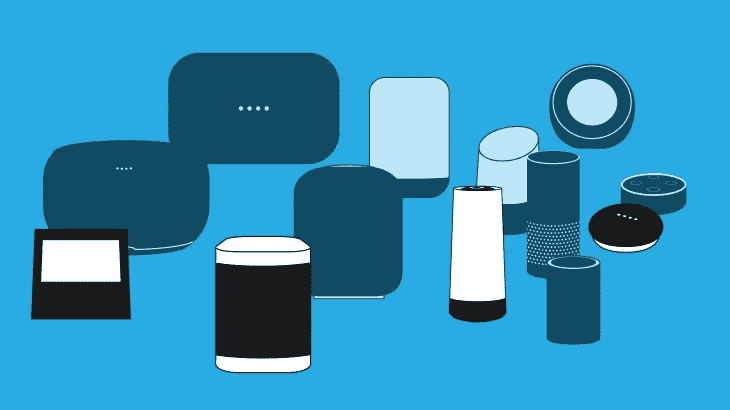

# Alexa 和 Alexa 自定义技能入门

> 原文：<https://medium.datadriveninvestor.com/getting-started-with-alexa-and-alexa-custom-skills-674f35ee17b?source=collection_archive---------3----------------------->

# P1。语音优先技术的魅力

Source: techcrunch.com

他的博客不仅面向开发者，也面向那些想更多了解 Alexa 的新手。因此，博客的第一部分包含了一些关于 Alexa 和其他虚拟助手的历史和一般知识。如果你想直接进入更技术性的部分，可以跳过第一部分。然而，在弄清楚如何帮助它之前，真正理解一个中断可能有多大是不是更令人着迷？如果是，那么让我们回到几年前……

# Alexa，跟我说说你自己

2014 年末，亚马逊向世界推出了一款名为 Echo 的音箱。乍一看，它的设计并不特别——一个黑色、高大、圆柱形的扬声器，能够产生 360 度的声音系统。然而，让 Echo 在技术世界如此引人注目的是它的内在。它的名字是 Alexa——内置在扬声器中的基于语音的虚拟助手。在那个时候，虚拟助手并不是一个突破性的发明，考虑到 3 年前，苹果已经通过展示 Siri——它自己的虚拟助手——如何帮助用户设置闹钟、提醒、查看天气情况、股票价格甚至导航，震惊了世界。

# Alexa，你和其他助手有什么不同？

在第一次发布时，Alexa 与 Siri 相比最大的不同可能是调用方式。亚马逊 Echo 在机器顶部配备了 7 片麦克风阵列。这意味着用户可以从一定距离调用或“呼叫”Alexa。这在今天可能看起来没什么大不了，尤其是如果你已经看到 Google 在 Duplex 上走了多远。然而，在那个你必须手动按住 iPhone 上的 Home 键才能调用 Siri 的时代，Alexa 让用户开始交互的方式在一个低价位设备中相当令人印象深刻。

自普通消费者有机会真正与他们的设备交谈以来，已经超过 6 年了。语音优先技术的游戏已经迎来了许多新来者。两大巨头微软和谷歌联合了谷歌助手和 Cortana。然而，除了通过基于语音的命令以及媒体消费解决用户问题的重叠核心功能之外，每个语音优先平台都有自己的优势和重点。Alexa 正在改变在线购物时的消费者行为，从使用基于文本的搜索查询转向基于语音的命令。基于亚马逊的大量服务，以及消费品品牌和智能家居制造商的逐步支持，Alexa 和语音优先技术总体上有望飞得更高，毫无疑问，将更多的客户注意力吸引到他们的平台上。

# 语音优先技术的未来在哪里？

让我们首先重新考虑为什么我们要采用这种非常规的电子设备交互方式。第一个也是最重要的可能是我们对这样一种与计算机交互的新方式的好奇和兴奋，这种方式以前只能在科幻小说中找到。接下来，解决一定量的任务，只需要找一个助手，更快、更方便、更直观。最后但同样重要的是，考虑到科技巨头积累的数据量和人工智能系统的反馈，客户可以期待随着时间的推移获得更好的体验。他们花在与设备互动上的时间越多，就能得到越好的定制。

那么，面对所有这些巨大的潜力，我们应该期待什么呢？尽管采用率不太可能在 1 或 2 年内飙升，但该数字乐观地预计到 2022 年将达到美国市场的 55%。特别是对于 Alexa，RBC 资本市场在一份报告中表示，到 2020 年，Echo 智能音箱可以帮助亚马逊获得[100 亿美元的收入。收入来源分为三个主要渠道:支持 Alexa 的设备的销售，语音驱动的购物销售，平台收入，因为亚马逊可以向支持语音的技能提供商收取平台上突出位置的费用，以及为客户提供云解决方案的 AWS。](https://www.cnbc.com/2017/03/10/amazon-alexa-voice-assistan-could-be-a-10-billion-mega-hit-by-2020-research.html)

## 它比仅仅卖东西更漂亮

商业目的无疑是每个语音优先平台的主要关注点。然而，仅仅关注促进销售可能会使人们忽略语音系统被指定用于以自然、直观的方式解决用户问题的核心原因——语音。在我看来，语音优先技术的魅力在于它与人互动的直观方式。

# 然而，这只是故事的一面

正如我们所见，语音优先技术一直在不断进步，因此从长远来看潜力巨大。尽管如此，[普华永道](https://techcrunch.com/2018/04/30/younger-consumers-adopt-voice-technology-faster-but-use-voice-assistants-less/)最近一份关于语音助手的报告实际上显示，尽管年轻人正在引领采用语音应用的潮流，但他们使用虚拟助手的频率却在下降。这可能是由许多原因造成的，包括隐私和安全，缺乏用户的信任，助手本身的有限能力，更重要的是，用户在与语音助手交互时发现的复杂体验。

那么，谁对这些负责呢？关于信任的毁灭，我们可能知道科技巨头如何出于商业目的操纵我们的个人数据。然而，在我看来，这是否会对我们的生活产生负面影响是一个客观的观点。对我个人来说，我想对许多其他人来说，我愿意交出我的个人数据，如电子邮件或在线活动，以获得更好的产品/服务和更好的购买体验。如果 Alexa 跟踪我搜索到的商品的历史，以合理的价格向我推荐一款好产品，更重要的是，在合适的时间，我无疑会考虑这个建议，甚至购买该产品。其次，关于处理用户请求的能力，虚拟助手变得越来越好。如果你听过或看过 Google Duplex 如何使用几乎像人类一样的声音来安排与人类同行的预订，你就知道我说的是实话。

最后，开发人员在为虚拟助手开发“技能”时需要解决一个大问题。我们如何才能让用户体验像语音对话应该的那样简单、直观和流畅？这听起来可能很简单，但是，它确实需要深刻的理解，不仅在技术方面，而且在用户期望与设备交互方面。换句话说，作为开发人员，我们如何才能促进用户的旅程:从他们调用助手的时间，直到他们得到他们想要的东西，更重要的是，他们对他们得到的东西和他们得到它的方式感到满意。这也为用户提供了更多进一步互动的动力。因此，用户在与设备交互时感觉越舒服，他们就会越频繁、越愿意使用它。

## 感谢阅读《Alexa 和 Alexa 自定义技能入门》第一部分。在下一部分中，我将简要地向您介绍在了解交互模型、亚马逊开发者控制台和 Lambda 函数之后，如何构建一个简单的 Alexa 技能。敬请期待！

## 在 SM 上打招呼:[脸书](https://www.facebook.com/VinhLee95)，[推特](https://mobile.twitter.com/vinhle95)， [LinkedIn](https://www.linkedin.com/in/vinhlee95/) ，或者我的[个人网站](http://vinhlee.com/)。

## 敬请关注即将到来的科技博客👈👈👈