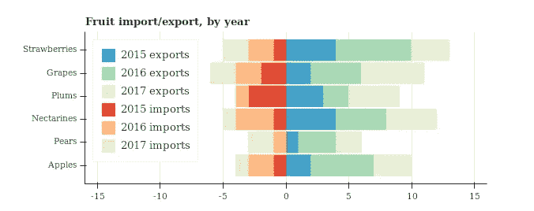
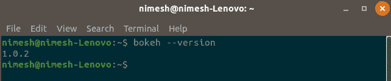
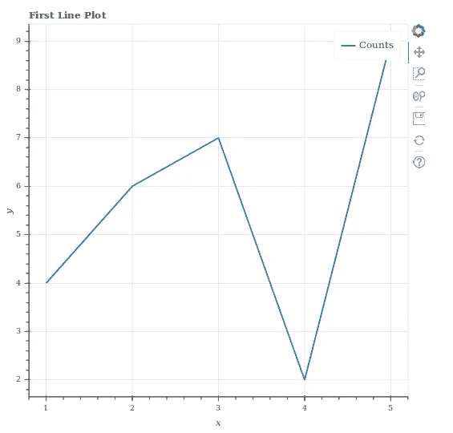
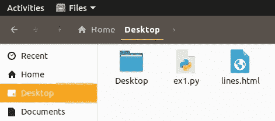
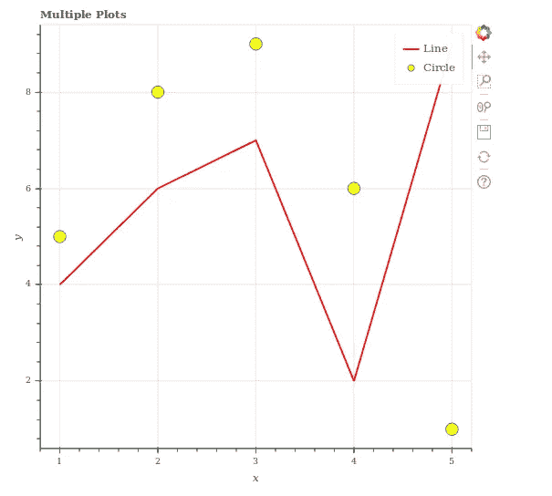
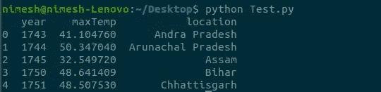

# Bokeh 和 Python 入门:第 1 部分

> 原文：<https://medium.datadriveninvestor.com/getting-started-with-bokeh-and-python-d9ccff53f4ff?source=collection_archive---------11----------------------->

Bokeh 是一个交互式 Python 数据可视化库，面向现代 web 浏览器进行演示。Bokeh 致力于提供优雅、简洁的多功能图形结构，并通过超大型或流式数据集的高性能交互来扩展这种能力。使用散景，您可以创建交互式绘图、仪表盘和应用程序。它可以很容易地将大量数据可视化，并以一种吸引人的方式创建不同的图表，使其更容易阅读和理解。



散景提供了两个简单、适应性强的界面级别，并给出了两个界面级别:

## **散景模型**

为应用程序开发人员提供最大灵活性的*底层*接口。

## **散景绘图**

一个*更高层次的*界面围绕着组成视觉符号

让我们从散景装置开始:

**依赖关系:**NumPy

我们可以使用 conda 或 pip 安装散景

**使用** [**康达**](https://conda.io/docs/) **:**

> sudo conda install bokeh

**使用**[**pip**](https://www.datacamp.com/community/tutorials/pip-python-package-manager)**:**

> sudo pip 安装散景

要检查它是否安装正确，您可以在终端中键入以下命令。



一旦安装了散景，让我们跳到一个小程序。

```
**from bokeh.plotting import figure, output_file, show**# data sets
**x = [1, 2, 3, 4, 5]
y = [4, 6, 7, 2, 9]**# output is generated to static HTML file **output_file("lines.html")**# create a new plot with a title and axis labels **p = figure(title="First Line Plot", x_axis_label='x', y_axis_label='y')** #plot the line graph on the figure **p.line(x, y, legend="Counts", line_width=2)** # show the results **show(p)**
```

当我们执行这个脚本时，我们会看到在代码所在的目录中创建了一个新的输出文件`"lines.html"`,浏览器会自动打开一个新的选项卡来显示它。



如你所见，一个 html(*lines.html*)被自动创建并在浏览器中打开。 *(ex1.py 为源代码)*

让我们破解前面提到的代码并理解它

```
**x = [1, 2, 3, 4, 5]
y = [4, 6, 7, 2, 9]**
```

在这里，我们准备了一些数据来绘制图表。我们必须确保 x 和 y 中的值长度相同。

*例:x=[1，2，3，4] y= [6，8，9](会显示错误)*

```
**output_file("lines.html")**
```

output_file()，文件名为“lines.html ”,生成输出。这告诉 bokeh 在哪里生成输出。*(如果你用的是 Jupyter Notebook 那就用 output_notebook())。*

**参数:**

*   **文件名** ( [*str*](https://docs.python.org/3/library/stdtypes.html#str) ) —保存 HTML 文档的文件名
*   **标题** ( [*str*](https://docs.python.org/3/library/stdtypes.html#str) *，可选*)—HTML 文档的标题(默认为:“散景图”)
*   **模式** ( *str，可选* ) —如何包含 BokehJS(默认:`'cdn'`)其中之一:`'inline'`、`'cdn'`、`'relative(-dev)'`或`'absolute(-dev)'`。更多详情见`bokeh.resources.Resources`。

```
**p = figure(title="First Line Plot", x_axis_label='x', y_axis_label='y')**
```

这使得绘图具有平均默认选择和标题和轴标签的简单定制。

```
**p.line(x, y, legend="Counts", line_width=2)**
```

在图上，我们显示了我们想要的绘图，如直线、圆、阶梯、vbar、hbar、三角形等，它们是绘图的子类，使用默认轴、网格、工具等简化了绘图的创建。在这里，我们使用 line()作为我们的数据，可以定制颜色、图例和宽度等。我们也可以在一个图形上显示多个图。

你可以在散景[这里](https://bokeh.pydata.org/en/latest/docs/reference/plotting.html#bokeh.plotting.figure.Figure.arc)看到各种类型的图形。

```
**show(p)**
```

这是用来展示剧情的。因此，当我们执行代码时，这将自动在已创建的默认 web 浏览器上打开静态 html 文件。

## 多重情节

一个图形中可以有多个图

```
**from bokeh.plotting import figure, output_file, show**# data sets
**x1 = [1, 2, 3, 4, 5]
y1 = [4, 6, 7, 2, 9]****x2 = [1, 2, 3, 4, 5]
y2 = [5, 8, 9, 6, 1]**# output is generated to static HTML file **output_file("lines.html")**# create a new plot with a title and axis labels **p = figure(title="Multiple Plots", x_axis_label='x',y_axis_label='y')**#plot the line graph on the figure and setting up color and width **p.line(x1, y1, legend="Line",color="red", line_width=2)**#plot the circle graph on the figure and setting up color and size
**p.circle(x2,y2,legend="Circle",fill_color="yellow",size=15)**# show the results **show(p)**
```

输出将是这样的:



# 运行散景服务器

我们上面看到的所有例子都创建了一个静态 html 文件，这意味着我们有静态图形，但我们也可以通过散景服务器在散景中创建一个动态图形。

散景的架构是这样的，高层次的“模型对象”(代表像地块，范围，轴，字形等东西。)是用 Python 创建的，然后转换成 JSON 格式，由客户端库 BokehJS 使用。

然而，如果有可能保持 python 和浏览器中的“模型对象”彼此同步，那么更多额外的和强大的可能性就会立即出现:

*   使用 python 的全部功能，通过计算或查询来响应浏览器中生成的 UI 和工具事件
*   自动将服务器端更新推送到 UI(即浏览器中的小部件或绘图)
*   使用定期、超时和异步回调来驱动流更新

这种在 python 和浏览器之间同步的能力是散景服务器的主要目的。

让我们举个例子:

我们有一个 *temperature1.csv* 文件，其中包含从 1743 年到 2013 年最高温度的州的样本数据。



Sample Data

我们将编写一个程序，在图上绘制年和最高温度数据图，当我们选择**(框选)**图上的区域时，它将显示所选区域的所有州。