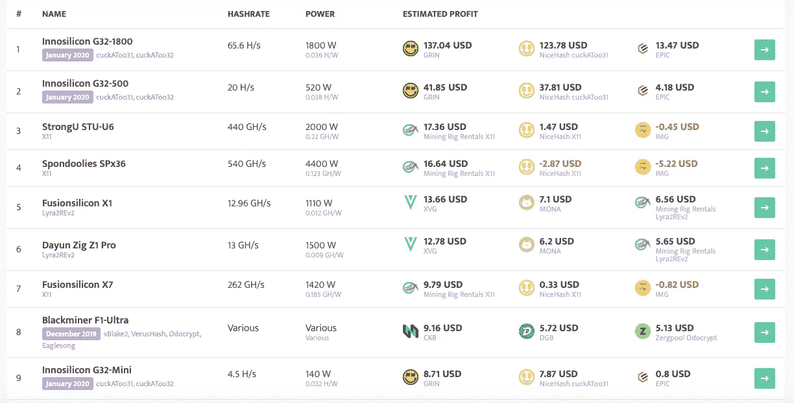

# 加密挖掘入门

> 原文：<https://medium.datadriveninvestor.com/getting-started-with-crypto-mining-48b679265c7b?source=collection_archive---------5----------------------->

*为什么采矿会持续存在，如何开始*

想想这个——根据这篇 [Cointelegraph 文章](https://cointelegraph.com/news/bitcoin-miners-made-14-billion-to-date-securing-the-network)，截至 2019 年 8 月 30 日，比特币矿工已经让**赚了 140 亿美元**。让这一统计数据更加惊人的是，这只是比特币的收入，按市值计算，比特币是最大的加密货币。

再加上其他加密货币如**以太币**和 **Dash** 的采矿收入，这个数字会更高。这证实了以下情况:

> 加密采矿仍然是一项创收业务

作为散户投资者，你如何开始加密挖掘？我们将在本文及其他文章中对此进行探讨。但首先，让我们来了解一下加密挖掘的基础知识。

# 加密挖掘的工作原理

本质上，挖掘有两个目的- **以安全和可验证的方式向区块链添加新交易**以及**向生态系统发布新令牌**。

这是通过矿工用与要开采的特定块相关的加密散列函数解决数学问题来完成的。

 [## 总部位于瑞士的 ETP 进入加密交易市场|数据驱动的投资者

### 虽然金融市场几乎没有沉闷的时刻，特别是在引入…

www.datadriveninvestor.com](https://www.datadriveninvestor.com/2019/03/10/swiss-based-etp-enters-the-crypto-trading-market/) 

如果这听起来过于复杂，一个简化的版本将如下-计算机和服务器同时运行来解决一个数学问题，由此更高的计算能力给出解决问题的更高概率。

解决问题的服务器将因挖掘特定区块而获得硬币奖励！

这种加密挖掘方法保护了网络，因为想要控制网络的黑客需要拥有至少 51%的网络计算能力。除非你愿意并且能够投入大量的资源，否则黑客入侵网络在大多数情况下是不可能的。

开采成功的硬币可以在交易所出售或通过柜台交易(OTC)赚取利润，这就把我们带到了下一点。

# 散户投资者入门

为了使秘密采矿有利可图，它需要一个中长期的努力。对于典型的散户投资者来说，资金和时间都是有限的，所以最好先加入一个矿池。

List of [ASIC miners](https://minerstat.com/hardware/asics) and their returns.Source: minerstat.com

这要求散户投资者使用一个[加密挖掘监控软件](https://minerstat.com/)来跟踪大量变量。这些变量包括但不限于以下内容

*   产生的电费
*   竞赛速度(解方程的速度)
*   交易所的硬币数量
*   整体奖励的估计值
*   您的采矿池的性能(使用什么算法和采矿设备)
*   采矿池收取的费用
*   采矿池的规模——较小的池提供不规则但较高的回报，而较大的池则相反

Minerstat 是一个平台，允许您在单个仪表板中监控大多数这些变量。这将有助于您评估要挖掘哪些硬币，加入哪个挖掘池以及何时将挖掘切换到其他硬币。

欲了解更多详细的矿池评估标准，请阅读 Investopedia 的[指南](https://www.investopedia.com/tech/how-choose-cryptocurrency-mining-pool/)。

# 最佳加密采矿国家

评估进行采矿的管辖区与评估采矿池的性能同样重要。

选择最佳管辖区进行采矿是在降低成本的**和每个管辖区对加密的**规定**之间的平衡。**

成本低的国家可能不是最好的地方，因为它们要么政治局势不稳定，要么对加密持不友好态度，例如对加密收益征收高税率。

考虑到这两个因素，这里有 3 个国家需要考虑加密开采。

**在中国采矿**
说到加密采矿，你永远不能把中国从话题中带走。截至 2019 年初，中国占了比特币网络总哈希值的 70%。

Taken from [Kurious on Pixabay](https://pixabay.com/illustrations/china-flag-hand-thumbs-up-national-641112/)

大量的煤炭和水电供应，加上政府的电力补贴，使得这里成为开采加密技术最便宜的地方之一。

此外，中国政府最近已经将地下采矿从他们想要消除的行业名单中移除。对于这个国家的地下采矿者来说，这是一个令人鼓舞的迹象。

然而，比特币和其他加密货币在中国仍然被禁止。在中国运营的加密交易所也受到了打击。没有人知道秘密采矿是否以及何时会被禁止。这是中国矿业公司不得不承担的风险。

**格鲁吉亚的采矿**
谈到秘密采矿，格鲁吉亚不是一个我们经常听说的国家，但它是一个理想的地点。格鲁吉亚拥有丰富的天然气和水力发电资源，开采成本低廉。

此外，该国已被证明是加密友好的，[免除比特币的增值税](https://news.bitcoin.com/georgia-exempts-bitcoin-from-vat-to-become-the-next-country-to-affirm-its-currency-status/)。这适用于交易密码的公司和个人。由于友好的加密法规和低廉的开采成本，格鲁吉亚是进行加密开采的最佳国家之一。

**在其他欠发达国家**
采矿其他地方，如**科威特**、**巴林、**和**委内瑞拉**都被认为是进行地下采矿的廉价可行的地方。

然而，还有其他因素需要评估，例如他们不稳定的政治局势和炎热的天气可能会增加成本，因为需要更多的电力来冷却。与所有其他地点一样，在做出适合散户投资者的决定之前，需要进行更多的研究。

# 采矿业(仍)会继续存在

尽管目前熊市，加密采矿仍然可以是一个有利可图的长期投资。通过研究矿池和不同的管辖区来降低成本，你会给自己最好的机会以尽可能低的成本积累你相信的硬币。

# 联系我

网址:[www.blockconstellation.com](http://www.blockconstellation.com)
邮箱:jiayung@blockconstellation.com