# 牙科入门。人工智能

> 原文：<https://medium.datadriveninvestor.com/getting-started-with-dentistry-ai-cd1eae606472?source=collection_archive---------33----------------------->

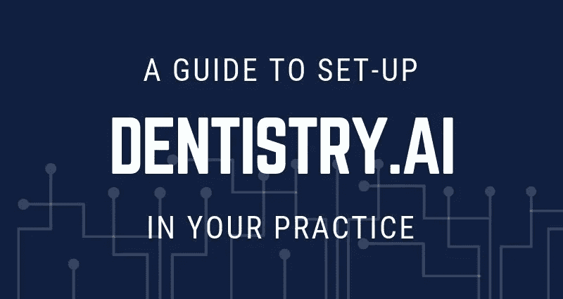

[牙科。AI](http://dentistry.ai/) 是世界上最复杂的人工智能龋齿检测软件之一。牙医可以利用牙科发现许多龋齿。可能被错过的人工智能。牙科。AI 会立即突出显示牙齿 x 光片上有高龋齿可能性的区域，提醒牙医在临床检查中更密切地关注这些区域。

[牙科。AI](http://dentistry.ai/) 与所有类型的 x 射线传感器无缝集成，在几秒钟内检测龋齿。如果你是一名有执照的牙医，并希望与我们一起踏上革新牙科保健的征途，请遵循这个循序渐进的指南来设置牙科。AI 在你的实践中。

1.  **签约成为临床研究员**

*   去看牙医。AI 网站[https://dentish . AI](https://dentistry.ai/)并点击“**报名**按钮。

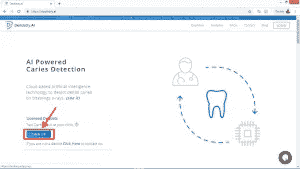

*   您将被重定向到注册窗口。填写详细信息并点击'**提交**按钮。

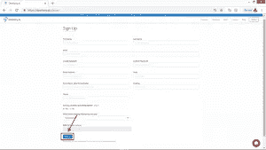

1.  **验证您的电子邮件地址**

*   提交表格后，您将收到一封来自**support @ dentish . ai**的电子邮件。点击邮件中提供的链接以验证您的电子邮件地址。

*   一旦您点击链接，您将被重定向到以下窗口。点击**“前往车间”**

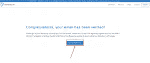

1.  **随船牙科。艾**

*   点击**继续**开始登机程序。

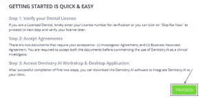

*   您将被重定向到登录窗口。输入您的凭据，然后单击“**登录**”登录您的车间。

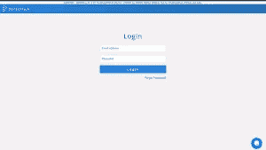

第一步:核实你的牙科执照

*   在提供的空白处输入您的许可证号，然后点击“**提交**”。然后点击“**进入下一步**”。
*   或者您也可以点击“**暂时跳过”**，稍后提交许可证号码。

*注意—如果您未能在入职后 7 天内提交您的许可证，我们可能会暂停您的帐户。*

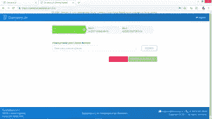

**第二步:审核&接受协议**

*   在下一页，您将看到两份协议——业务伙伴协议和研究者协议，以及另外两份供您参考的文件——研究方案和数据政策。
*   查看所有文档，并接受这两个协议以继续下一步。
*   接受协议后，点击**进入下一步**。

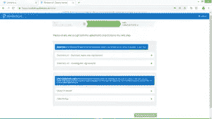

**第三步:下载牙科。人工智能应用与接入研讨会**

*   点击'**下载**，下载该窗口的应用牙科. AI，可以参考视频'[设置牙科指南。艾在你的诊所](https://www.youtube.com/watch?v=VRJm3XJ99JE&feature=youtu.be)调教牙科。人工智能窗口的应用。

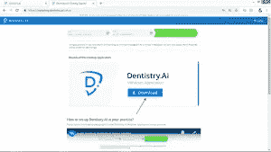

*   如果您想在安装应用程序之前进行测试，也可以点击“**前往车间”**按钮直接进入您的车间。

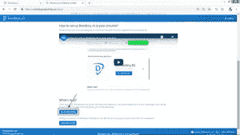

1.  **安装牙科。AI WINDOWS 应用**

*   一旦你点击下载按钮，你将被重新定向到一个网页，安装牙科。AI Windows 应用。点击**安装**和牙科。人工智能安装文件将开始下载。

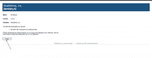

*   双击安装文件' **setup.exe'** 文件，点击'**安装**按钮。这可能需要几分钟，请耐心等待。

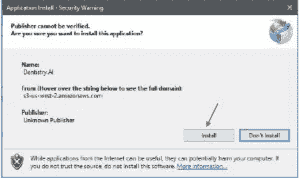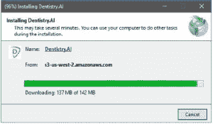

*   一旦安装好设置，点击“**运行**”运行牙科。AI 桌面应用。

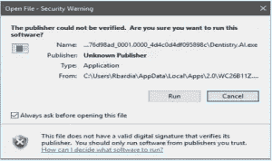

1.  点击**开始**开始使用牙科人工智能桌面应用程序。

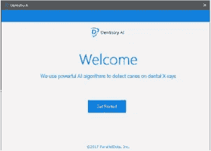

如果您是 Dexis 用户，请参考我们的“[与 Dexis](https://blog.dentistry.ai/2018/11/02/integrating-with-dexis/) 整合”指南，以设置和整合 Dexis 与牙科。AI

