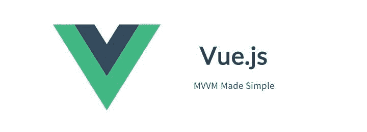
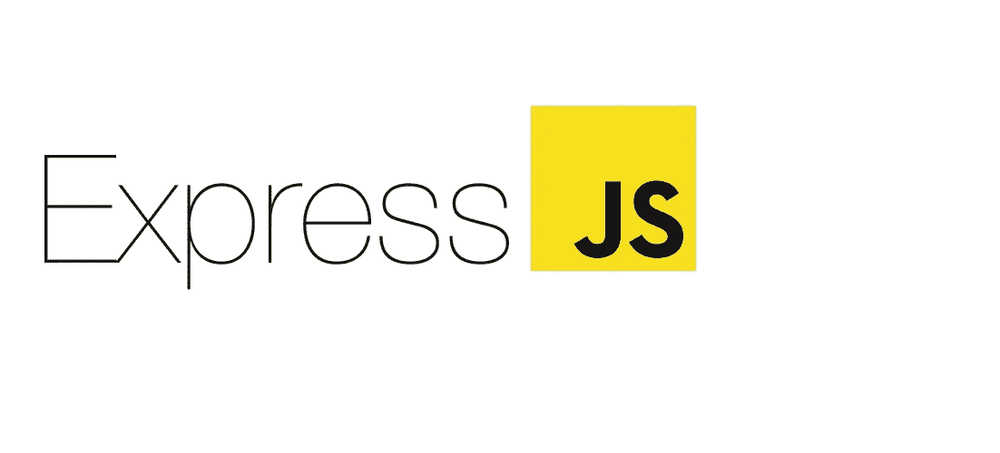
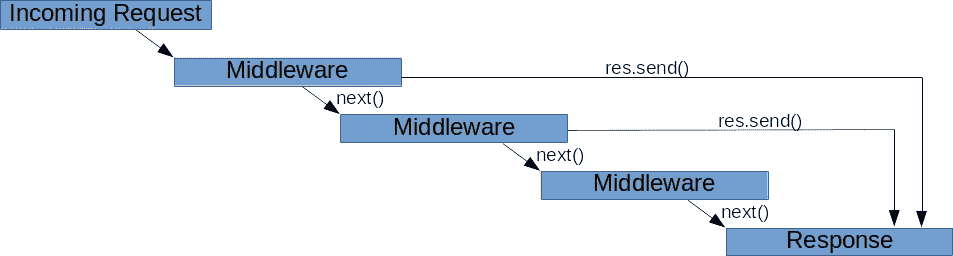
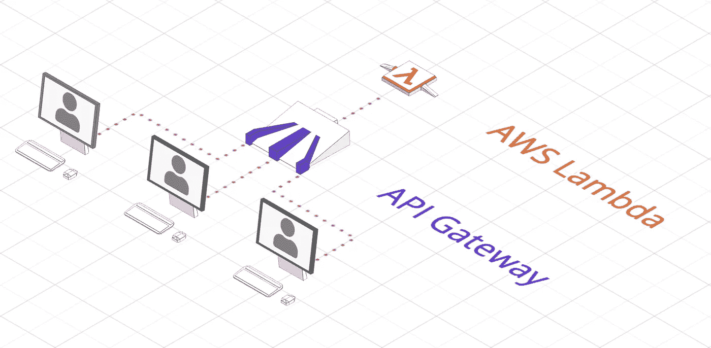

# JavaScript 工具入门

> 原文：<https://medium.datadriveninvestor.com/getting-started-with-javascript-tools-3fcde6be3a88?source=collection_archive---------13----------------------->

JavaScript 已经存在很长时间了。它最初是一种简单的脚本语言，用于 web 早期的客户端需求。现在，它是迄今为止最强大的编程语言之一。

学习 JavaScript 可以让我们构建非常丰富的 web 应用、复杂的微服务架构、健壮的控制台应用、原生移动应用等等。

这里有一些工具，我们可以用 JavaScript 来构建我们的应用程序

## VueJS

VueJS 是一个强大的 web 客户端框架。VueJS 的概念与 Angular 和 ReactJS 没有太大的区别，但是与其他 web 框架相比，VueJS 的学习曲线要低得多。为什么？因为它拥有在 VueJS 框架上构建 web 应用程序所需的所有工具。此外，在我看来，它拥有最好的 API 文档。

## 反应自然

React Native 是脸书开发的一项技术，主要使用 JavaScript 为 iOS 和 Android 创建原生应用程序。我不得不承认，React Native 仍然缺少很多 bug 和东西，使移动平台的开发过程变得轻而易举。

 [## 数据科学和软件工程哪个更有前途？数据驱动的投资者

### 大约一个月前，当我坐在咖啡馆里为一个客户开发网站时，我发现了这个女人…

www.datadriveninvestor.com](https://www.datadriveninvestor.com/2019/01/23/which-is-more-promising-data-science-or-software-engineering/) 

学习这个的好处是，如果你是一个小组织的一部分，并且你的项目的业务需求不是那么复杂，那么学习 React Native 并在你的项目中使用 React Native 将会是有益的。此外，如果您已经熟悉 JavaScript，那么使用这项技术将是轻而易举的事情。

## ExpressJS

ExpressJS 是一个开源节点 API 框架，被后端开发人员广泛用于创建他们的 web APIs。如今，我们也可以使用这个框架来构建我们的微服务架构。

ExpressJS 中吸引开发人员的一个主要特性是“中间件”概念，在这个概念中，您可以在不同的请求中重用一些代码。这在实现验证和处理请求参数和请求体时非常强大。

Middleware Workflow

为什么我推荐这个工具而不是其他 API 框架？是因为它不像其他 API 框架那样有不必要的抽象。ExpressJS 易于充分利用。

## 无服务器 API

如果你想在软件优化过程中的某个时候不用服务器，有几个主机提供商。像微软 Azure 和 AWS(亚马逊网络服务)这样的云服务提供商为开发人员提供使用 JavaScript 创建无服务器 API。

尽管一些研究文章表明在云中实现 NodeJS 比实现 Java 要慢。Java 很快，因为它是编译的，而 JavaScript 是解释的。与 JavaScript 相比，Java 更难部署在无服务器架构中。

这就是为什么我认为使用 JavaScript 实现无服务器 API 比 Java 更好。

## 包装管理

NPM 社区有很多可用的软件包，它们将有助于使软件开发更加容易，因为如果我们的代码库是 JavaScript，我们将会接触到大量的开源软件包。

尽管我不鼓励其他开发者下载他们觉得有吸引力的每一个包，如果他们不能充分利用这些包的话。我总是建议学习 NodeJS 中的基本模块来构建他们需要的功能，而不是从 NPM 安装软件包。这也是为了避免依赖性弱点和依赖性障碍。我们尽可能不希望我们的应用程序与我们使用的包紧密耦合，尤其是当包只有少量贡献者的时候。

## 注意到

学习 JavaScript 的回报会比你想象的更快。随着时间的推移，它在行业中的采用只会获得更多的关注。我建议我们花时间学习目前最流行的 JavaScript 工具，这样我们作为开发人员就可以在当前的 JavaScript 趋势中有所准备。