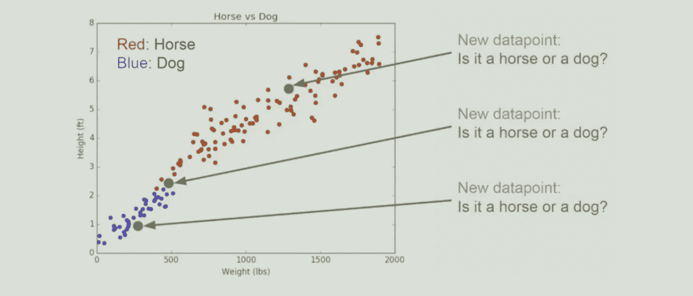
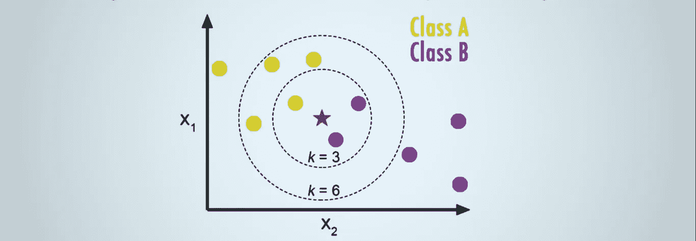

# K-最近邻算法入门

> 原文：<https://medium.datadriveninvestor.com/getting-started-with-k-nearest-neighbors-algorithm-77e4936a120?source=collection_archive---------8----------------------->

KNN 算法非常简单也非常有效。它广泛应用于金融、政治学、笔迹检测和图像识别等领域。在信用评级中，金融机构会预测客户的信用评级。在贷款发放中，银行机构将预测贷款是安全的还是有风险的。它用于解决分类和回归问题。

KNN 是最好的例子！想象一下，我们有一些虚构的狗和马的数据，包括身高和体重。如果我们把它们画出来，我们会得到这样的东西…

红点表示马，蓝点表示狗。我们想知道的是，如果我们得到一个新的动物(新的数据点)，我们只知道它的身高和体重，我们是否能够将其归类为狗或马？根据绿点的位置及其与邻近点的关联，很容易预测它是什么。

 [## DDI 编辑推荐:5 本让你从新手变成专家的机器学习书籍|数据驱动…

### 机器学习行业的蓬勃发展重新引起了人们对人工智能的兴趣

www.datadriveninvestor.com](https://www.datadriveninvestor.com/2019/03/03/editors-pick-5-machine-learning-books/) 

例如，最上面的点可能是一匹马，因为它周围的所有点都是红色的。同样，左下角的点将是一只狗。中间点将取决于您选择考虑的邻居数量。让我们看看你如何选择 K，因为选择 K 会影响一个新的数据点将被分配到什么类。考虑下面的例子。

此处绘制了训练数据，A 类为黄色点，b 类为紫色点。红星表示新的数据点。我们希望预测该点属于 A 类还是 b 类。如果我们选择 K 等于 3，那么我们将查看该新点的三个最近邻点，并明显预测该点属于 b 类。但是，如果我们设置 K 等于 6，我们将拥有大多数黄色点，并最终预测该新点属于 A 类。邻点的数量是核心决定因素。您可以将 K 视为预测模型的控制变量。

KNN 的模型表示是整个训练数据集。简单吧？通过在整个训练集中搜索 K 个最相似的实例(邻居)并总结这 K 个实例的输出变量，对新的数据点进行预测。对于回归问题，这可能是平均输出变量，对于分类问题，这可能是模式(或最常见的)类值。

诀窍在于如何确定数据实例之间的相似性。如果属性的比例都相同(例如都以米为单位),最简单的方法是使用距离测量值，例如欧几里得距离、汉明距离、曼哈顿距离和闵可夫斯基距离，这是一个可以根据每个输入变量之间的差异直接计算的数字。

# 赞成的意见

*   很简单。
*   适用于任意数量的类。
*   您可以随时更新和管理您的训练实例，以保持预测的准确性。
*   需要的参数很少。大多数情况下，K 和距离度量使得调整参数变得容易。

# 骗局

*   距离或接近度的概念在非常高的维度(大量的输入变量)中可能会失效，这可能会对算法在您的问题上的性能产生负面影响。这被称为维数灾难。它建议您只使用那些与预测输出变量最相关的输入变量。

希望你能更好地理解 K 近邻是如何在幕后工作的，你可以看看本系列的第二部分，在这里我们将使用 python [实现 knn。](https://medium.com/datadriveninvestor/implementing-k-nearest-neighbors-with-python-1c0b7cdf85f2)