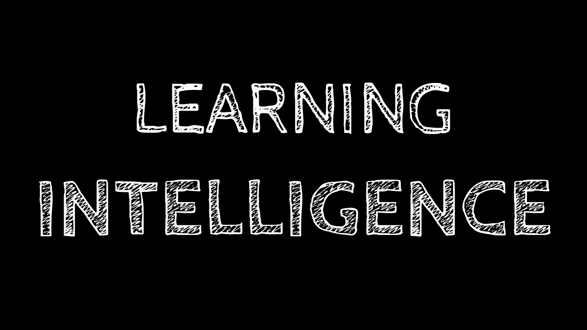
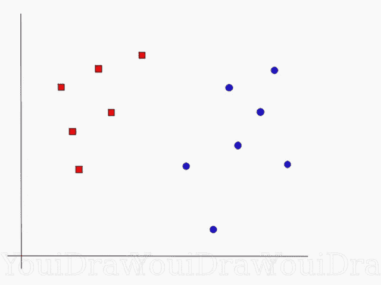
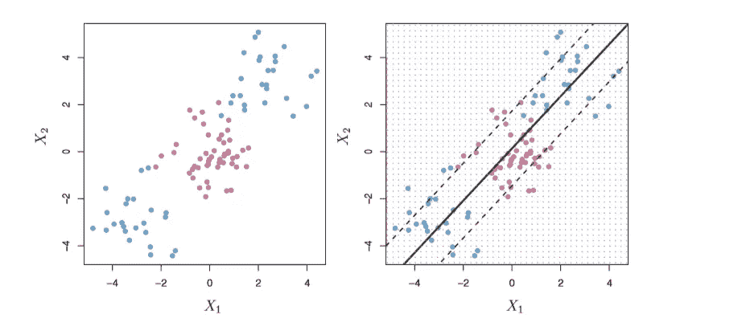
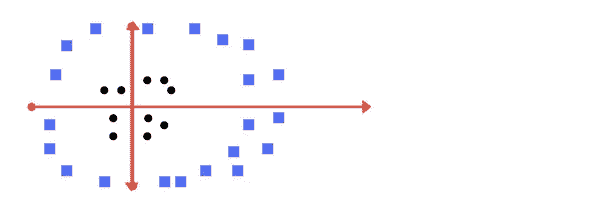
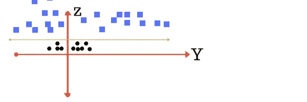
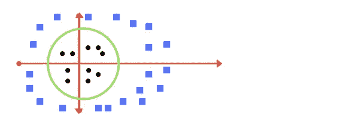
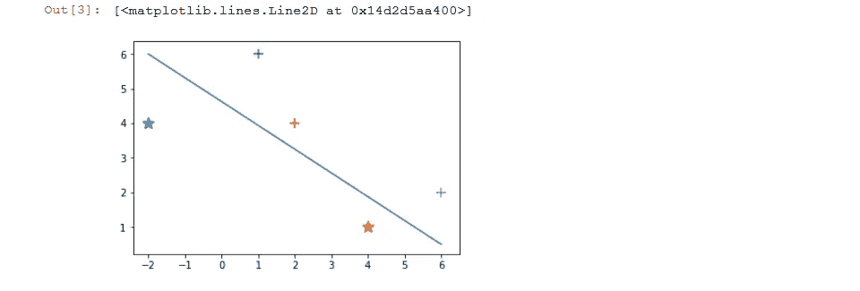
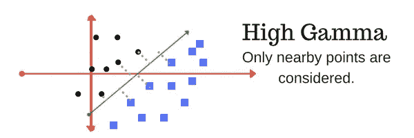
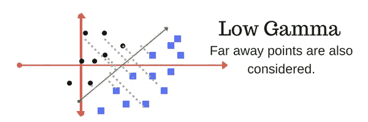

# 简而言之，支持向量机(SVM)

> 原文：<https://medium.datadriveninvestor.com/getting-started-with-svm-551fec2589d5?source=collection_archive---------4----------------------->

[](http://www.track.datadriveninvestor.com/1B9E)

正如我在我的一篇博客([https://medium . com/@ shwetarawat 620/machine-learning-the-future-of-tomorrow-5 ccbafff 3774](https://medium.com/@shwetarawat620/machine-learning-the-future-of-tomorrow-5ccbafff3774))中解释的那样，机器学习是让计算机在没有明确编程的情况下进行学习的艺术和科学。背后的想法是我们得到数据，清理它，然后用某种算法训练它，最后做出预测。

在这篇博客中，我将简要介绍我最喜欢的机器学习算法之一“支持向量机”。SVM 基本上是一个用于分类和回归问题的线性模型，其工作原理是创建一条线或一个超平面，将数据分成不同的类(在下图中，假设是蓝色和红色)。



听起来很简单对吧！等等，等等，在深入研究支持向量机之前，我们应该了解一下“边缘分类器”。遗憾的是，这种分类器不能应用于大多数数据集，因为它要求这些类可以通过线性边界分开。

[](https://www.datadriveninvestor.com/2019/03/03/editors-pick-5-machine-learning-books/) [## DDI 编辑推荐:5 本让你从新手变成专家的机器学习书籍|数据驱动…

### 机器学习行业的蓬勃发展重新引起了人们对人工智能的兴趣

www.datadriveninvestor.com](https://www.datadriveninvestor.com/2019/03/03/editors-pick-5-machine-learning-books/) 

# 什么是什么:

人们通常将最大间隔分类器、支持向量分类器和支持向量机统称为“支持向量机”。为了避免混淆，让我们区分这三个概念。

*超平面:一个 n-1 维的决策面，它将 n 维空间分成两个不相连的部分，由方程*定义

β0 + β1X1 + β2X2 + …+ βpXp =0(对于 p 维)

## 最大利润分类器:

SVM 背后的想法是，它输出一个超平面，将数据分成不同的类，现在可以有无限个这样的超平面，对吧！如何选择最好的？我们必须有一个合理的方法来决定使用哪一个无限可能的分离超平面。

一个自然的选择是最大间隔超平面(或最优分离超平面)，它是离训练观察最远的分离超平面。我们计算从每个训练观察到给定分离超平面(边缘)的(垂直)距离。到训练观测值的最小距离最远的超平面就是我们想要的超平面。**这被称为最大利润分类器。**


hyperplane with large margin will be our optimal hyperplane

## 支持向量分类器:

对于数据集，可能不存在分离超平面，因此不存在最大间隔分类器。支持向量分类器根据测试观察位于超平面的哪一侧来对测试观察进行分类。超平面被选择来将大多数训练观察正确地分成两类，但是可能将一些观察错误分类。



The support vector classifier seeks a linear boundary, and consequently performs very poorly

如果两个类别之间的边界是线性的，则支持向量分类器是两个类别设置中分类的自然方法。然而，在实践中，我们有时会面临非线性的阶级界限，这就是我们的第三个朋友“SVM”。

## 支持向量机:

SVM 使用核方法来适应类之间的非线性边界。我们来看一个场景，你将如何为下图绘制一个超平面？



In this figure, can you imagine a separating hyperplane for the two classes above?

首先，我们将把数据转换成高维空间中的线性可分数据，然后使用任何类型的变换将其投影回原始维度。请参见下图。



Now plotting the data on z-axis we get something like this

我们又增加了一个维度(z 轴)，假设 z 平面上的点的值，z= x + y，现在数据是线性可分的，我们可以很容易地画出一个超平面。



最后，我们使用数学变换将决策边界投影回原始维度。

这是一个简单的方法，不是吗？但每次都不是保护 3D 数据并对数据进行分类的最佳解决方案。SVM 通过使用内核使我们变得容易。再说一次，我们不需要在幕后做数学计算，sklearn 会为我们做所有的事情。

让我们快速编码，以便更好地理解幕后发生的事情

```
import numpy as np
from matplotlib import pyplot as plt
x = np.array([
    [-2,4,-1],
    [4,1,-1],
    [1, 6, -1],
    [2, 4, -1],
    [6, 2, -1],
])

y = np.array([-1,-1,1,1,1])

#lets plot the examples on a 2D graph
for d, val in enumerate(x):
    #separate the first 2 negative and remaining positive samples
    if d < 2:
        plt.scatter(val[0], val[1], s=100, marker='_', linewidths=3)
    else:
        plt.scatter(val[0], val[1], s=100, marker='+', linewidths=3)

# Print a possible hyperplane, that is seperating the two classes.
plt.plot([-2,6],[6,0.5])
```



Output

# 调整参数:内核、伽玛和正则化

SVM 使用核来执行为给定的线性/非线性数据选择最佳超平面的繁重任务，顺便问一下，什么是核？

内核:在上面的例子中，我们将数据投影到一个更高的维度，以找到正确的超平面，所有这些转换都是使用一些线性代数来执行的。这就是内核发挥作用的地方。核参数选择用于分离数据的超平面的类型。线性超平面的线性(在 2D 数据的情况下是直线)，非线性超平面的“rbf”和“poly”。Degree('degree ')是内核设置为' poly '时使用的参数。基本上就是用来寻找超平面分割数据的多项式的次数。

伽马:该参数用于非线性超平面。它定义了单个训练示例的影响范围。增加伽玛会导致我们的数据过度拟合。



*正则化:正则化参数(C)是一个非负的调整参数* *，它指定了我们希望在多大程度上避免对我们的每个训练样本进行错误分类。我们可以把 C 看作是 n 次观察可以违反的裕量的预算。*

如果 C = 0，则没有违反边际的预算，随着预算 C 的增加，我们对边际的违反变得更加容忍，因此边际将变宽。相反，随着 C 值的降低，我们对违反利润的容忍度降低，因此利润变窄。控制统计学习技术的偏差-方差 trade-off。当 C 很小时，我们寻求很少被违反的狭窄边界；这相当于一个高度符合数据的分类器，可能具有低偏差但高方差。另一方面，当 C 较大时，裕度较宽，我们允许更多的违例；这相当于降低了拟合数据的难度，并获得了一个可能更有偏差但方差可能更低的分类器。

目前就这些，在支持向量机和机器学习方面还有很多需要学习和探索的地方。去找 youtube 教程和一些好的机器学习博客，坚持练习。

编码快乐！