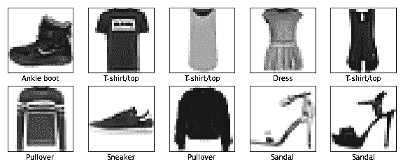

# Tensorflow 2.0 入门

> 原文：<https://medium.datadriveninvestor.com/getting-started-with-tensorflow-2-0-53d4e9d04c57?source=collection_archive---------0----------------------->

[](http://www.track.datadriveninvestor.com/1B9E)

Photo by [Marko Blažević](https://unsplash.com/photos/INKqQcjNPCA?utm_source=unsplash&utm_medium=referral&utm_content=creditCopyText) on [Unsplash](https://unsplash.com/?utm_source=unsplash&utm_medium=referral&utm_content=creditCopyText)

Tensorflow 是一个机器学习的开源平台。使用 tensorflow，我们可以轻松地编码、构建和部署我们的机器学习模型。

Tensorflow 2.0 专注于简单易用，包括以下更新:

*   使用 Keras 轻松构建模型。
*   在任何平台上的生产中实现强大的模型部署。
*   强大的研究实验。
*   通过清理废弃的 API 和减少重复来简化 API。

[](https://www.datadriveninvestor.com/2019/01/23/deep-learning-explained-in-7-steps/) [## 用 7 个步骤解释深度学习——数据驱动投资者

### 在深度学习的帮助下，自动驾驶汽车、Alexa、医学成像-小工具正在我们周围变得超级智能…

www.datadriveninvestor.com](https://www.datadriveninvestor.com/2019/01/23/deep-learning-explained-in-7-steps/) 

这篇文章是写给那些想知道如何从 Tensorflow 2.0 开始的人的。它将帮助您在不到一个小时的时间内创建自己的图像分类模型！所以让我们开始吧😃

**设置 Tensorflow 2.0**

使用 pip -安装 Tensorflow 2.0 软件包

```
pip install tensorflow==2.0.0-alpha0
```

要验证其安装是否正确，请尝试导入 tensorflow 并检查其版本。(应该指向 2.0.0-alpha0)

**Keras 概述**

在开始 tensorflow 之前，我们应该先简要了解一下什么是 Keras。Keras 是一个高级神经网络 API，用 Python 编写，能够在 [TensorFlow](https://github.com/tensorflow/tensorflow) 、 [CNTK](https://github.com/Microsoft/cntk) 或 [Theano](https://github.com/Theano/Theano) 之上运行。使用 Keras 是非常用户友好的，它可以帮助你立刻建立一个模型。

Keras 的核心数据结构是一个**模型**，一种组织层的方式。最简单的模型类型是`[Sequential](https://keras.io/getting-started/sequential-model-guide)`模型，一个线性的层堆栈。

`Sequential`型号定义为:

```
**from** keras.models **import** Sequentialmodel = Sequential()
```

使用`.add()`堆叠层:

```
**from** keras.layers **import** Densemodel.add(Dense(units=64, activation='relu', input_dim=100))
model.add(Dense(units=10, activation='softmax'))
```

一旦模型建立完成，它的学习过程可以用`.compile()`配置:

```
model.compile(loss='categorical_crossentropy',
              optimizer='sgd',
              metrics=['accuracy'])
```

要了解更多关于 Keras 的信息，请点击链接-

 [## Keras:快速概述| TensorFlow Core 2.0a | TensorFlow

### 面向移动和嵌入式设备的 TensorFlow Lite

www.tensorflow.org](https://www.tensorflow.org/alpha/guide/keras/overview) 

**时尚 MNIST 数据集上的分类**

我们已经准备好建立我们自己的分类模型了！这就像 tensorflow 中的“Hello World”😄

我们采用了**时尚 MNIST 数据集**，该数据集包含 10 个类别的 70，000 张灰度图像。数据集中的每个图像都是一种服装，分辨率为 28 x 28 像素。

做必要的进口

```
import tensorflow as tf
from tensorflow import keras
import numpy as np
import matplotlib.pyplot as plt
```

数据集可以直接从 keras.datasets 加载

```
fashion_mnist = keras.datasets.fashion_mnist
(train_images, train_labels), (test_images, test_labels) = fashion_mnist.load_data()
```

训练集`train_images`具有 60k 个图像，而`test_images`具有 10k 个图像。每个图像都是一个 28x28 的数组，像素值范围从 0 到 255。*标签*是一个整数数组，范围从 0 到 9，对应于服装的*类别*。0 对应 t 恤/上衣，1 对应裤子等等。这 10 类服装类型被映射到`class_names`

```
class_names = ['T-shirt/top', 'Trouser', 'Pullover', 'Dress', 'Coat','Sandal', 'Shirt', 'Sneaker', 'Bag', 'Ankle boot']
```

缩放训练和测试图像，使得训练和测试图像的像素值都在 0 和 1 之间。

```
train_images = train_images / 255.0test_images = test_images / 255.0
```

您可以绘制前 10 幅图像来检查数据。

```
plt.figure(figsize=(10,10))
for i in range(10):
    plt.subplot(5,5,i+1)
    plt.xticks([])
    plt.yticks([])
    plt.grid(False)
    plt.imshow(train_images[i], cmap=plt.cm.binary)
    plt.xlabel(class_names[train_labels[i]])
plt.show()
```



Fashion MNIST (first 10 images of train set)

使用 keras 构建序列模型

```
model = keras.Sequential([
    keras.layers.Flatten(input_shape=(28, 28)),
    keras.layers.Dense(128, activation='relu'),
    keras.layers.Dense(10, activation='softmax')
])
```

在神经网络中处理图像时，我们需要将 28×28 的 2D 阵列展平为 1D 阵列(28×28 = 784 像素)。`tf.keras.layers.Flatten`层执行这个任务。在这一层之后是两个致密层(完全连接),分别有 128 和 10 个神经元。最后一层中的 Softmax 激活函数返回 10 个值的数组，这些值对应于总和为 1 的概率得分。**我们获得最高概率的类别被分配给输入图像。**

编译模型

```
model.compile(optimizer='adam',
              loss='sparse_categorical_crossentropy',
              metrics=['accuracy'])
```

*   *损失函数* —这衡量模型在训练期间的准确度。我们想最小化这个函数。
*   *优化器* —这是模型如何基于它看到的数据和它的损失函数进行更新。
*   *指标* —用于监控培训和测试步骤。*精度*衡量图像被正确分类的比例。

训练模型

```
model.fit(train_images, train_labels, epochs=5)
```

为了开始训练，我们调用`model.fit`方法来使模型符合训练数据。

在`test_images`上评估精度

```
test_loss, test_acc = model.evaluate(test_images, test_labels)print('\nTest accuracy:', test_acc)
```

使用这个简单的模型，我们可以达到大约 0.86 的精度

对测试图像进行预测

```
predictions = model.predict(test_images)
predictions[0]
```

`predictions[0]`给出第一张测试图像的概率分数。我们可以检查模型预测的最大概率或类别。

```
np.argmax(predictions[0])
```

它给出了一个值 9，这表明模型已经识别出这个图像是一个踝靴，或`class_names[9]`。我们可以通过检查值为 9 的`test_labels[0]`来验证这个结果。这表明我们的模型能够预测第一个测试图像的正确值:)

就是这个！😛使用 Tensorflow 2.0 和 Keras，您可以立即建立并运行您的分类模型。你可以玩代码来检查改变损失函数，历元数，优化器的影响。如果需要的话，你可以在我的 Github repo 中找到代码。

[](https://github.com/apoorva-dave/Image-Classification-Tensorflow2.0) [## apoorva-Dave/图像分类-Tensorflow2.0

### 使用 tensor flow 2.0-apoorva-Dave/Image-class ification-tensor flow 2.0 对时尚 MNIST 数据集进行分类

github.com](https://github.com/apoorva-dave/Image-Classification-Tensorflow2.0) 

**Google Colab**

Colaboratory 允许我们使用 Jupyter 笔记本并与其他人共享，而无需在您自己的计算机上下载、安装或运行除浏览器之外的任何东西。我们所有的笔记本都保存在 Google Drive 上。在 Colabs 中，代码在专用于我们帐户的虚拟机中执行。虚拟机在空闲一段时间后会被回收，并且有一个由系统强制实施的最长生命周期。我们在训练模型时经常会遇到问题。使用 Colab 很容易做到这一点，因为它提供了免费的 GPU 和 TPU。要设置 Colab，您可以点击下面的链接😺

[](https://towardsdatascience.com/getting-started-with-google-colab-f2fff97f594c) [## Google Colab 入门

### 沮丧和困惑的基本教程

towardsdatascience.com](https://towardsdatascience.com/getting-started-with-google-colab-f2fff97f594c) 

这是 Tensorflow 2.0 入门的一个非常简短的概述。我自己也在学习的过程中，当我学习的时候，我会写关于我们如何做回归、文本分类、保存模型、迁移学习、张量和运算的文章😸如果你觉得这篇文章有帮助，一定要展示一些❤的作品。敬请期待更多 tensorflow！😄