# Terraform 入门

> 原文：<https://medium.datadriveninvestor.com/getting-started-with-terraform-eada2cbb442d?source=collection_archive---------1----------------------->

[](http://www.track.datadriveninvestor.com/1B9E)

> 看看这个来学习地形……

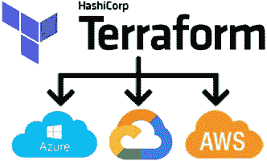

## 为什么是 Terraform？？

我们可以通过两种方式管理云环境

1.  直接登录到相应的 U.I 并进行更改
2.  通过控制台将命令传递到云(GCP/AWS/AZURE)

这些是提供给用户的云服务提供商选项，除了这些选项之外，还有一种方法，即 terraform，这是一种专为云基础架构管理而构建的哈希公司语言

## 使用 Terraform 的优势

*   Terraform 认为。tf 状态文件，记录通过 terraform 向云基础架构所做的所有更改

## 什么是 Terraform？？

Terraform 是一个用于基础设施管理的 HCL 语言脚本，它在基于 API 的系统上创建/修改基础设施，如 GCP、自动气象站、数字海洋等

[](https://www.datadriveninvestor.com/2019/02/12/ready-or-not-the-revolution-is-upon-us/) [## 不管准备好了没有，革命就在我们面前|数据驱动的投资者

### “对于技术如何影响我们的生活和重塑经济，我们必须形成全面的全球共识……

www.datadriveninvestor.com](https://www.datadriveninvestor.com/2019/02/12/ready-or-not-the-revolution-is-upon-us/) 

Terraform 命令:

———这是一些基本的命令，本文末尾提到了完整的命令列表。— — —

```
#INITIALIZE BY SET UP ENVIRONMENT
terraform init#PREVIEW CHANGES ON EXECUTE AND STORE INTO A FILE(OPTIONAL)
terraform plan -out changes.terraform#EXECUTE TERRAFORM SCRIPTS ON THE CURRENT FOLDER FROM ##changes.terraform file(OPTIONAL ELSE ALL FILES WILL BE EXECUTED)terraform apply changes.terraform #REMOVE FILE FROM CURRENT LOCATION
rm changes.terraform#COMPLETELY DESTROYS ALL THE TERRAFORM CHANGES HAPPENED 
terraform destroy
```

## 语法类型:

Terraform 是一种哈希公司语言(HCL)脚本语言，它有两种不同的文件类型

1 .tf.json —这是一个 json 语言文件，用于创建资源 aws_instance，如下所示

```
{
  "resource": {
    "aws_instance": {
      "example": {
        "instance_type": "t2.micro",
        "ami": "ami-abc123"
      }
    }
  }
}
```

2 .TF——这是一种常规的 HCL 语言类型，如下所示，与上面所示的类型相同，本文中的所有语法都将基于这种语法

```
resource "aws_instance" "example" {
  instance_type **=** "t2.micro"
  ami           **=** "ami-abc123"
}
```

现在，让我们深入探讨将在 terraform 中使用的各种主题

## 1.变量:

任何不固定的值，如区域、图像等..可以从动态的 vars.tf 中调用

我们可以传递 3 种类型的变量

1.  线

```
//declare
variable "template" {
    type = "string"
    default = "01000000-0000-4000-8000-000030080200"
}//assign
storage = "${var.template}"
```

2.目录

```
//declare
variable "users" {
    type    = "list"
    default = ["root", "user1", "user2"]
}//assign
username = "${var.users[0]}"
```

3.地图

```
variable "plans" {
    type = "map"
    default = {
        "5USD"  = "1xCPU-1GB"
        "10USD" = "1xCPU-2GB"
        "20USD" = "2xCPU-4GB"
    }
}//assign
plan = "${var.plans["5USD"]}"
```

4.布尔代数学体系的

```
variable "set_password" {
    default = false
}create_password = "${var.set_password}"
```

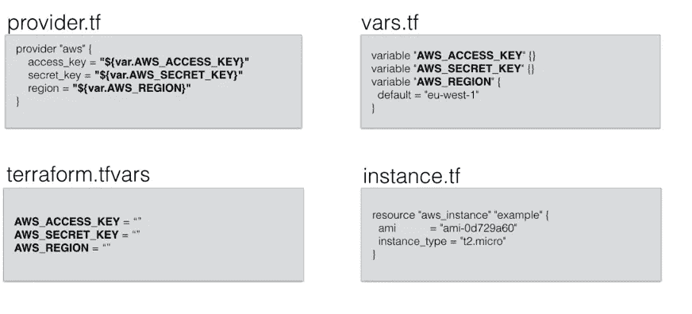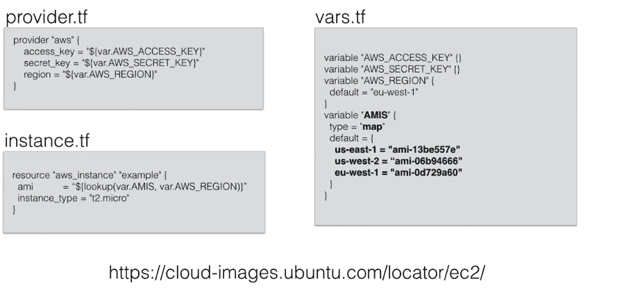

。TF-存储带此后缀的主要地形代码

。TF vars—保存到 git 或任何外部提供程序时可以忽略的所有要放置的机密文件

vars.tf —存储所有变量

## 2.文件上传

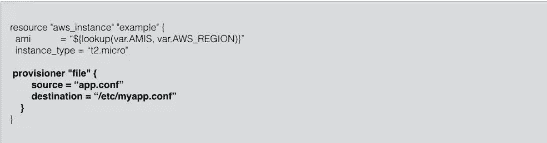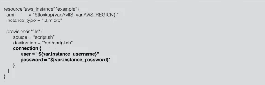

## 3.正在执行脚本:

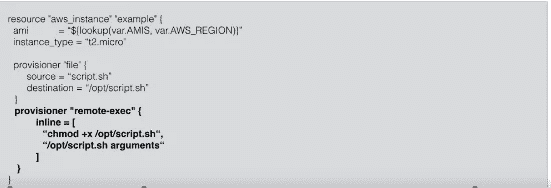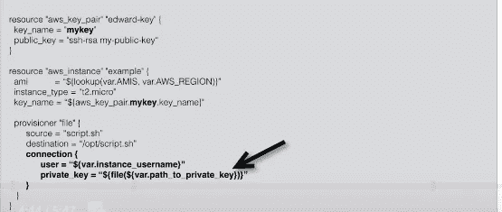

## 4.属性:

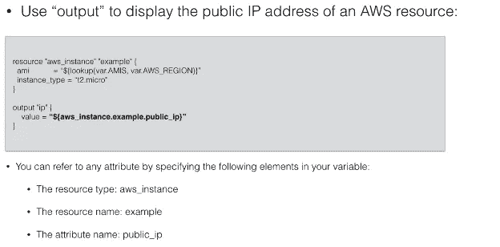

## 5.数据资源

一个*数据源*代表一条只读信息，每次运行 Terraform 时都会从提供者(在本例中是 AWS)获取。将数据源添加到 Terraform 配置中不会产生任何新内容；这只是一种向提供者的 API 查询数据，并使这些数据对其余的 Terraform 代码可用的方法。

```
data "<PROVIDER>_<TYPE>" "<NAME>" {
 [CONFIG ...]
}#  PROVIDER is the name of a provider (e.g., aws), TYPE is the type of data source you want to use (e.g., vpc
```

## 6.数据源

AWS 上的数据源是我们可以通过 API 从 AWS 中检索所有动态信息的东西，如 ami 类型列表、可用性区域等…

下面是一个 AWS 代码，只允许来自欧盟地区的 ip 范围，就像下面我们有“欧盟西部-1”和“欧盟中部-1”为 ec2 服务的输入。

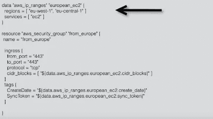

数据源和变量之间的主要区别是，变量-静态&数据源-动态在执行前获取最新的值

## 7.模块

模块就像是 Terraform 中的包，可以重用代码

两种类型

1.  本地模块

这是我们在本地系统上编写的内容，如下所示，terraform 开始从/module-example 文件夹中查找 terraform 脚本，以下值充当 terraform 脚本的参数

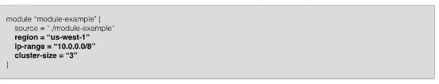

2.外部模块

我们可以连接到外部系统，如 git 等…

```
terraform get #This downloads files from git 
terraform apply #executes terraform files downloaded from git
```

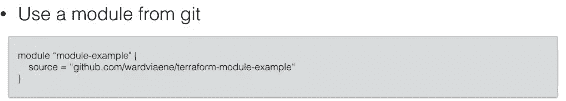

## 8.导入

这是 terraform 提供的一个非常好的特性，它允许我们将现有的云基础设施一次一个地导入到我们的 tf 状态中

更多信息::-[https://www.terraform.io/docs/import/](https://www.terraform.io/docs/import/)

要做的步骤:

1.  创建一个空白/填充的资源块，如下所示

```
resource "google_compute_instance" "default" {
  # ...instance configuration...
}
```

2 .运行 terraform 导入，如下所示

```
//  Instances can be imported using the project, zone and name, e.g.
// terraform import <type>.<name>$ terraform import google_compute_instance.default gcp-project/us-central1-a/test
```

这会提取特定的实例详细信息并将其添加到。tfstate，同见“地形图”

## 9.输出

一旦执行完成，这个块对于向用户展示输出非常有用

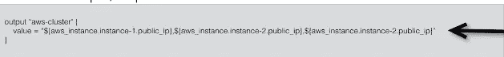

## 地形状态:

。tfstate 和。创建 tf statebackup 并存储 terraform 执行时的所有 terraform 脚本，从而跟踪 terraform 脚本完成的所有活动。

例如:如果我们已经创建了一个实例，并在 GCP 上手动删除，当执行 terraform 时，它会自动创建实例。

我们可以通过存储在 GIT 或 remote 上来监控这些变化，我们可以管理这些状态，执行 backend.tf 文件并在 GCS 脚本上存储 backend 可以在这里找到

[](https://www.terraform.io/docs/backends/types/gcs.html) [## 后端类型:GCS—hashi corp 的 Terraform

### Terraform 可以远程存储状态，这使得团队中的版本管理和工作变得更加容易。

www.terraform.io](https://www.terraform.io/docs/backends/types/gcs.html) 

以下为 AWS-S3

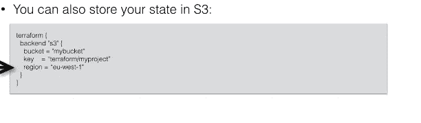

如果。tfstate 被删除，请使用 terraform 导入重新创建。tfstate 否则它不会自动创建

## 10.插入文字

[credits::[https://blog . grunt work . io/terra form-tips-tricks-loops-if-statements-and-gotchas-f 739 bbae 55 f 9](https://blog.gruntwork.io/terraform-tips-tricks-loops-if-statements-and-gotchas-f739bbae55f9)]

像传统语言一样，我们不能使用 IF-ELSE 条件/FOR 循环，相反，我们可以使用插值的概念。

**【I】For 循环**

*   `**count**` **参数**:循环资源。
*   `**for_each**` **表达式**:在一个资源内的内联块上循环。
*   `**for**` **表情**:循环列表和地图。

**i.i)计数**

如果您想要“循环”整个资源，则参数非常有用

```
--Traditional for loop for creating 3 users
  for (i = 0; i < 3; i++) {
  resource "aws_iam_user" "example" {
    name = "neo.${i}"
  }
}---TERRAFORM wayresource "aws_iam_user" "example" {
  count = 3
  name  = "neo.${count.index}"
}
```

如果我们想传递一个列表而不是数字

```
--TRADITIONAL WAY--
for (i = 0; i < 3; i++) {
  resource "aws_iam_user" "example" {
    name = vars.user_names[i]
  }
}---TERRAFORM---variable "user_names" {
  description = "Create IAM users with these names"
  type        = list(string)
  default     = ["neo", "trinity", "morpheus"]
}resource "aws_iam_user" "example" {
  count = length(var.user_names)
  name  = var.user_names[count.index]
}
```

**i.ii) for_each**

我们知道一种循环资源的方法，现在我们将看到资源内部的循环

```
resource "aws_autoscaling_group" "example" {
  # (...)  # This is just pseudo code. It won't actually work in Terraform.
  for (tag in var.custom_tags) {
    tag {
      key                 = tag.key
      value               = tag.value
      propagate_at_launch = true
    }
  }
}---TERRAFORM----
  variable "custom_tags" {
  description = "Custom tags to set on the Instances in the ASG"
  type        = map(string)
}
--resource "aws_autoscaling_group" "example" {
  # (...)

  dynamic "tag" {
    for_each = var.custom_tags    content {
      key                 = tag.key
      value               = tag.value
      propagate_at_launch = true
    }
  }
}
```

**i.iii)为表达式**

如果我们在 python 中进行列表综合操作，这是非常有用的

```
---PYTHON-----
names = ["neo", "trinity", "morpheus"]short_upper_case_names = [name.upper() for name in names if len(name) < 5]----TERRAFORM----
                     ---SYNTAX----
            [for <ITEM> in <LIST> : <OUTPUT>]
            [for <KEY>, <VALUE> in <MAP> : <OUTPUT>]variable "names" {
  description = "A list of names"
  type        = list(string)
  default     = ["neo", "trinity", "morpheus"]
}
output "upper_names" {
  **value = [for name in var.names : upper(name)if length(name)<5]**
}
--
 ** output "upper_roles" {
  value = {for name, role in var.hero_thousand_faces : upper(name) => upper(role)}
}**
```

**【二】IF-ELSE**

下面的示例代码显示了 terraform 中条件的用法

```
//set variablevariable "give_neo_cloudwatch_full_access" {
  description = "If true, neo gets full access to CloudWatch"
  type        = bool
} //IF BLOCK
resource "aws_iam_user_policy_attachment" "neo_cloudwatch_full" {
  count = var.give_neo_cloudwatch_full_access ? 1 : 0    user       = aws_iam_user.example[0].name
  policy_arn = aws_iam_policy.cloudwatch_full_access.arn}//ELSE BLOCKresource "aws_iam_user_policy_attachment" "neo_cloudwatch_read" {
  count = var.give_neo_cloudwatch_full_access ? 0 : 1    user       = aws_iam_user.example[0].name
  policy_arn = aws_iam_policy.cloudwatch_read_only.arn
}
```

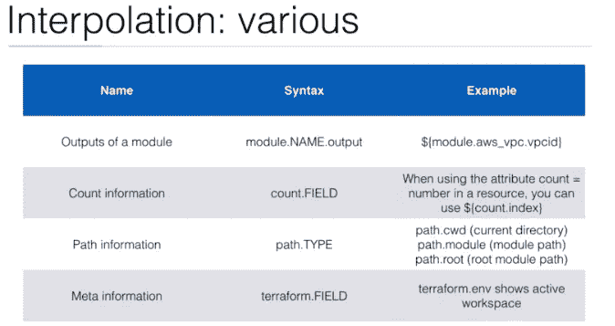

计数限制:

1.  您不能引用`count`中的任何资源输出。
2.  您不能在`module`配置中使用`count`。
3.  你不能(轻易)改变`count`。

## 11.功能

Terraform 有一些内置功能，

i) ${file("myfile.pub)} ←读取文件中的内容

ii) basename("abc/test.txt") ←返回路径的文件名结束文件(test.txt)

iii)合并(str1，str2..)←返回第一个非空字符串

iv)element(module . VPC _ subnet . count . index)←返回列表中给定索引处的单个元素

v) format("server-%03d，count . index+1 ")::o/p:server-001，002 ←将字符串/列表格式化为给定的格式

vi)切片(字符串/列表，从索引到索引)

下面还有一些功能……|

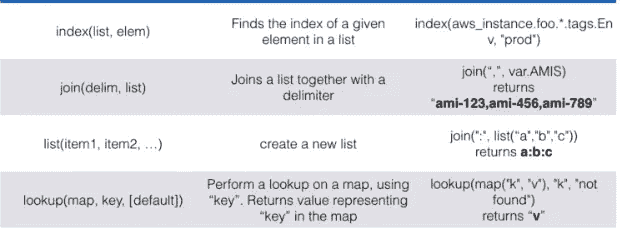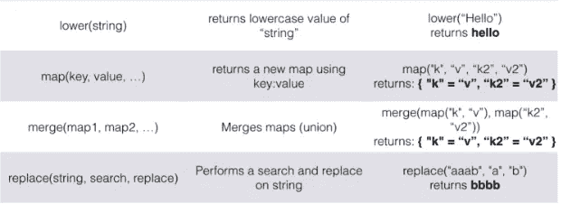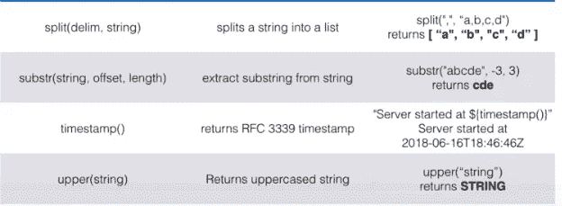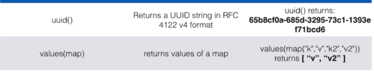

## 总体地形命令

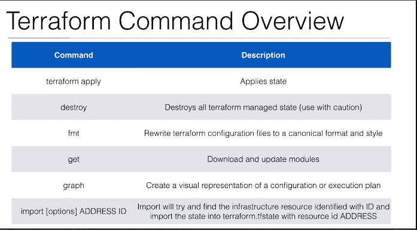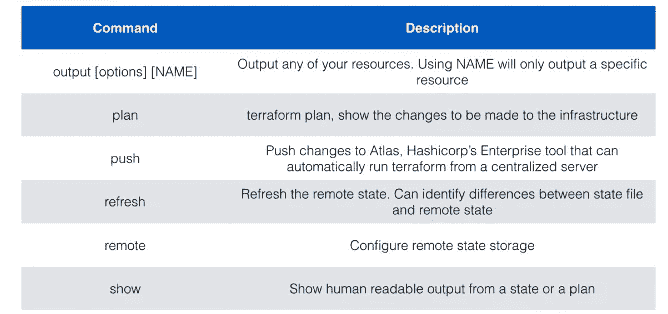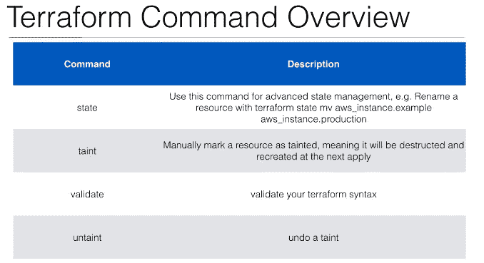

## 示例:

> VPC

我们可以通过虚拟专用网络(vpc)使 GCP/AWS 完全私有，即在 GCP 创建一个 vpc 网络，以便我们可以从该网络连接到 GCP，并且通过使用 g-suite，我们可以使所有来自 G-SUITE 组织的登录通过将 G-SUITE 与 LDAP 集成来利用这一点，以便只有他们的员工可以登录

> GCP-计算实例创建

以下示例代码有助于创建计算实例

```
/////////////////////////main.tf/////////////////////////resource "google_compute_instance" "example" {name         = "${var.NAME}"machine_type = "${var.MACHINETYPE}"zone="${var.ZONE}"#firewall rules to appply to this instancetags = "${var.TAGS}"boot_disk {initialize_params {image = "${var.IMAGE}"size="30"//type=pd-ssd/pd-standardtype="pd-standard"}}network_interface {network = "default"//network_ip="1.1.3.4" //this is internal ip//subnetwork="10.132.0.2"access_config {// Include this section to give the VM an external ip address}}scheduling {automatic_restart=true}metadata ={foo="bar"}metadata_startup_script="echo hi"labels = {"${var.LABELSKEY}" = "${var.LABELSVALUE}"}}//////////////////variables .tf////////////////////////////
variable "GOOGLE_REGION" {default = "europe-west1"}variable "IMAGE" {default = "ubuntu-minimal-1804-bionic-v20190617"}variable "NAME" {default = "test-terraform"}variable "MACHINETYPE" {default = "n1-standard-1"}variable "ZONE" {default = "europe-west1-c"}variable "TCP" {default = "80"variable "TAGS" {type="list"default = ["https-server"]}variable "LABELSKEY" {default = "keyname"}variable "LABELSVALUE" {default = "value"}variable "auto_start" {default=true}
```

## 错误:

1.  从 U.I .重新运行，填写计算创建的所有详细信息，纠正以下错误

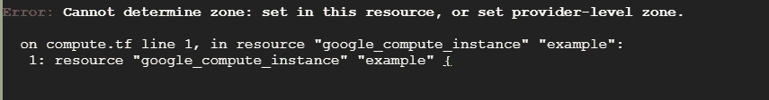

## 命令帮助:

```
terraform --help       //lists all options of terraform
terraform apply --help //lists all options of terraform apply
etc.. similarly any commands could be found with this.
```

> 包装工人

1.  这用于创建映像，可用于多种环境(任何云提供商)
2.  流程:打包程序从源提供程序中挑选映像创建包含以下映像的实例将映像加载到目标云中查看并删除实例
3.  在这个脚本生成器中有两个部分——映像提供程序的源位置——要做的事情的过程以及必要的映像，如额外的软件安装等..
4.  https://www.packer.io/docs/provisioners/index.html——求助

> Terra 试验

## 参考资料:

1.  下面的链接显示了各个云提供商构建的所有经批准的模块

 [## 地形模块注册表

### 编辑描述

registry.terraform.io](https://registry.terraform.io/modules/) 

## 将会更新更多关于这个话题的信息，敬请期待！— — — —