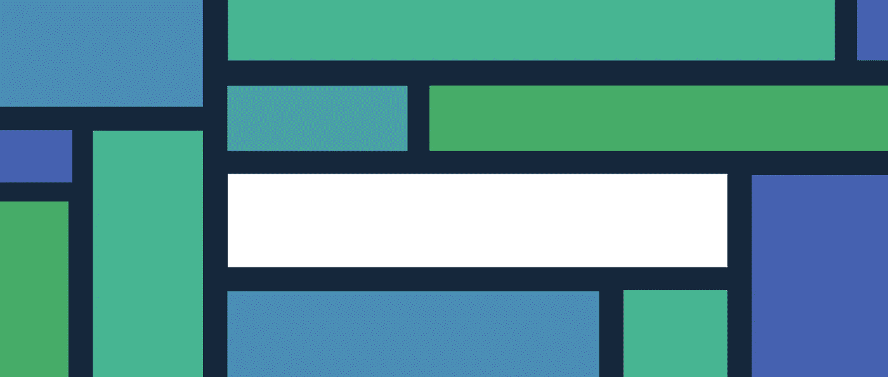
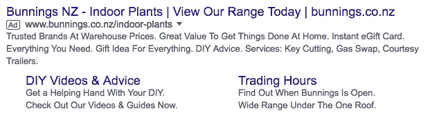
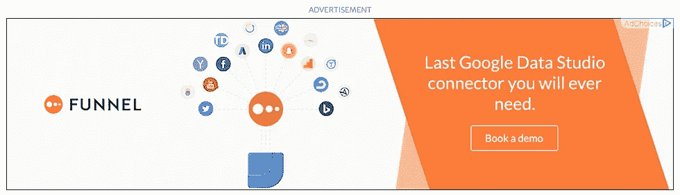
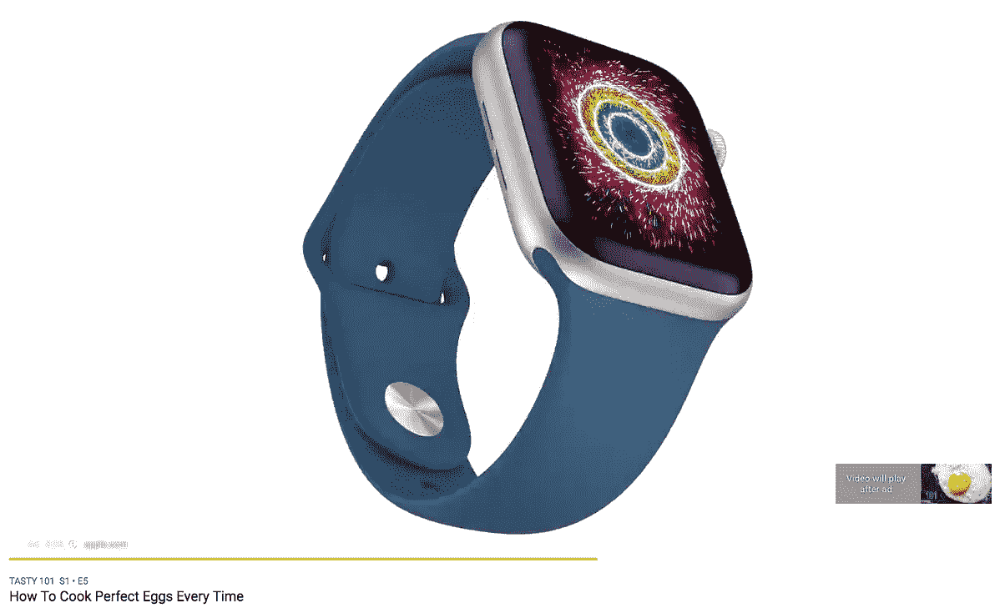
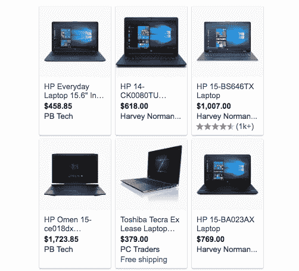
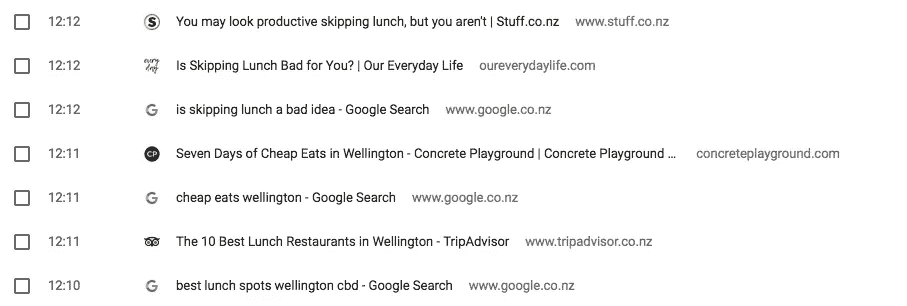
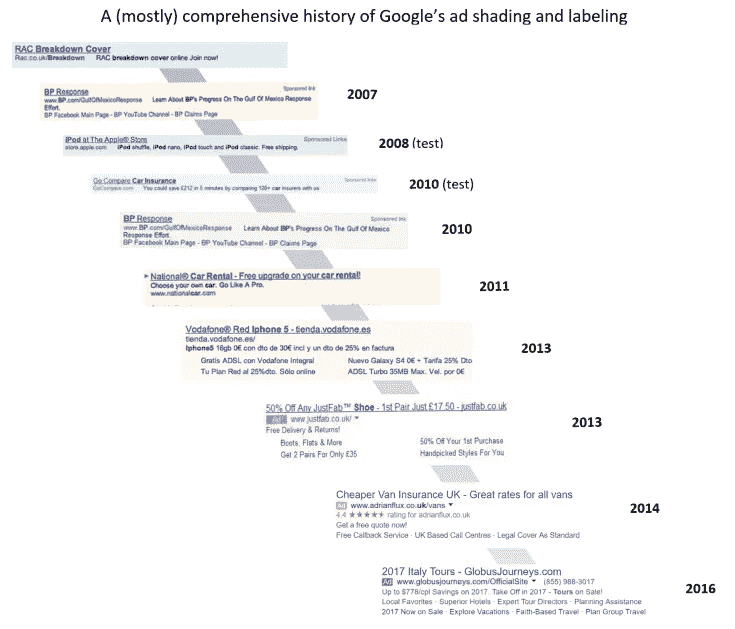
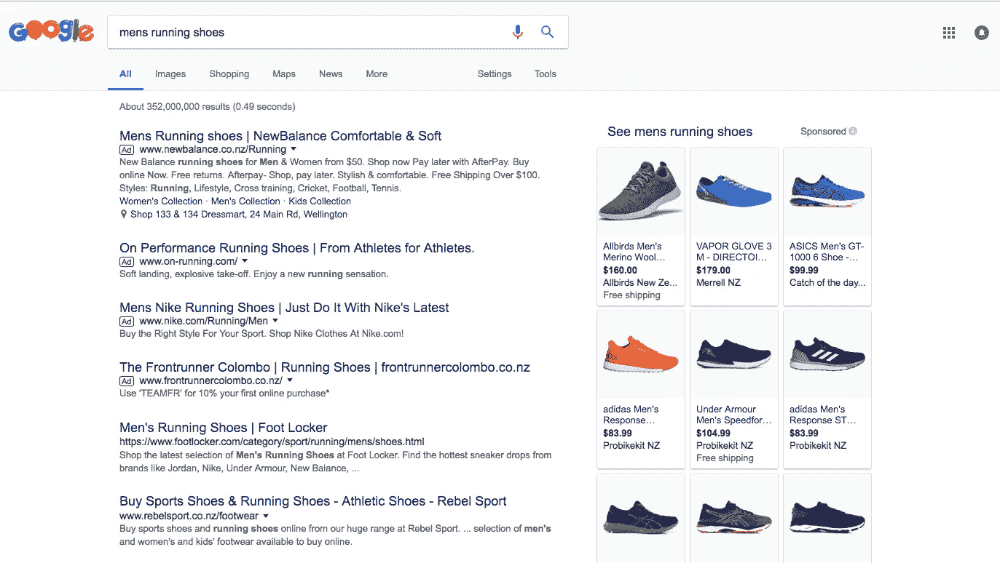

# 了解谷歌广告

> 原文：<https://medium.datadriveninvestor.com/getting-to-know-google-ads-c7200a0ce8ac?source=collection_archive---------39----------------------->

Find [this blog](https://www.springload.co.nz/blog/getting-know-google-ads/), and plenty more wisdom over at [Springload](https://www.springload.co.nz/)

在我们这个充斥着广告的世界里，制作突出的广告对今天的营销人员来说是一个巨大的挑战。但是谷歌广告提供了一个强大的平台来帮助他们做到这一点。

五十年前，人们每天可以看到大约 500 个广告。[现在 5000 左右](https://www.cbsnews.com/news/cutting-through-advertising-clutter/)。对于消费者来说，这可能是压倒性的。但对营销人员来说，这是一个越来越大的挑战。我们需要创建吸引人的、相关的营销活动，让我们的受众难忘。我们如何做到这一点？通过使用谷歌广告。

# 什么是谷歌广告？

Google Ads(以前称为 Google Adwords)是一个在线广告平台，让营销人员创建和管理广告活动。这些都显示在谷歌的搜索结果页面( [SERPs](https://en.wikipedia.org/wiki/Search_engine_results_page) )、他们的[展示网络](https://support.google.com/google-ads/answer/2404190?hl=en)、YouTube 以及整个互联网上。

Left: A typical Google search ad. Right: A banner display ad.

对于企业来说，谷歌广告的付费在线广告是接触目标受众的有效渠道。你可能熟悉一些广告形式。

Left: YouTube pre-roll ad. Right: Shopping ads displayed alongside search results.

但是为什么你希望你的广告出现在谷歌搜索结果页面上呢？只要想想一个人每天看到一个谷歌 SERP 的次数就知道了。例如，在寻找吃午餐的地方时，我在两分钟内进行了三次谷歌搜索。

# 广告的效果如何？

你可能会想，“*我当然使用谷歌，但是广告很烦人，谁会点击它们呢？我更喜欢有机的结果*”。有机结果是由谷歌决定的最相关的结果。他们没有付费，所以他们被认为比付费结果更值得信赖。

但是谷歌 333 亿美元收入的 97%来自在线广告。很容易看出原因。不仅广告变得越来越相关，它们看起来也不再像广告。

大约 45%的用户分不清付费广告和自然搜索广告的区别。广告经常占据 SERP 的大部分空间。当我搜索男式跑步鞋时，广告和有机搜索结果几乎没有区别。

高商业意图搜索，如“买花”或“我附近的咖啡馆”通常在 SERP 上有更多的广告。这是因为搜索者更有可能愿意花钱。平均而言，在“高商业意图”关键词上的赞助广告占据了超过 85%的像素。在上面的广告中，你可以看到四个搜索广告，多个购物广告在右边，只有两个有机结果在底部。

# 如何选择展示广告

每次有人在谷歌上搜索，[就会有一些公司](https://www.youtube.com/watch?v=JLf2LwA2oek)对搜索者查询中的关键词或短语进行“竞价”。利用谷歌广告平台，广告商对他们最看重的关键词进行竞价。这增加了他们的广告出现在 SERP 上的机会。但是还有其他因素影响谁会被显示，以及显示的顺序。

谷歌希望展示最好的广告，而不仅仅是来自付费最高的营销商的广告。他们根据质量分数决定谁的广告是最好的[。较高的质量分数增加了广告显示的机会。预算少的营销人员可以通过制作高质量的相关广告来击败预算多的营销人员。](https://support.google.com/google-ads/answer/140351?hl=en&ref_topic=24937)

# 使用谷歌广告平台

对于数字营销人员来说，谷歌广告平台至关重要。它可以让你精确地锁定受众，揭示你的受众和竞争对手的数据，并让你尝试不同的定价策略。

## 精准地接触你的观众

在正确的时间、正确的地点接触到正确的客户非常重要。

例如，丹的学生酒吧从下午 5 点到 6 点有一个欢乐时光。当这些偏好得到满足时，丹可以选择在谷歌搜索上显示他的“快乐时光”广告。

*   时间—下午 3 点到 6 点
*   位置—在酒吧 5 公里半径范围内
*   受众类型——“当前大学生”和“高中毕业生”

这意味着丹只在有很大机会吸引潜在客户的时候才花营销预算。这就是为什么在线广告经常与消费者密切相关。

## 借助数据驱动的洞察力改进您的营销活动

谷歌拥有大量关于人们搜索内容的数据。结合他们的机器学习能力，他们对当今的消费者有着宝贵的洞察力。

您可以找到关于当前和历史搜索量、关键词竞争以及关键词竞价的平均成本的信息。谷歌还可以预测一组给定的关键词会给你带来多少印象、点击或转化。

管理您的活动时，您可以获得最佳广告的最新信息。您还可以进行实验，测试不同广告文案或登录页面的有效性。

## 控制预算以符合你的目标

Google Ads 有很多方法可以根据你的营销目标来查看投资回报(ROI)。这些可以随着您的目标在活动中的变化而动态调整。谷歌会根据你制定的策略，优化你的广告，在正确的时间展示给正确的用户。如果你的目标是:

*   建立知名度，你可以按印象付费(人们看到广告)。
*   推动参与度，只有当客户与你的广告互动时，你才能付费。
*   获得转化(例如购买、下载或注册),您可以选择仅在客户转化时支付。

这种控制使您的营销策略更容易与公司的目标保持一致。你也可以设定每日消费限额，这样你就不会超出预算。

# 更好的广告世界

谷歌堆积如山的搜索数据和机器学习能力允许我们使用谷歌广告创建洞察驱动的广告。对消费者来说，结果是制作精良的广告，为他们量身定制，更相关，希望不那么烦人。

对于预算较小的广告客户来说，他们可以更高效地使用资金来制作高质量的广告。他们可以很快看到什么是可行的，什么是不可行的，并利用洞察力来影响他们的观众。

推广高质量的广告可以让小企业的声音在巨头中被听到。

有兴趣利用 PPC 和在线广告为您的业务？在 Springload，我们有一个由专家组成的团队来帮助你最大化你的营销预算并接触到你的观众。[联系](https://www.springload.co.nz/contact/)了解更多信息。

【www.springload.co.nz】本文原载于