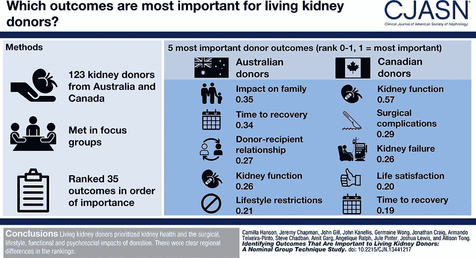

# 寻求生命的礼物会遇到社会禁忌

> 原文：<https://medium.datadriveninvestor.com/gift-of-life-confronts-social-taboos-321e0b91024b?source=collection_archive---------16----------------------->

## 一个人可以捐赠一份遗产，拯救许多需要帮助的人

Surgery at Queen Fabiola Children’s University Hospital, Brussel, Belgium, by Piron Guillaume on Unsplash

这是一个植入的事实:根据美国移植基金会的数据，美国每天有 20 名病人死于[缺乏可用于移植的器官](https://www.organdonor.gov/statistics-stories/statistics.html)。一名已故捐赠者最多可以挽救八条生命。

这不仅仅是美国的现象。

“在菲律宾，器官短缺可能更加明显，”T4 的纳西索·塔皮亚医生说。作为一名医学教育家，他在宿务医学院微生物学和寄生虫学系任教。

“例如，许多患有终末期肾病的人需要肾移植才能继续存活，”他说。"但是活着的和死去的肾脏捐赠者的数量非常少."

正如 Tapia 解释的那样，不同的国家可能采用两种策略来获得潜在器官捐赠者的同意:选择加入或选择退出。

 [## 我们屏蔽了社交媒体，这引起了公愤。数据驱动的投资者

### 上瘾，我们看不出来。在最近的一项研究中，基于以前的研究成果，我们想…

www.datadriveninvestor.com](https://www.datadriveninvestor.com/2018/12/01/we-blocked-access-to-social-media-it-caused-an-outrage/) 

“选择加入意味着只有那些明确同意的人才是捐赠者，”他说。

“另一方面，选择退出意味着任何没有拒绝同意捐献的人都是捐献者，”塔皮亚说。"在选择退出中，假设个人打算在死后捐献器官用于医疗用途."

捐赠的另一个问题是出售器官。

塔皮亚说:“甚至在脸书，器官买卖在许多国家都有报道，举几个例子，像英国的 T8，印尼的 T11。”。“当地有传闻称，有人试图通过渗透脸书患者群体来出售器官，这也令人担忧。”

这导致塔皮亚和其他人考虑促进器官捐献的策略。

医疗保健促销从教育开始，这有助于抑制情绪和政治。如果宗教问题是一个问题，神职人员需要被告知这个问题，这样他们就可以向他们的会众解释。

桑德拉·伍兹(Sandra Woods)是生物伦理、医疗保健、疼痛、患者权利、隐私和退伍军人健康方面的专家，她有着独特的观点。

“不‘顺其自然’的想法经常会遭到抵制，”她说。“家庭成员觉得他们‘拔掉了插头’或‘提前’结束了生命。”公共教育应该关注脑死亡的概念以及什么是文化上合适的。

“我和一个小组一起工作，该小组鼓励人们在仍然健康的情况下谈论他们的临终愿望，”伍兹说。“我们需要打破禁忌，让我们爱的人知道他们最终想要什么。总是谈论器官捐献。”

这样，可能的捐赠是过程的一部分，而不是目的。

“讨论生命终结的愿望给了人们一种方式来告诉家人他们是否想要一个不复苏或无代码的订单，”伍兹说。“我们需要能够在最佳状态下捐献器官，而不是加速死亡。以器官捐献为目标，这样谈起来更容易。”

[查克·韦伯斯特博士](https://twitter.com/wareFLO)，Twitter 上#HealthSystemsChat 的主持人和社交媒体大使，着眼于提高器官匹配“市场”的规模和效率

“例如，2012 年诺贝尔经济学奖颁给了一位接受过运筹学培训的工程师，”他说。“这是为了改进和应用将可用器官匹配到相容患者的算法。

“这很有趣也很讽刺，因为市场通常是由价格驱动的，但出售器官是违法的，”韦伯斯特说。“我们需要专注于减少财务抑制因素:寻找匹配的成本、交通和住宿成本，以及机会成本，如从工作到康复的时间。”

选择退出有可能扩大器官捐赠的范围。教育再次发挥作用。人们需要知道每个人都有选择退出的权利，无论是在驾照上还是其他地方，在紧急情况下都会被知道。

“选择退出同意理论上是一个好主意，但这个概念假设整个人口已经充分了解什么是器官捐赠，以及它在生命结束时意味着什么，”伍兹说。“我认为大多数国家还没有达到这个水平。这也没有考虑到家人的愿望。

“选择加入和选择退出是不同类型的同意方式，”她说。“重点关注如何获得‘知情同意’非常重要。”"

# 其他人必须理解

选择退出使捐赠行为更加“主流”，因为捐赠是默认选项。

“一点不错，”伍兹说。“这有助于减少谈论生命终结时的禁忌。按照你喜欢的方式“前进”的唯一方法是别人知道并理解你自己的优先事项。

“这包括器官捐赠，”她说。"这是在你生命的尽头拯救另一个生命的机会。"

和许多有争议的问题一样，文字很重要。

塔皮亚说:“捐赠受到的不良影响是因为‘强制’一词和缺乏关于选择退出的信息。”。“有些人认为每个人都是被迫的，没有其他选择。

“这就是为什么很难找到真正无私的活着的捐赠者，”他说。

这导致了器官买卖的问题，尤其是通过社交媒体。

器官买卖源于短缺带来的绝望。关于捐赠好处的教育可以扩大潜在捐赠者的供应，同时关闭黑市。

伍兹说:“解决——教育反对——并制止黑市上的器官买卖，就像试图制止奴隶制、人口贩卖和儿童色情一样困难。”“但我们必须试一试。

“为了打击黑市上的器官买卖，也许我们应该谈谈器官购买者的风险，”她说。“这包括不正确处理‘购买’器官的风险。还有被抓的风险。对于考虑购买器官的人来说，公平的概念可能不是一个重要因素。”

一项相关交易是卖血，这让伍兹吃了一惊。

“在加拿大，有偿献血在很大程度上被认为是不道德的，”她说。“有一个关于分配正义的生物伦理问题。

“越来越多生活在贫困中的人会献血——社会将会把这视为不那么幸运的人的公认‘角色’——这带来了巨大的风险，”伍兹说。

Tapia 重申了社交媒体在非法移植中的作用令人担忧的前景。

“出售器官似乎越来越多地通过脸书进行，”他说。"一些人试图渗透到病人支持团体中去。"

**关于作者**

吉姆·卡扎曼是[拉戈金融服务公司](http://largofinancialservices.com)的经理，曾在空军和联邦政府的公共事务部门工作。你可以在[推特](https://twitter.com/JKatzaman)、[脸书](https://www.facebook.com/jim.katzaman)和 [LinkedIn](https://www.linkedin.com/in/jim-katzaman-33641b21/) 上和他联系。

*原载于 2019 年 2 月 9 日 www.datadriveninvestor.com***。**