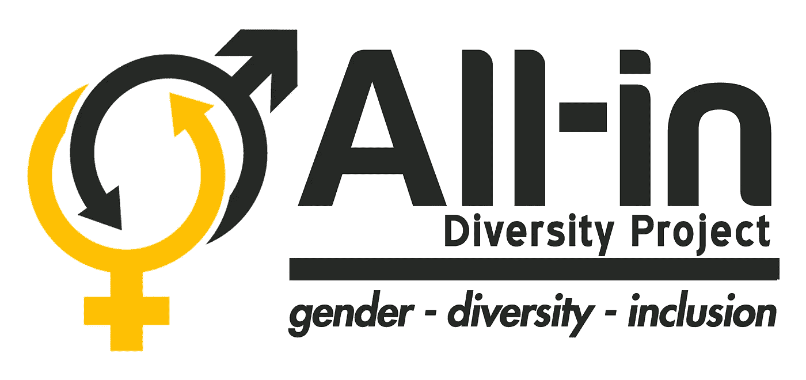
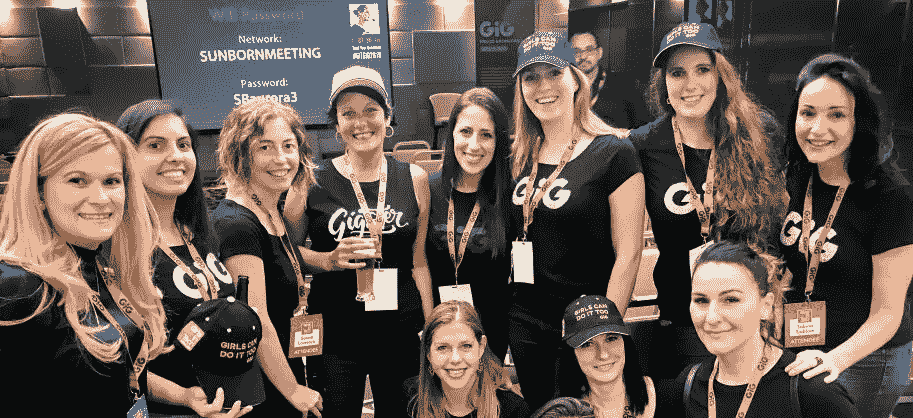

# GiG 全力支持多元化，并承诺做得更多

> 原文：<https://medium.datadriveninvestor.com/gig-goes-all-in-with-diversity-and-commits-to-do-more-1c6b622ec89f?source=collection_archive---------23----------------------->

# 随着 All-In Diversity benchmark 研究上周报告了其结果，我们希望开诚布公地讨论这些结果，以及我们将如何继续努力实现平等。

我们是 All-In 多元化项目的创始成员，并与其他 25 家组织一起参与了最近发布的 2018 [All-Index](https://allindiversityproject.com/the-all-index/last-report/) 研究，该研究用于衡量全球博彩和游戏行业的多元化、平等和包容性。

那么，我们与同龄人相比如何呢？让我们看看一些亮点，是的，让我们也看看我们在哪些方面还有更多工作要做，我们如何拥有它，以及我们已经在“加大赌注”来实现这些变化。

首先，我们应该看看最热门的话题之一，性别多样性。作为这项研究的结果，40%的女性对 60%的男性的比例被认为是这个行业中非同寻常的。尽管我们以 30%比 70%的比率远远高于竞争对手的平均水平，但该指数称我们“停滞不前”。这是因为我们在公司中的女性比例一直都很高，但是我们已经制定了一个全面的计划，除了我们目前的计划，以使这些数字更接近“公平”的比例。

GiG 的人事主管克劳迪娅·吉内克斯(Claudia Ginex)解释道:*“我们一直在努力吸引更多的女性进入这个行业，我们很早就认识到这是一个系统性问题，根源在于女性从小就缺乏对技术职业的兴趣和鼓励——但时代在变。考虑到这一点，我们今年开始实施多项计划，并考虑如何让所有年龄段的女性都能来为我们工作:*

1.  我们的招聘流程不会歧视性别——顶尖人才总能胜出。
2.  直布罗陀技术女孩 2017/18 白金赞助——通过活动向世界各地的女性强调，任何人都可以做到，技术是为每个人准备的。
3.  真正的好处:我们将陪产假增加到了六周，让父母双方都感到得到了支持(相比之下，马耳他当地为一天，英国平均为两周，西班牙为五周)，我们为结婚的人提供了 10 天的假期，我们提倡非常斯堪的纳维亚式的工作方式，包括在家工作和弹性工作时间。
4.  马耳他骄傲 2018 主要合作伙伴。性别多样性是关于所有性别的，我们相信开放 iGaming 是为了让它对所有人都公平和有趣，我们相信生活应该对所有人都公平和有趣——我们上面提到的政策反映了这一点。

我们还添加了这些来加强我们的措施:

1.  延续 2018/19 直布罗陀技术女孩白金赞助——我们将与她们进一步合作，与渴望从事技术工作的学生或女性分享我们女性员工的经验
2.  所有未来的实习和研究生项目将有 50:50 的男女比例。
3.  我们要回学校了！我们将通过已经在积极提高学习技术学科的女生比例的学校来促进伊加明的职业发展。
4.  到 2019 年底，我们所有的政策都将实现平等。与大多数公司不同，我们的政策更多地基于公司文化，而不是遵守当地法律。这是因为我们希望我们所有的员工都有同样的权利和机会。当然，我们仍然遵守我们办公室所在地的法律，我们刚刚决定确保我们不只是发放基本津贴，我们相信平等，并通过将多元化作为一种公司文化，将我们的钱用在我们的嘴上。
5.  我们将通过 GiG 的内部电子学习平台“GiGsters Academy”以及课堂会议，进一步教育所有员工，让他们了解多元化，从而继续创造一个更加积极的工作环境。"

这些只是 GiG 为给企业带来更多平等和更多人才所做工作的头条新闻。"

除此之外，我们如何在同龄人面前塑造自己？嗯，我们在保护同事免受任何歧视的现有流程方面得到了很高的评价，满分为 8 分(政策包括欺凌和骚扰、收养父母休假、举报政策、申诉程序)

我们得到了满分 10 分，因为我们实施了一个允许同事诚实和匿名反馈的系统，这让同事感到非常“安全”，并且在提供反馈时能够做到“非常诚实”。该系统正是为了实现这一目的而部署的，并且当然符合 GDPR 和数据保护标准。

我们的高层领导在促进全公司多元化方面的承诺得到了 5 分的高分，我们在已经实施和即将实施的促进所有员工多元化的举措数量方面得到了 10 分。

这方面的一些例子包括我们的招聘广告、招聘和人才搜索以及候选人选择，这些都使用不同的网站、招聘会，明确要求不同的候选人提出申请，并有透明和一致的标准来评估候选人。

我们的绩效评估和离职流程也详细说明了清晰一致的标准，今年增加了薪酬平等评估。

GiG 首席人力官 Mikael Angman 评论道:*“我们很自豪能够被列入 All-Index，并为更好地了解我们如何才能创造一个更加多样化和创新的行业做出贡献。我们的愿景是“开放 iGaming，让所有人都能享受公平和乐趣”，其中很大一部分是创造一种可持续的工作方式和环境，让我们有足够的创造力来提出推动行业发展和为客户创造价值的想法。很明显，我们仍有工作要做，特别是在改善性别平衡方面，我们承诺在 2019 年进一步共同解决这一问题。”*

对于任何潜在的同事，请随意查看我们的招聘页面【www.gig.com/careers**。**