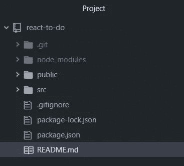
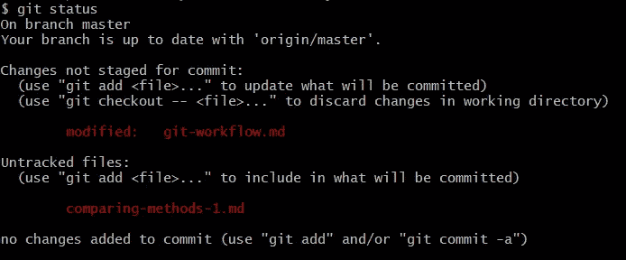
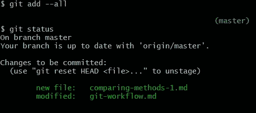

# 代码新手的 Git 基础

> 原文：<https://medium.datadriveninvestor.com/git-basics-for-code-newbies-f8028706dae7?source=collection_archive---------22----------------------->

[](http://www.track.datadriveninvestor.com/Split11-20)

我是通过管理一个图书馆网站两年来接触编程的。为了保存我的工作，以防我需要回滚更新，我保留了三个 USB 驱动器:一个我每周更新，一个我每月更新，一个我每半年更新。我不是一个开发者，我是一个公共图书馆系统的图书管理员——我不知道任何更好的！这个方法节省了我几次，但现在我可以确保使用 Git 保存每个文件和代码更改。

如今，Git 对于跟踪代码中的变化并允许团队无缝协作是非常必要的。它是一个虚拟助手，让你的工作有条不紊，尽在掌握之中。如果您是 Git 新手，这里有一个如何在您的下一个项目中使用它的概述！

# 它是如何工作的

Git 是一个版本控制软件，这基本上意味着它是一个在整个项目中帮助跟踪各种变化和代码“版本”的程序。命令行用于访问 Git 软件并告诉它该做什么。如果对你来说这是一个新领域，你可能想读一读我写的关于命令行入门的文章。

当 Git 开始跟踪某个项目时，会为它记录的所有信息创建一个**存储库**。要向存储库添加信息，您需要创建一个**提交**。

提交是代码保存(称为“提交”)到 Git 存储库时的快照。它还包含来自开发人员的任何注释，详细说明自上次提交以来所做的事情。因为 Git 跟踪所有这些信息，所以通过查看所做的提交，您可以很容易地看到项目文件构建的每个阶段。

# 基本命令

所以您已经为您的新项目创建了一个根文件夹，并且您想用 Git 来跟踪它。你现在做什么？

> `git init`

用 Git 开始跟踪一个项目:
1。打开命令提示符
2。导航到项目的根文件
3。输入命令 git init

你一输入`git init` ( `init` 为“初始化”)，一个隐藏的。git 目录是在项目文件中创建的。这是保存所有存储库信息的地方。其他 Git 命令可以用来访问这些信息，所以您不必去。直接 git。



> `git add`

您已经为新项目创建了 index.html 和 main.css，但是还没有告诉 Git 保存这些更新。下一步是使用`git add`命令。在一个文件上使用`git add`意味着您准备将它提交给 g it 存储库。

使用该命令有两种方式:
1。添加单个文件:通过名称引用它，比如`git add index.html` ——但是这意味着您必须记住对其他文件名再次使用该命令。
2。添加所有文件:使用`git add --all`。这将为下次提交存放所有新的和修改过的文件。

> `git commit`

一旦将内容添加到要保存到 Git 存储库的队列中，就可以使用命令`git commit`。

**但是等等！**光用`git commit`是逃不掉的。提交的一个重要元素是附带的消息，详细说明您对提交的文件做了什么。这些消息是查看项目变更历史所必需的。你创建了一个新文档吗？添加按钮？删除一节？这些都是需要了解的有用的东西，并与提交一起保存在 Git 存储库中，可以使用`-m “*message text*”`将其添加到您的命令中。

您的命令应该类似于:`git commit -m “Created index.html and main.css”`

> `git status`

假设您已经准备好结束今天的项目，但是您不记得是否已经将所有内容保存到 Git 中。在这种情况下，你可以依靠命令`git status`！它很方便地告诉你下一步该做什么。

你忘了加点东西吗？它将告诉您需要为提交准备什么。在下图中，我需要添加两个文件。



您是否有一些暂存文件尚未提交到存储库中？也会告诉你的。在下图中，我首先使用了`git add --all`，然后`git status`向我展示了两个准备提交的文件。



我可能会键入如下内容:

```
git commit -m “Created comparing-methods-1.md; added viewing history section to git-workflow.md”.
```

`git status`是你非常好的朋友，所以要经常依靠！

# 查看历史记录

> `git log`

准备好看看你所做的一切了吗？命令`git log`将打印出到目前为止您对该存储库所做的所有提交——列表可能会变得很长！每个日志项显示提交 ID(一长串数字和字母)；提交的时间、日期和作者；和提交消息。

> `git checkout *commit-id*`

您还可以查看以前提交的文件的旧版本。使用`git log`找到某个提交的 ID，然后键入命令`git checkout *commit-id*`。这个命令带你进入另一个维度来查看这个过去的文档，所以当你准备返回到项目的当前状态时，你将需要使用命令`git checkout master`。这将带您回到存储库的`master` 分支——但是我将在以后的文章中讨论分支。

我希望这能给新的程序员足够的时间在他们的下一个项目中尝试使用 Git！如果你想做更多的研究，这里有一些好的起点:

 [## Git 手册

### 一个版本控制系统，或称 VCS，在人们和团队一起合作项目时跟踪变更的历史…

guides.github.com](https://guides.github.com/introduction/git-handbook/) [](https://www.atlassian.com/git) [## 了解 Git- Git 教程、工作流和命令| Atlassian Git 教程

### 从初级到高级 git 教程学习 git，包括工作流、Git 命令、Git 迁移和代码审查。

www.atlassian.com](https://www.atlassian.com/git) [](https://git-scm.com/) [## 饭桶

### Git 易于学习，占用空间小，性能快如闪电。它远胜于 Subversion 等配置管理工具…

git-scm.com](https://git-scm.com/)