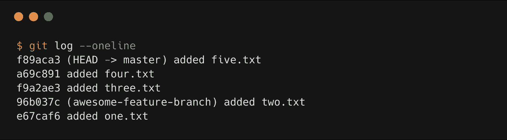
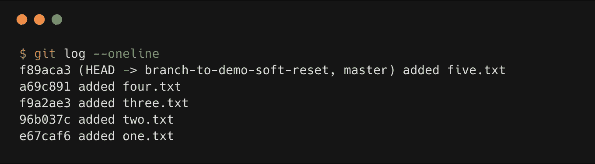
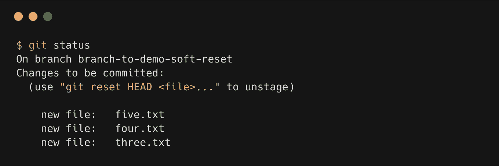
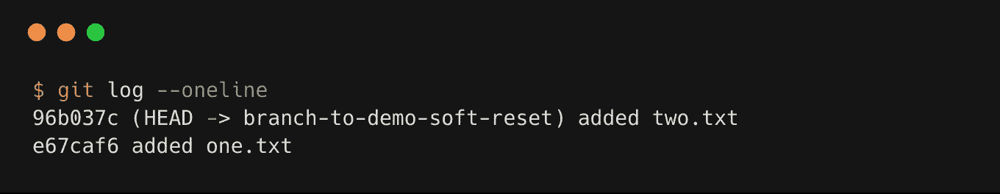
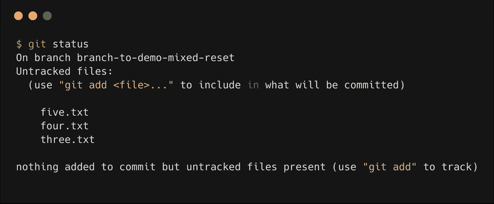
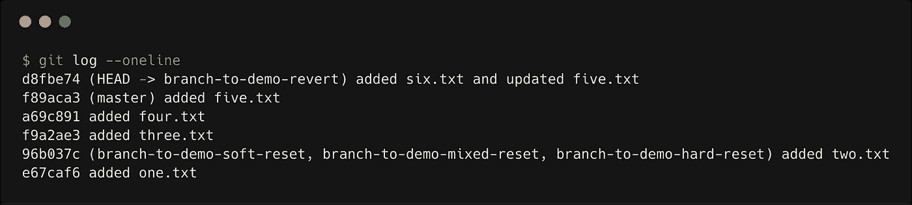
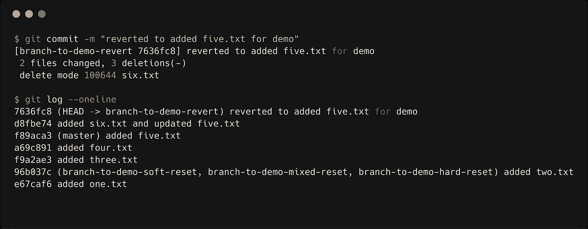

# 面向初学者的 git ++版

> 原文：<https://medium.datadriveninvestor.com/git-for-beginner-f438adfc3599?source=collection_archive---------0----------------------->

你知道 git 工作流的基础，熟悉一些基本的命令，比如添加、提交、推送、拉取，那么这篇文章可能适合你。这篇文章主要关注日常的 git 使用改进，修正一些常见的错误，并向高级 git 学习者迈出一步。


“closeup photo of eyeglasses” by [Kevin Ku](https://unsplash.com/@ikukevk?utm_source=medium&utm_medium=referral) on [Unsplash](https://unsplash.com?utm_source=medium&utm_medium=referral)

## **#场景加**

您只想在临时区域中添加具有特定扩展名的文件。当然，您可以逐个添加所有文件。但是可以用*。<extension_name>包含具有该扩展名的所有文件。以下命令将添加所有 python 文件。</extension_name>

```
git add *.py
```

您希望添加具有特定扩展名的文件，并且还希望指定目录名，那么您可以运行以下命令。以下命令将从`models/`目录的子目录中添加所有 python 文件。

```
git add models/\*.py
```

## #干净的场景

您在分支中创建了一些新文件或文件夹。过了一段时间，你意识到你不想要那些文件或文件夹。你需要你的工作树干净。这些是 git 中未跟踪的文件。

*未跟踪的文件是那些您尚未使用*T1 添加的文件

要清理您的工作树，您可以运行以下命令。这个命令将删除 git 没有跟踪的所有文件和目录。

```
git clean -df
```

如果您想在删除之前查看哪些未跟踪的文件将被删除，那么您可以运行此命令。

```
git clean -dn
```

## #使用 rm 的场景

现在您想删除您跟踪的文件。您可以使用此命令删除跟踪的文件。

```
git rm <file-path>
```

如果您的文件在暂存区，那么您必须给出额外的**强制标志。**

```
git rm <file-path> -f
```

您希望从 git 存储库中删除文件，但不希望从您的文件系统中删除文件，那么您可以运行这个命令。

```
git rm --cached <file-path>
```

## **#分支场景**

您在您的分支机构名称中输入了错误，或者您想要更改您的分支机构名称，那么下面的命令将会更改您的分支机构名称。

```
git branch -m <old-branch-name> <new-branch-name>
```

您想要更改当前的分支名称，那么您只需运行以下命令。

```
git branch -m <new-branch-name> 
```

如果您已经使用旧名称推送分支，那么还需要几个额外的步骤。您需要从远程删除旧的分支，并推上新的分支。

```
git push <remote-name> --delete <old-branch-name>
git push <remote-name> <new-branch-name> 
```

您想要推送本地分支代码，但是本地分支名称与远程存储库分支名称不匹配。然后，您可以运行以下命令。

```
git push <remote-name> <local-branch-name>:<remote-branch-name> 
```

## #带日志的场景

您想要查看您的提交历史，所以您只需运行一个`git log`命令。这显示了很多信息，但是您只需要看到提交 id 和消息。然后，您可以运行以下命令。

```
git log --oneline
```

`git log --oneline`将显示以下一种输出。



上面输出中的前七个字符是**速记提交 id** ，然后我们有我们的提交消息。提交 id 是简写的，因为完整的提交 id 是 40 个十六进制字符，它们指定了 160 位 SHA-1 散列。通知`Head -> master`。这意味着我们现在在主分支。

如果您想查看特定作者的提交消息，那么您可以运行下面的命令。我想作者的名字是约翰·多伊。

```
git log --author="John Doe"
```

## #隐藏场景

你在分公司工作，做了一些改变。现在，您只想在进行这些更改之前看到该分支的输出或代码。然后就可以运行`stash`命令了。它会让你的工作树变得干净。

```
git stash
```

如果您想恢复您的更改，那么您必须运行以下命令。

```
git stash pop
```

如果您不想恢复这些更改，那么您必须运行以下命令。

```
git stash drop
```

您更改了错误分支中的一些文件。然后你可以把你的修改藏起来，然后把**签出**到你想要的分支，然后在那里运行`git stash pop`。您将在您想要的分支中得到您的更改。

## #带结帐的场景

你想换一家分店。然后，您可以运行下面的命令。

```
git checkout <branch-name>
```

*如果你已经修改了你当前分支中的一些文件，那么一定要* `*stash*` *你的修改或者* `*commit*` *的修改。。如果你没有* `*stash*` *或* `*commit*` *的那些变化，它也会反映在你切换的分支中，你可能不想要或不需要。*

您有一个名为`development`的分支，您想从`development`创建一个分支，并直接切换到您的新分支。然后，您可以运行以下命令。

```
(development)$ git checkout -b <your-new-branch-name>
```

您也可以使用提交 id 进行签出。如果您的项目不是很大，您可以安全地使用速记提交 id。

```
git checkout <commit-id>
```

*这个会落在* ***脱离头*** *状态的饭桶里。****Head****只是对当前分支*上的当前提交(最新)的引用。*一般来说，git 中的****Head****都可以指向分支或者提交。当 Head 指向一个分支时，git 不会抱怨。但是当 head 指向一个提交，而不是一个分支时，它就进入一个* ***脱离 head*** *状态。*

你想从这个**分离头**状态开发一个特性，那么你必须从这个状态创建一个分支，并在那里开发你的特性。

```
git checkout -b <your-new-branch-name>
```

## #提交的场景

您刚刚添加了一个提交消息，并意识到您的提交中有一个打字错误，或者您只是想让您的提交消息更具表现力和可理解性。然后可以使用下面的 git 命令。

```
git commit --amend -m "your-new-commit-message"
```

如果您只是添加了一些文件或修复了一个 bug，但不想添加另一个提交消息，那么您可以使用带有`--no-edit`标志的 git 命令。

```
git commit --amend --no-edit
```

*这里有一点非常重要，要记住修改最后一次提交会重写提交历史。这意味着当您修改提交时，您的* ***提交 id*** *将会改变。*

如果您已经在远程存储库中推送了您的代码，然后您意识到您必须`amend`提交消息，那么在修改之后，您必须进行**强制推送。假设您的远程名称为`origin`，您可以运行以下命令。**

```
git push origin <branch-name> -f
```

## #带复位的场景

你想要放弃你最后的一些提交。然后您可以使用`git reset`来丢弃这些提交。您应该知道 git 重置有三个标志。

*   `--soft`
*   `--mixed`
*   `--hard`



让我们假设您想要放弃更改，直到**添加了 two.txt** ，它具有提交 id **96b037c**

现在，让我们运行带有`--soft`标志的`git reset`命令。

```
git reset --soft 96b037c
```

`git reset --soft`将使**孤立**该提交 id(如 96b037c)之后的所有提交，但文件不会被删除。文件会在暂存区。

**孤立的**提交意味着没有来自 ref 的直接路径来访问它们。这些孤立的提交通常可以使用`git reflog` 找到并恢复。Git 在运行内部垃圾收集器后将永久删除任何孤立的提交。默认情况下，git 被配置为每 30 天运行一次垃圾收集器。

因此，如果您运行`git status`，您将看到以下输出。



如果您运行`git log --oneline`，您将会看到先前的提交被删除。



如果您运行带有`--mixed`标志的重置命令，那么您的提交将成为**孤立的**，并且文件将不在暂存区中，但是文件将在文件系统中找到。如果你在重置中没有指定任何标志，那么 git 将默认使用`--mixed`标志。

如果您运行`git status`，那么您将看到以下输出。



如果您想永久删除文件，那么您可以运行带有`--hard`标志的重置命令。

*你可以遵循的一个好习惯是，首先运行带有* `*--soft*` *标志的重置命令，然后查看受影响的文件。如果你确定你不想要这些改变，那么你可以运行带有* `*--hard*` *标志的复位命令。*

当< commit-id >之后的任何快照都被推送到公共存储库时，你不应该使用`git reset <commit-id>`。删除其他团队成员继续开发的提交会给协作带来严重的问题。

## #带恢复的场景

您正在公共存储库中工作，并且想要撤消提交。然后，您可以运行以下命令。

```
git revert <commit-id> --no-commit
```

运行上述命令后，您可以使用`git status`检查受影响的文件。然后，您必须使用`git commit -m "commit-message"`提交。

`*git revert*` *不会* ***孤儿*** *一次提交。它只会撤销对已还原的提交 id 的更改。*



让我们假设您想要恢复最后一次提交。然后恢复后，您的状态将看起来像下面的图片。


在最后一次提交**之前，six.txt** 文件未被添加，因此它被删除，并且 **five.txt** 被改回其先前的状态。现在，提交后，您的提交历史将如下所示。



您想要恢复一个范围内的多个提交，那么您可以运行以下命令。

```
git revert <oldest-commit-id>..<recent-commit-id> --no-commit
```

如果您想要恢复一个范围之外的多个提交，那么您必须提供您想要恢复的每个提交 id。

```
git revert <commit-id-1> <commit-id-2> --no-commit
```

## #精选场景

您正在一个分支中工作，并且您需要来自另一个分支的提交(例如，bug 修复提交)来在当前分支中工作。然后，您可以使用`cherry-pick`命令在当前分支中获得提交。如果您在错误的分支中提交，并希望在另一个分支中提交，这也很有帮助。

首先，您必须切换到提交的分支。复制该提交的提交 id，并切换回您自己的工作分支。然后运行下面的命令在您的工作分支中获得提交。

`*git cherry-pick*` *就像从一个文件夹里复制一些东西，粘贴到另一个文件夹里。因此，它不会从您挑选的位置删除提交，并且目标分支中的提交 id 也将不同。*

```
git cherry-pick <commit-id>
```

我也几乎每天都在学习 git，并不认为自己是 git 的高级用户。所以，如果我犯了什么错误，请随时纠正我，并在评论区提出你的建议。