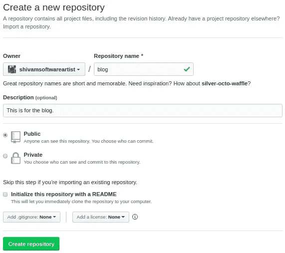
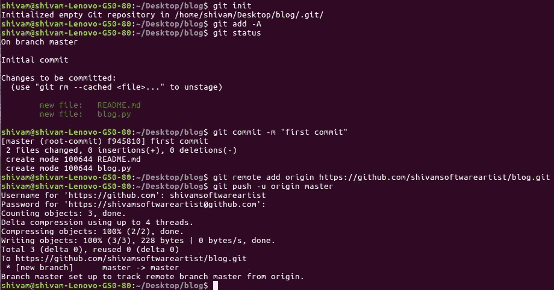
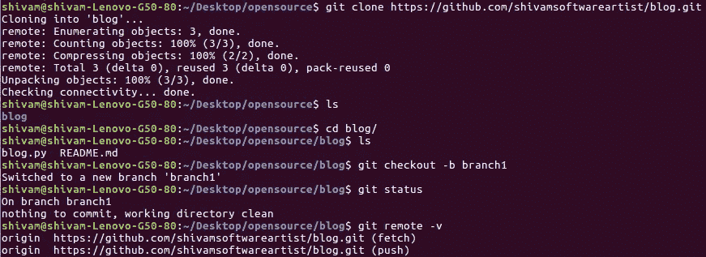
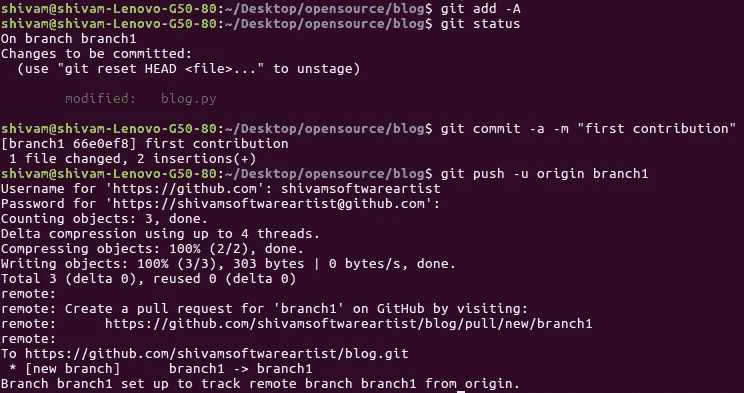
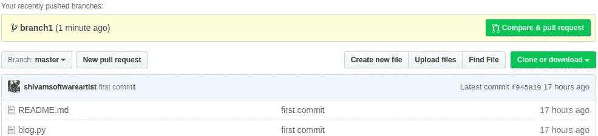

# Git & Github(对初学者来说可行且可理解的东西)

> 原文：<https://medium.datadriveninvestor.com/git-github-things-to-understand-for-a-beginner-425b4b3865bf?source=collection_archive---------8----------------------->

Git 是一个版本控制系统，处理项目的所有版本，Github 是一个 git 存储库托管服务。

Git 在我们的计算机上本地使用，Github 为它提供了一个基于 Web 的图形界面。

要明白 Git 和 Github 是两个不同的东西，可以分开使用，但是为了方便起见，我们一起使用两者。

# GIT 和 GITHUB 做什么:

它保存所有编辑过的历史，编辑前和编辑后的项目或存储库文件，以便您可以随时查看任何文件。

它允许我们远程操作一个存储库。

# 我们在 Git & Github 上做什么:

一般来说，我们在 Git & Github 上执行两个任务之一:

1.  在 Github 上上传一个新项目。
2.  对已经在 Github 上的项目进行更改。

 [## 数据科学和软件工程哪个更有前途？-数据驱动型投资者

### 大约一个月前，当我坐在咖啡馆里为一个客户开发网站时，我发现了这个女人…

www.datadriveninvestor.com](https://www.datadriveninvestor.com/2019/01/23/which-is-more-promising-data-science-or-software-engineering/) 

# 上传项目:

首先，确保您已经在系统上正确安装了 git。

第一步:进入你在 Github 上的个人资料，点击“新建库”。

1\. Create repository

*   添加存储库名称和描述，然后单击绿色按钮“创建存储库”。

注意:不要直接从这里用 Readme 初始化(Github)。

*   一旦你按下那个绿色按钮，你就会:

2\. Github

现在转到您的项目所在的文件夹，添加一个 README.md 文件。

打开保存项目的终端，执行以下操作:

3\. Terminal

确保您的终端位于包含所有文件的项目文件夹中。

上传一个项目的整个过程一般大概 6 个步骤:

1.  *git init:* 这个命令将您项目转换成 git 存储库。
2.  *git add -A:* 这个用来添加项目的所有文件。
3.  *git status:* 它会告诉你你在哪个分支上，要做的改变。
4.  *git commit-m " first commit ":*该命令用于提交更改， *-m* 用于给出提交消息。
5.  *git remote add origin https://github.com/shivamsoftwareartist/blog.git:*该命令设置远程 repo 指向的路径。每个其他回购的回购链接都是不同的。
6.  *git push -u origin master:* 这将把本地 repo 的内容上传到您的远程 repo，因为它是第一次提交，所以它被设置在 master 分支上。然后它会要求您输入您的 GitHub 个人资料的用户名和密码。

注意:提交消息很重要，因为它向其他人提供了进行更改的内容和位置的线索。

# 对 Github 上的现有项目进行更改或做出贡献

有两种类型的贡献:

1.  为你自己的项目做贡献。
2.  为他人的项目做贡献。

他们的执行没有那么多区别。

## 贡献:

**为自己的项目做贡献:**

4\. Terminal

1.  *git 克隆 https://github.com/shivamsoftwareartist/blog.git:*这个命令用于将项目下载到你的本地计算机，不同的库链接会有所不同。
2.  *git checkout -b branch1:* 现在转到存储库并创建一个分支(branch1 是分支的名称)。
3.  *git 状态:*它会告诉你你在哪个分支上。
4.  git remote -v: 它会告诉你你的来历。
5.  现在，在项目中进行您想要的更改，即添加文件或编辑您想要更改的文件。

5\. Terminal

6.git add -A: 这将添加项目中的所有变更。

7.再次运行 git status 来检查要提交的更改是什么。

8.*git commit-m " first contribution ":*这个命令将提交你所有的修改，提交消息同样重要。

9.*git push-u origin branch 1:*这将推送您的更改，但不会直接推送至主分支。

现在转到 GitHub 个人资料，你会看到:

6\. Github

10.您将看到“比较和提取请求”按钮，以创建提取请求。一旦创建了拉取请求，您的贡献就完成了。

如果这是你自己的回购，那么你可以随时合并它。

**为他人的项目做贡献:**

在你参与他人的项目之前，你必须决定你正在做哪个问题，或者为你想要的改变创建一个问题。

过程没有那么多区别。我们将遵循之前解释的相同流程，但请记住以下几点:

1.  *Fork:* 这里的第一步是将 repo 分支或复制到您的 GitHub 概要文件中，然后克隆到您的本地。
2.  现在，在终端中运行命令，在本地克隆项目。
3.  *pip Install-r requirements . txt:*通过这个命令安装所有的需求。
4.  现在执行前面解释的从步骤 2 到步骤 7 的步骤，并确保创建了一个单独的分支。
5.  提交您的更改，并在提交消息中始终提及问题编号，如#1 或给出的任何问题编号，以便您的提交可以用该问题编号来标识。
6.  推动您的更改，但不要直接推动到主分支上。
7.  转到 GitHub，点击“比较和提取请求”按钮，然后在消息中提及问题编号，这将引用该问题。
8.  在这种情况下，回购协议的所有者会查看您的提交，然后他/她只有在确信您的更改后才会合并它。

现在，我对实践这一过程的建议是，首先创建自己的回购协议，并开始为此做出贡献。你贡献的越多，你学到的新东西就越多。

这个博客不是关于 Git 和 Github 术语的详细解释。这个博客是为那些想立即开始的人准备的。

你应该阅读 [*Git*](https://git-scm.com/) 文档以获得详细的解释。

Git & GitHub 有很多事情要做，你可以用谷歌搜索它们，或者在 youtube 上浏览各种视频教程。

如果你对这个博客有任何疑问，请在 telegram[shivam _ software artist](https://t.me/shivam_softwareartist)上评论或 ping 我。

你还在等什么？开始贡献，让开源成为你学习和赚钱的新办公室。

快乐编码…😊😊