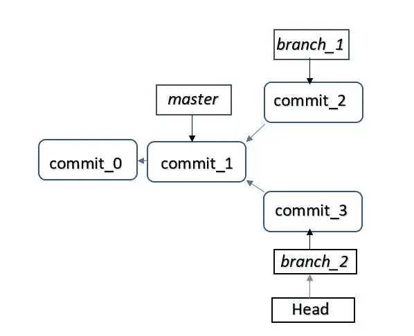
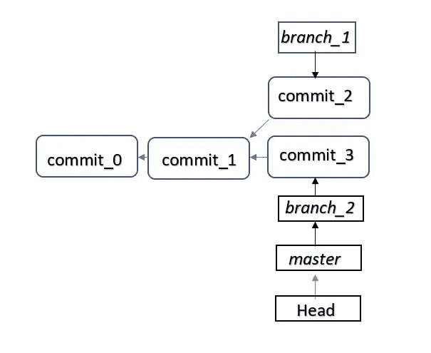

# Git good…适合初学者的分支

> 原文：<https://medium.datadriveninvestor.com/git-good-branching-for-beginners-96c1b97c2ca7?source=collection_archive---------3----------------------->

如果你和任何使用 [Git](https://medium.com/@sd_gitstorage/git-good-a-bit-about-git-9ce6a79c7e95) 的人交谈，你很可能会听到他们谈论分支、主、合并等等。如果您是 Git 新手，这可能会让您有点不知所措，但是相信我，它们听起来比实际情况更复杂。我会尽力用简单的英语解释分支。

考虑你最喜欢的软件或应用程序。您可能已经花了相当多的时间来使用它，并且已经探索了它的许多特性。你也可能对产品的新功能有想法。你可以建议产品团队开发这个新功能。想象一下，产品团队喜欢你的想法，甚至主动联系你，告诉你开发这个特性。可能性极小，但如果他们这么做了，那就太棒了，不是吗？

那么你该如何着手呢？一旦你获得了源代码，你会开始编辑它吗？不，你需要有一份代码副本，开发特性，查看它是否按预期工作，确保新代码不会破坏产品中的任何其他内容，精炼代码，彻底测试代码，然后将代码包含在主代码库中，以部署到生产中。Git 分支帮助您轻松完成所有这些工作，而不用担心弄乱原始代码或产品。

许多[版本控制系统(VCS)](https://medium.com/@sd_gitstorage/git-good-beginners-guide-to-version-control-systems-4fa96163fb68) 提供了一些分支的变体——在不影响主源代码的情况下开发一段新代码的能力。但 Git 比任何其他 VCS 都更有效，因为 Git 存储数据的方式——使用快照而不是文件和对文件的单独更改。当您提交一个更改时，Git 会存储树结构和相关文件的快照。您可以将分支视为指向特定提交的指针。默认情况下，引用第一次提交的第一个指针称为“主”分支。任何进一步的提交都会移动主指针以引用最近的提交。为了让我们更容易理解，假设主分支是部署在产品上的代码。

当您想要开始开发新特性时，您可以创建一个单独的分支，在这个分支上您可以进行所有的更改，而不用担心主分支。当您创建一个分支时，比如说从主服务器创建“branch_1 ”,创建一个新的指针，指向主服务器指向的同一提交，即 branch_1 指向当前在生产中部署的代码。但是在您做出任何更改之前，请记住您需要通知 Git 您想要通过 branch_1 来处理代码。Git 使用另一个名为“Head”的指针来确定您当前正在处理的分支。在我们的例子中，Head 现在将指向 branch_1。

您可以在 branch_1 中开始编写代码，一旦您提交了新的更改，就会存储一个新的提交，并且只有 branch_1 指向最近的提交。Head 仍然指向 branch_1，即您仍然在 branch_1 中工作。请注意，master 仍然指向上一次提交，即生产中的提交。您所做的更改没有影响到母版，因此也没有影响到生产环境。

如果您想到一种不同的方法来实现您的特性，并且如果您想从旧的提交开始您的开发，您可以将头部移回到 master 并创建一个新的分支，比如“branch_2”将 Head 移到“branch_2”，您就可以不同地实现这个特性了。一旦您提交了新的更改，branch_2 将指向您最近的提交。master 和 branch_1 都不受影响。

Multiple branches created; branch_2 is the current branch

您可以比较两个分支中的代码，并决定要在产品中包含哪个代码。假设您决定 branch_2 更好，并将该分支与主分支“合并”。主源代码现在包含了新特性的代码。你开心，产品团队开心，产品的用户也开心。这是一个双赢的局面！如果您想知道 branch_1 发生了什么，它仍然在您的存储库中，并且可以永远保留在那里。

Merge a branch to master

Git 使得创建新的分支、切换您想要工作的当前分支以及将特定分支合并到主分支变得容易。

[*Gitstorage*](http://gitstorage.com/) *对于开发新软件或考虑云 git 库替代方案的人来说是完美的设备。*