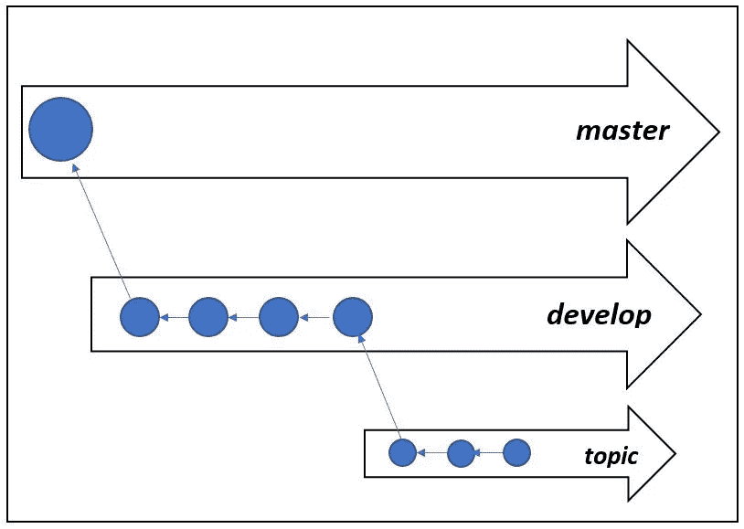

# git good…面向初学者的分支工作流

> 原文：<https://medium.datadriveninvestor.com/git-good-branching-workflow-for-beginners-93671e217b65?source=collection_archive---------24----------------------->

Branching workflow — master, develop and topic branches with commits

Git 是最流行的分布式[版本控制系统(VCS)](https://medium.com/@sd_gitstorage/git-good-beginners-guide-to-version-control-systems-4fa96163fb68) 之一。分支提供了开发一段新代码的能力，而不会影响主源代码或其他分支中的代码。尽管大多数 VCS 都提供了分支，但这是一个昂贵的操作，因为它需要复制整个代码库来创建分支。Git 以一种更加简单有效的方式实现了[分支](https://medium.com/datadriveninvestor/git-good-branching-for-beginners-96c1b97c2ca7)。Git 使用指针和快照来实现这一点。合并也处理得很好，允许开发人员创建分支并经常合并它们。他们可以在一天内多次这样做，事实上，建议这样做，并在短命的分支上工作。Git 之所以能够做到这一点，是因为它使用了指针和快照来维护代码库，使得分支的创建成为一项廉价的工作。

分支工作流强调了利用分支来创建稳定的软件产品并在您的组织中灌输软件开发过程的方法。可以通过查看三个样本分支的层次结构来理解工作流——主、开发和主题。主分支是在生产中部署的稳定代码。理想情况下，开发人员不应该直接在 master 上进行更改。这种做法可以防止在产品中引入不必要的 bug。“开发”分支理想地与主分支并行运行，也就是说，它包含主分支中存在的所有变更。打算包含任何新功能或代码修复的开发人员应该在开发分支上应用更改，彻底测试它，一旦这些更改被认为足够稳定，它们就可以与主分支合并。这可能是该产品的新版本。主题分支是带有特定目标的短期分支——重构代码、修复 bug、开发特性等。如果你正在处理一个大的、复杂的特性，你可以把它分解成更小的块，然后在单独的分支中开发这些块。

由于 Git 中处理分支和[合并](https://medium.com/datadriveninvestor/git-good-merging-for-beginners-37c437edf8e6)的方式，多个开发人员可以在不同的开发阶段同时处理多个分支。一旦一个分支中的开发完成，分支目标实现，代码被彻底测试，你就可以将这个分支合并到一个更稳定的分支中，这个分支在层次结构中更高。上面提到的层次结构—master—>develop—>topic，并不是一成不变的。您可以提出一个最适合您的流程的层次结构。但是强烈建议至少与一个分支而不是主分支合作。

我看到了这篇[文章](https://medium.freecodecamp.org/follow-these-simple-rules-and-youll-become-a-git-and-github-master-e1045057468f)，它谈到了为每个正在开发的新特性创建一个新分支的重要性。Git 通过使分支工作流简单明了，帮助开发人员坚持良好的开发实践。

[*Gitstorage*](http://gitstorage.com/) *是开发新软件或考虑云 git 库替代方案的人的完美设备。*