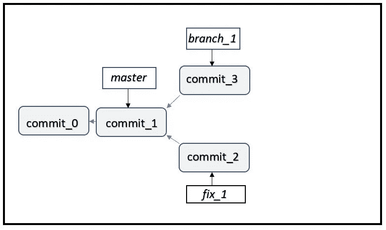
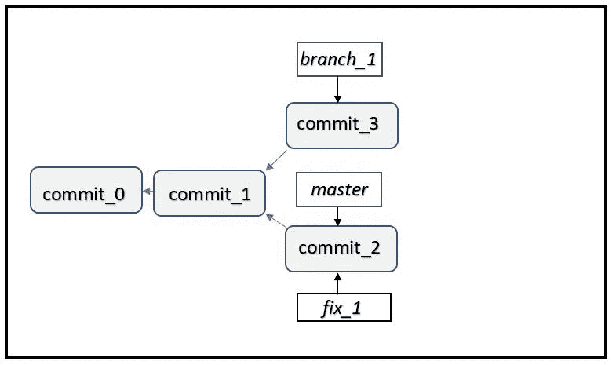
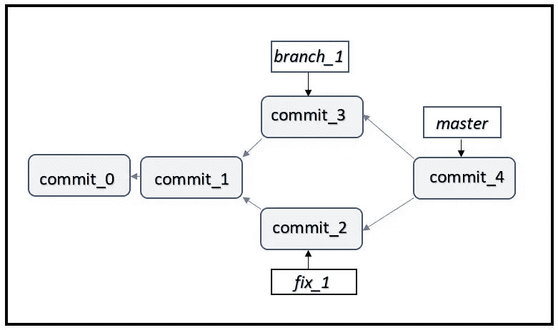

# Git good…为初学者合并

> 原文：<https://medium.datadriveninvestor.com/git-good-merging-for-beginners-37c437edf8e6?source=collection_archive---------42----------------------->

Git 的亮点之一是它管理分支的方式。与其他[版本控制系统(VCS)](https://medium.com/@sd_gitstorage/git-good-beginners-guide-to-version-control-systems-4fa96163fb68) 、 [Git 分支](https://medium.com/datadriveninvestor/git-good-branching-for-beginners-96c1b97c2ca7)相比，更加简单高效。其核心是，分支提供了开发一段新代码的能力，而不会影响主源代码或其他分支中的代码。人们可以同时处理几个想法或功能，而不用担心其他人正在做的改变。您还可以在开发树中来回切换，选择一个特定版本的代码，或者部署到生产环境中，或者对其进行修改。让我们看一个场景，在这个场景中，开发人员必须创建多个分支，并用这两个变更更新主分支。

假设你正在为一个软件产品开发一个新的特性。通常，会有一个主分支，它被部署到生产环境中，您将创建一个分支并致力于开发新的特性。现在假设你的同事在生产中发现了一个需要立即修复的 bug。你会等到特性开发和部署之后再修复 bug 吗？在修复 bug 之前，您是否希望暂停或放弃特性的开发？两者孰先孰后？可能更好的方法是独立开发特性和补丁，并在准备好的时候部署它们。您可以在稍后的时间点合并另一个分支。分支实现了这一点。让我们仔细看看这个例子。

假设产品的源代码在一个主分支中，有两次提交。创建 branch_1 并开始开发特征。同时，您的同事可以通过从 master 创建分支 fix_1 来修复 bug。他/她不必担心你在做什么，你在修改什么文件，你在做什么改变，或者你打算什么时候在产品中加入这个特性。您的同事或您可以更早地完成开发，并且可以毫无顾虑地将其与主分支合并。现在主服务器指向一个新的提交。

稍后试图合并的人需要更加小心，因为在开发历史中已经存在分歧，即，当前的主设备不同于创建 branch_1 的主设备。Git 考虑“原始”主服务器(branch_1 的父服务器)、当前主服务器(您同事的新提交)和 branch_1(您的最终提交)。Git 检查分支之间是否有任何冲突，即检查公共文件的公共部分在 branch_1 和 fix_1 中是否有不同的改变。如果没有冲突，Git 会合并两个分支，创建一个新的 commit 并更新 master。这个新的提交被称为合并提交，它引用两个分支作为父分支。

如果 branch_1 和 fix_1 中的变更之间存在合并冲突，会发生什么？Git 不会继续进行合并，这取决于开发人员来解决这个冲突。您可以选择代码的两个变体中的一个，或者根据需要编写一个可以实现这两种更改的新代码。解决冲突后，您可以像以前一样继续合并。Git 使开发人员能够高效地协作。他们可以独立开发软件，然后将它们组合起来开发产品。

[*Gitstorage*](http://gitstorage.com/) *对于开发新软件或考虑云 git 库替代方案的人来说是完美的设备。*