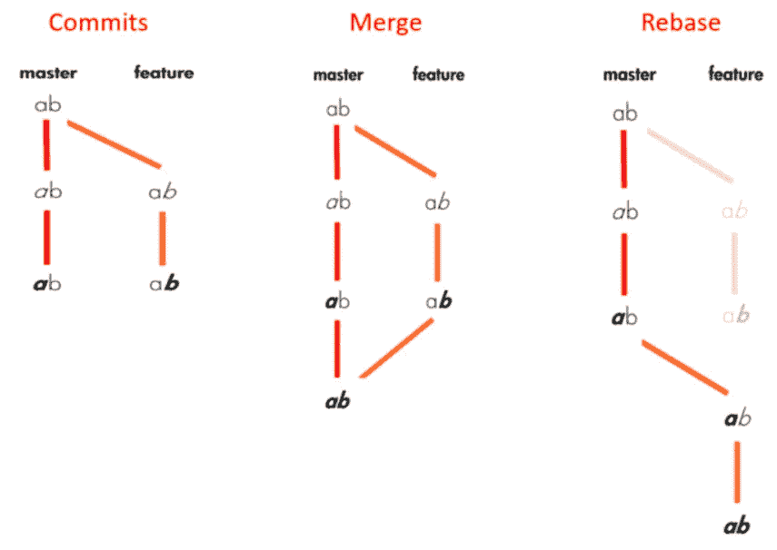
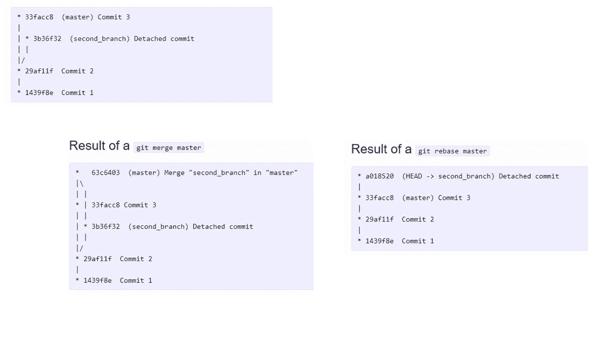

# git — Rebase vs Merge

> 原文：<https://medium.datadriveninvestor.com/git-rebase-vs-merge-cc5199edd77c?source=collection_archive---------0----------------------->

重定基础和合并都是为了将变更从一个分支集成到另一个分支，但是方式不同。

为了前任。假设我们有如下提交，合并将导致提交的组合，而 rebase 将从主分支的最后一次提交开始添加特性分支中的所有更改:

[https://hackernoon.com/git-merge-vs-rebase-whats-the-diff-76413c117333](https://hackernoon.com/git-merge-vs-rebase-whats-the-diff-76413c117333)

*   将特征分支重置到主分支上时，会将特征分支的基础移动到主分支的终点。
*   合并获取特征分支的内容，并将其与主分支集成。因此，只有主分支被更改。特征分支历史保持不变。
*   合并会向您的历史记录中添加一个新的提交。

提交将类似于:

[http://www.orbitale.io/2015/12/28/git-difference-between-merge-and-rebase.html](http://www.orbitale.io/2015/12/28/git-difference-between-merge-and-rebase.html)

什么时候重定基数？什么时候合并？

如果您从中获取变更的特性分支是与其他开发人员共享的，那么不推荐重新设定基础，因为重新设定基础的过程将会创建不一致的存储库。对个人来说，重定基数很有意义。

如果你想看到历史完全一样，因为它发生了，你应该使用合并。**合并保留了历史，而 rebase 改写了历史。**

重设基础更有利于简化复杂的历史，您可以通过 [**交互式重设基础**](https://medium.com/@filissen/git-interactive-rebase-e265bb55952a) 来更改提交历史。您可以删除不需要的提交，将两个或多个提交压缩为一个，或者编辑提交消息。

Rebase 将一次提交一个冲突，而 merge 将一次提交所有冲突。处理冲突更好也更容易，但是你不应该忘记，如果有很多冲突，恢复 rebase 比恢复 merge 要困难得多。你可以在 [**git —基本重置**](https://medium.com/@filissen/git-basic-rebase-1627b8296f04) 中找到基本重置过程的细节。