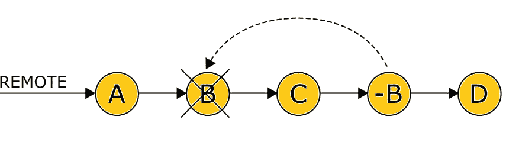
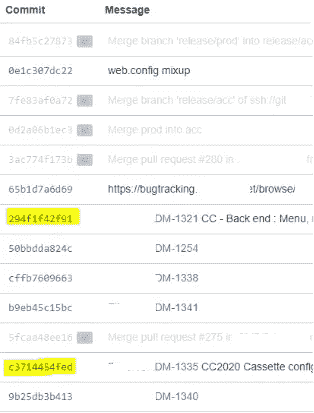
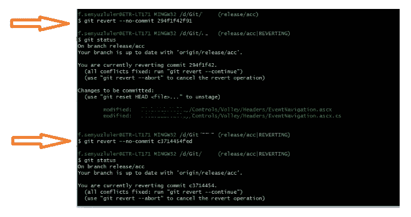
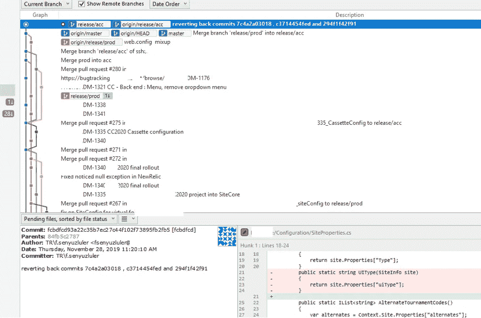
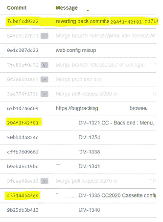

# git —恢复

> 原文：<https://medium.datadriveninvestor.com/git-revert-cfb7ed6e4d02?source=collection_archive---------5----------------------->

# 如何恢复已经合并到远程分支的提交

“ **git -revert** 用于记录一些新的提交，以**逆转**一些早期提交的效果。出于某种原因，您可能需要撤销之前所做的提交，

*   错误的提交，
*   在错误分支上进行的提交，
*   针对特定于项目的问题需要删除的提交…

假设您在一个项目中处理一个特定的特性，而您的队友在处理其他特性，并且所有属于您和他们的提交都以混合的顺序合并到主存储库中。然后项目将上线，但你所做的功能还不应该上线！

因此，您需要做的是“恢复提交”与您工作的特性相关的内容(不破坏现有的存储库),其余的都应该保持不变。

`git revert <commit>`是处理公共共享存储库的理想“撤销”方法。

 [## 数据科学和软件工程哪个更有前途？数据驱动的投资者

### 大约一个月前，当我坐在咖啡馆里为一个客户开发网站时，我发现了这个女人…

www.datadriveninvestor.com](https://www.datadriveninvestor.com/2019/01/23/which-is-more-promising-data-science-or-software-engineering/) 

您应该做的第一件事是获取到目前为止`git log`已经完成的提交列表，并识别需要恢复的提交。

下面的例子是使用 SourceTree 完成的。在这个例子中，我们不希望在提交`294f1f4f91`和`c3714454fed`中完成实现:

您必须小心的一点是**按照从最新提交到第一个提交的顺序恢复提交**(您想要删除的那些)**。**因此，第一个操作将是:

`git revert — — no — commit 294f1f42f91`

*   为了避免自动**提交**，有选项-n(或— **否**—**提交**)。

之后，要检查状态，您可以使用:

`git status`

对要恢复的其他提交重复相同的操作:

`git revert — — no — commit c3714454fed`

然后在 Sourcetree 上，您将看到一个新的提交出现，准备好被推送。这一步，如果你面临矛盾，一定要先解决矛盾再推。如您所见,`git revert <commit>`创建了新的提交，恢复了您不想要的提交。

虽然`294f1f42f91`和`c3714454fed`仍然存在于历史中，但是新的`fcbdfcd93a2`提交是变化的逆过程。因此，您可以将 **git revert** 操作视为反向的 **git cherry** - **pick** 操作、操作，它选择特定的提交并将其添加到回购中，而 **git revert** 创建一个提交来撤销回购中所选的提交。

希望这篇文章在你面临类似情况时有所帮助！