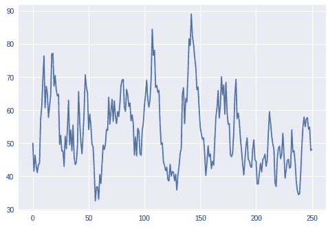
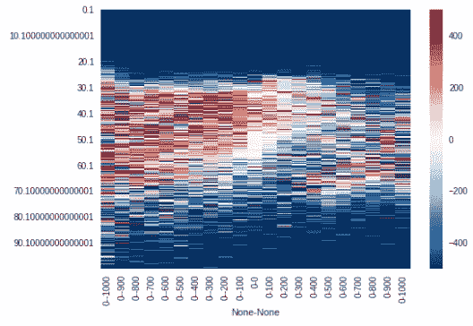
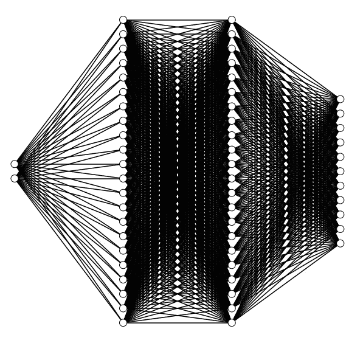
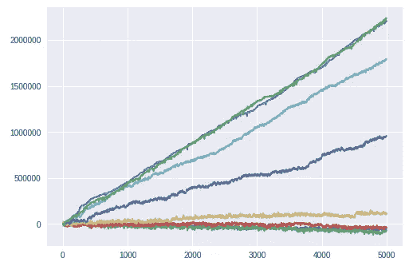
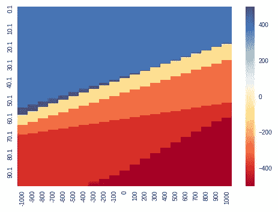

# 把虫子的大脑给交易机器人

> 原文：<https://medium.datadriveninvestor.com/giving-a-worms-brain-to-a-trading-robot-d55abccb4e8b?source=collection_archive---------0----------------------->

# DQ 商人

敏锐的眼睛注意到，在我之前的博客[‘教机器人低买高卖’](https://medium.com/@gjlr2000/teaching-a-robot-to-buy-low-sell-high-c8d4f061b93d)中，没有提到神经网络。

然而，在所有的新闻中，谈论的都是“深度学习”如何被用来在人类的地盘上击败人类(Go)。那么神经网络可以用在哪里呢？

概括一下戈登·里特在《交易的机器学习[中定义的学术问题:](https://papers.ssrn.com/sol3/papers.cfm?abstract_id=3015609)

给定一系列价格，比如

当价格水平均值回到 50 左右时，自动交易者需要选择能够返回“最佳”盈亏(PNL)曲线的操作。**注意:**代替这个学术例子，从业者可以使用现实生活中的价格信号——阅读我的入门系列[交易均值回复](https://www.linkedin.com/pulse/trading-mean-reversion-full-series-gerardo-lemus/)来找出如何找到它们。

这张图片展示了自动化交易者在一百万次模拟后可以采取的行动:

让我们选择价格= 40.1，持有= 0.0 (x 轴)；单元格中的橙色代表买入+200 股的行为。在左边有买入的偏好，但是当价格低于 20 时，系统回到默认(卖出)。

在深度 Q 网络学习 DQN 中，我们用一个函数逼近器来代替 Q 空间的‘备忘单’(阅读[‘教机器人低买高卖’](https://medium.com/@gjlr2000/teaching-a-robot-to-buy-low-sell-high-c8d4f061b93d)来理解 Q 空间的含义)。在我的例子中，我使用了一个“深度”神经网络(大脑)——深度是因为它有“多个”隐藏层(即使只有 2 层)。

我们不是通过模拟大量可能的“状态”来构建一个巨大的“备忘单”(请阅读我上面的博客)，而是训练一个具有 2 个输入(一个用于价格，另一个用于当前持股)和 11 个输出(每个动作一个，从卖出 5 股到买入 5 手股票*包括*什么都不做)的神经网络。添加(完全任意地)2 组 22 个隐藏神经元(使用输出数量 2 倍的经验法则)，我们得到一个总共有 57 个神经元的“大脑”！(甚至一个[蛔虫](https://en.wikipedia.org/wiki/List_of_animals_by_number_of_neurons)都有更多)。它与 AlphaGo 的架构相去甚远，但对于这个简单的例子来说，它工作得很好——如果有什么不同的话，也许我们可以降低复杂性并获得相同的结果。

在[用于交易的机器学习](https://papers.ssrn.com/sol3/papers.cfm?abstract_id=3015609)论文中，Gordon Ritter 模拟了这个过程 1000 万次；使用神经网络，我只需要模拟这个过程 7 万次，直到我在样本外测试中得到类似的结果:

每条线代表 1 万次训练模拟后的交易 PNL，最后一次运行(总共 7 万次训练模拟)是绿线，它符合 Ritter 描述的 PNL——接近 250 万单位(美元？)使用五千个样本模拟。

我让神经网络给我提供等价的动作清单:

神经网络定义了更好购买的区域(例如，如果你当前持有的是 0 手，则以低于 40 *的价格购买，但是如果你已经持有超过 500 手，则以 40 *的价格出售)。经过更多的训练后，整个画面可能会集中在两个区域(买入和卖出)。

神经网络生成的动作图比全 Q 空间更清晰(谁说神经网络是黑盒？)，而且需要的样本更少(7 万个而不是 1000 万)。然而，我很随意地定义了这个架构——它应该遵循一个更系统的方法(假设我们有一个模拟器，可以根据需要生成尽可能多的样本)

代码相当古怪，但我在下面添加了它: