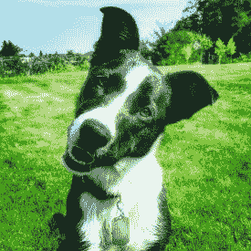

# 给艾一张信任和原谅的脸

> 原文：<https://medium.datadriveninvestor.com/giving-ai-a-face-to-trust-and-forgive-e5c47385995b?source=collection_archive---------3----------------------->

Brilliant, for a dog…

人工智能在激发信任方面有问题。许多人都对 Alexa 的持续收听或谷歌助手近乎人类的声音感到不安。当我告诉人们设计人工智能时，我得到的普遍反应是“它太令人毛骨悚然了”，他们没有错。很少有聊天机器人可以冒充人类，即使是最优秀的聊天机器人也能稳稳地呆在恐怖谷，对这项技术的错误期望最终会造成令人沮丧的失望。那么，我们如何让人们信任他们已经在交谈的人工智能，并减轻最终的失望？我想推荐可爱的非人类化身。

三分之二的美国人与动物生活在一起，90%的宠物主人认为他们的狗和猫是家庭成员。我们通常更信任狗而不是人，并原谅它们的错误，认为它们是可爱的怪癖。你的狗在听你说话时会翘起它的小脑袋吗？或者当它知道自己把事情搞砸了，而你马上原谅它时，它看起来很难过？如果是这样，你并不孤单。就像狗一样，人工智能非常聪明，但有时也会傻得令人捧腹。

我们可以利用这张可爱的毛茸茸的脸来创造一个人们既信任又接受其局限性的人工智能。如果下一次谷歌助手说“对不起，我不明白”时，它有一只狗的头像，突然垂下它的头，就像它在地板上撒尿一样，我们可能更愿意原谅它，毕竟它仍在学习，并非常努力地想变好。

谁是好机器人？是的，你真是个好机器人！