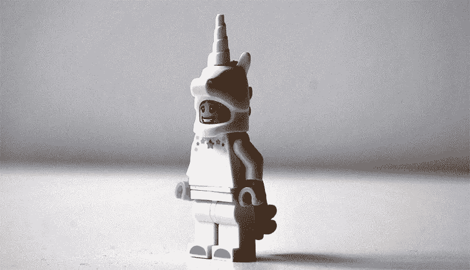
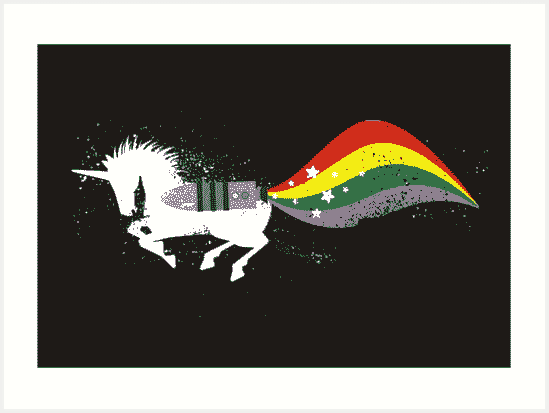
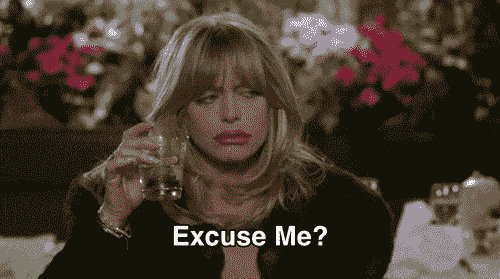
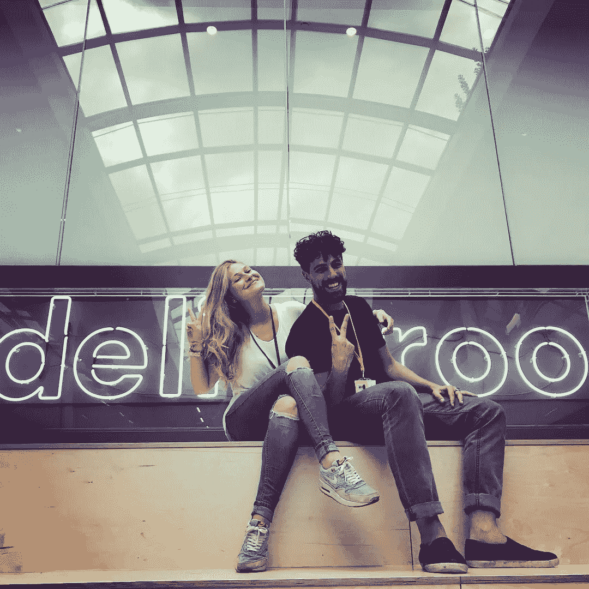

# 放弃自我——为什么你必须“大”才能感觉“小”并在初创企业(和生活)中生存。

> 原文：<https://medium.datadriveninvestor.com/giving-up-your-ego-why-you-have-to-be-big-to-feel-small-and-survive-in-a-start-up-and-in-5132ee6c49e?source=collection_archive---------2----------------------->

十几岁时，我是一个半途而废的人——除了在学校戏剧中扮演主角，或者在体育比赛中被“降级”到 B 队，我什么都不做，就认输了。

我对“不是最好的”感到极大的侮辱。我不能忍受当副手，有一种比我自己更好，说实话，比其他人更好的扭曲的感觉。

我很惭愧地说，我觉得不可理解的是，别人可能比我更适合或更有技能，却不因此少考虑自己。更糟糕的是，这种“冷落”会让我的同事们认为我“没那么好”,而不是我迫切希望他们相信的那样。我也看不到坚持做某事来赢得尊重或实现我的长期目标的价值。快进到两年半前，我加入了欧洲发展最快的公司 Deliveroo。这是一家羽翼未丰的初创企业(D 轮)，正处于大事件的风口浪尖。我们有 500 人，我觉得自己像是小池塘(但不断扩大)中的一条大鱼。这就是加入早期企业的好处之一——你有机会成为某件事情的开端，成为引擎中的关键一环。我坐在离我们的首席执行官只有四个座位的地方，很幸运地在火箭飞船开始真正起飞的时候，我登上了飞船并帮助建造了它。5, 4, 3, 2, 1….

升空。

自那些令人兴奋的早期以来，发生了很大的变化。我们的努力得到了回报——我们的规模是我刚开始时的八倍多，并且享受着谷歌式办公室的远景。我们已经获得了另外两轮融资，与我们的销售一样，我们的员工也呈指数级增长。虽然创业精神依然存在，但这家公司已经从我加入的那家公司发生了翻天覆地的变化。同样，许多面孔也是新面孔，与人人都直呼其名的时代相去甚远。我呢？我已经变成了一个更大团队中的一条小鱼，一个有着更大抱负的更大办公室。这个池塘现在变成了一个湖，有更多的鱼，很多都比我大。如果一切按计划进行，我们正在变成海洋。

正如莫莉·格雷厄姆(Molly Graham)完美地描述的那样，在初创企业和这种环境中，需要“放弃你的乐高[s]”。以这样的速度发展业务，对公司和为公司工作的个人来说，都有一系列独特的挑战。随着业务呈指数级增长，我们也必须跟上步伐。因此，一个人的适应能力以及他们对不断变化的业务性质、他们在业务中的角色以及他们所做的工作的适应能力，可能是我们生存下来的最有价值的资产，更不用说茁壮成长了。我最喜欢的一句话是我们必须**“在感觉不舒服的时候变得舒服。”**正是这种驾驭变革之风的能力最近对我的考验超过了迄今为止我任职期间的任何时候。

公司决定雇佣一个比我级别更高的人来管理我——一个迄今为止我一直是“领导”的区域的主管。在一家成长中的初创公司工作，尤其是作为一名雄心勃勃的送货员，是需要改变的。需要新的技能，获得新的视角。这些人会挑战你的思维，带来新的想法。但这是破坏性的，很难听到，尤其是当你已经习惯了自己在公司的角色以及公司的发展方向。

我们公司的价值观之一，也是我最看重的一点是“直截了当”因此，作为一个将自己描述为雄心勃勃的人，我不会假装这不是对更高级别的人加入的一种调整。像我们中的许多人一样，在将公司发展到今天的过程中，我流过血、汗和泪。如果我的自大的“黑猩猩”得到了它的方式，最简单的事情就是被这个挫伤，沮丧。**这是十几岁的爱丽丝会跳槽的地方。**

但是，既然我已经长大了，如果我让自己这样想，我会是什么样的“个人发展迷”呢？嗯，不是很好，就是这样。所以，我选择“挑战我的黑猩猩”，贬低我的自我，用不同的眼光看待事物。建设性地。也就是说，有过沮丧的时候吗？当然，那是人之常情。但我认识到，如何应对这一挑战是我的选择。我可以是失败主义者，也可以是积极的。

我不是唯一一个经历这种混乱情绪的人——创业不适合胆小的人，我们都在情感洗衣机周围翻滚。我知道这篇文章可能会让我变得脆弱——“你好，未来的新老板，有一天你会读到这篇文章！”。但我想我只是想说，当它感觉暗淡，当它变得太多和“疯狂的艰难”时，你只想从过山车上下来——你并不孤独。我们都有这样的时刻。我们每个人都在自己的疯狂、令人兴奋的旅程中经历着独特的曲折。请记住，伴随着疯狂的是乐趣——疯狂的乐趣伴随着我们的成长、学习和建立一些我们可以引以为豪的东西，同时也让我们成为一生的朋友。

如果我们想要成功地走出舒适区，创业和生活中的障碍是不可避免的。但是我们如何回应它们是在我们的天赋之内的——这实际上是我们自己唯一能控制的东西。重要的不是我们遇到了什么，而是我们如何练习我们需要练习的东西。我们如何有自知之明，如何保持谦逊，以及当我们跌倒或停滞不前时，如何重新振作起来。我们选择我们生活的现实，我们是我们头脑中的声音。我们决定如何与自己对话，如何描绘一幅情景。

我能不能大大方方地看到这个决定比我更重要，甚至对我有好处？我能看着自己的眼睛，诚实地说我已经准备好达到公司需要这个董事职位的水平了吗？**我真的像我想的那样好吗？妈的，也许不是。**

这可以吗……**我可以吗？我想我开始意识到它终于来了。我正在学着适应自己，不管有没有这个头衔。我知道我的幸福是我自己创造的，而不是人们是否认为我是个了不起的女商人，或者，举个例子，不是。尽管有挫折，我是一个好人，我有一个非常幸运的生活。**

虽然这对我来说似乎是世界上最大的事情，但在生活的大计划中，事实上，对我来说，或者对我认为真正在乎它的人来说，这并不重要。因为事实是，人们太专注于自己的挑战，而没有太多时间关心我们的挑战。他们不会纠结于我们在一次会议上说的那句蠢话，也不会纠结于我们额头上有一大块斑点的事实。因为他们忙于生活在自己的“聚光灯”下，担心自己的位置和搞砸的事情。所以，你看，**我们困境的大小完全取决于我们自己和我们看待困境的方式。我们可以小题大做，我们可以为此自杀。或者我们可以深呼吸，接受并学习，然后继续前进。**

透视是一件奇妙的事情。因为当你从池塘中放大时，你会发现整个生态系统充满了生命。我们决定我们在什么上花费精力，我们把注意力放在哪里，我们赋予什么价值。只有我们最终会专注于负面的东西。**佛说；"抓住愤怒不放就像喝了毒药，然后期望对方死去."**无果。当我们能够谦卑地看到，往往是我们自己的自我的气味是可疑的，并意识到无论今天的头条新闻可能是什么，都将是明天的鱼和薯条纸，我们最终可以开始放下所有的包袱，感到自由。尽我们最大的努力，找到困境中的“塞翁失马焉知非福”,看到未来是光明的，充满了成长的机会。

