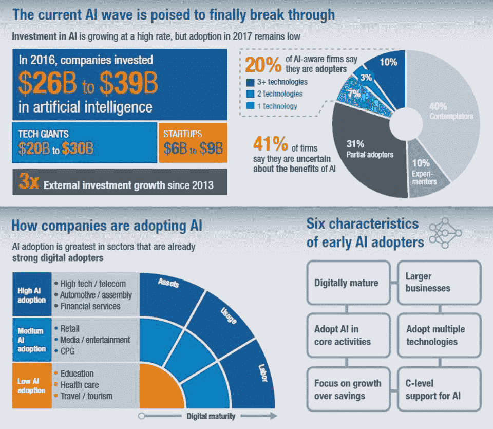
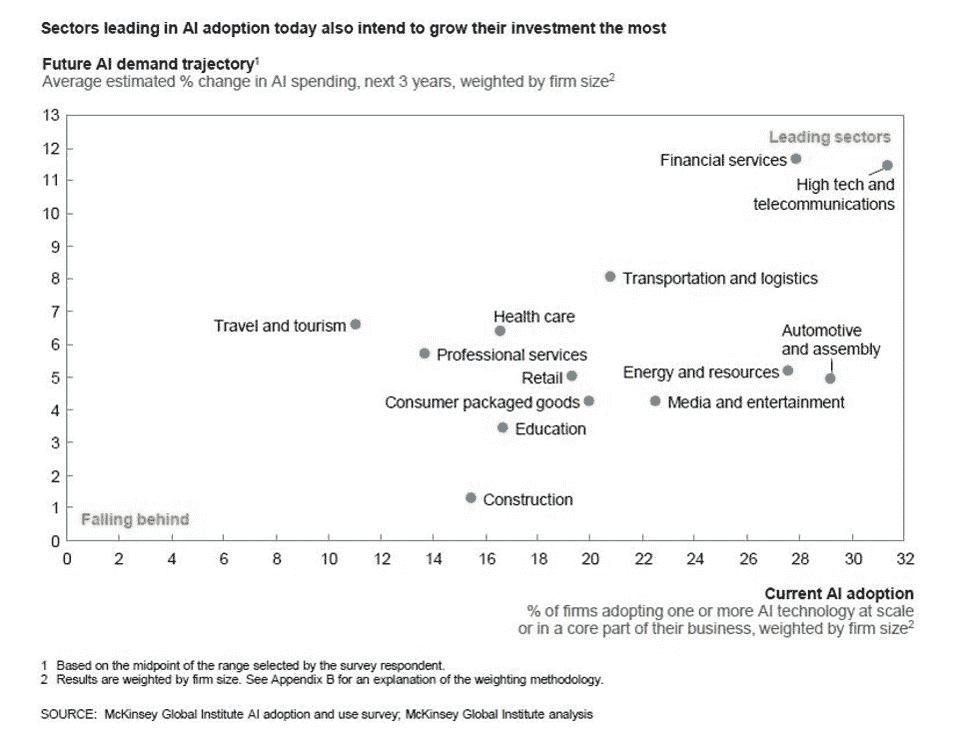

# 窥见未来:人工智能

> 原文：<https://medium.datadriveninvestor.com/glimpsing-into-the-future-artificial-intelligence-444b1ef79e07?source=collection_archive---------33----------------------->

在我今天正式开始我的第四个十年之际，在审视了我们面临的大趋势之后，我们现在展望将塑造我们未来的技术是再合适不过了。

技术进步正在加速并创造新的机遇，同时也产生了新的争论和挑战。重要的是要确保技术不会把人们分成赢家通吃阵营和输家阵营。

几乎在整个人类历史上，技术一直是一个推动者，但现在它比以往任何时候都更能塑造我们所知道的世界。这是因为三个关键事实:

1.  计算机处理能力(CPU、RAM 或存储)从未如此巨大和便宜:它实际上正在成为地球上几乎每个人都能负担得起的。亚马逊、谷歌、微软、IBM、阿里巴巴或数字海洋等公司已经在全球范围内部署了云。IaaS(基础设施即服务)的可用性仍在快速增长。
2.  互联网现在是一个真正的平台，启动了数字化转型:一切都是(或正在成为)数字化的。以前所未有的速度收集[的数据](https://www.eetimes.com/author.asp?section_id=36&doc_id=1330462)。
3.  从未经历过没有手机或互联网的世界的新一代数字原住民今天正在进入劳动力市场。他们正在挑战[业务流程](https://hbr.org/2018/03/how-digital-natives-are-changing-b2b-purchasing)和仍然依赖于一套预定义角色和任务的内部结构。

# 未来的一瞥

著名的未来学家和科学家雷·库兹韦尔做出了几个被证明是正确的预测。最近，他对未来 40 年的预测总结如下:

*   2010 年:10tb 的计算能力只需 1000 美元
*   2020 年代:纳米机器人将变得更加智能，无人驾驶汽车将开始主宰道路
*   **2030s** :虚拟现实(VR)会感觉 100%真实
*   2040 年代:非生物智能将比人类强大十亿倍

你可以在这里找到更多他迷人的预言。

窥探未来的另一种方式是看各种技术将如何改变我们生活方式的预言。根据咨询公司[McKinsey](http://fortune.com/2015/07/22/mckinsey-disruptive/)2013 年的一份报告，2025 年的六大颠覆性技术将是:

*   移动互联网
*   知识工作的自动化
*   物联网
*   云技术
*   高级机器人技术
*   自主和准自主车辆

在本系列的后续文章中，我将探索各种技术趋势，并看看它们的影响。但让我们从其中最大的一个开始，它影响了麦肯锡列表中的所有技术:人工智能(AI)。

# 人工智能

艾已经成为主流媒体和公众关注的焦点:[报纸几乎每天都在谈论它](https://metro.co.uk/2018/09/10/artificial-intelligence-poses-bigger-risk-to-humanity-than-terrorism-or-climate-change-expert-warns-7919332/)。然而，术语“人工智能”是有问题的，因为它被用得太广泛了，指的东西太多了。“人工智能”并不是捕捉这项技术带来的许多变化的最佳或最准确的术语。

简而言之，人工智能基本上是机器执行我们与人类思维相关的认知功能的能力，例如感知、推理、学习、与环境的互动、解决问题，甚至是锻炼创造力。

人工智能既是一个平台，也是技术的组合，将推动我们的生活变得更有生产力、更有创造力，或许更容易控制。今天，人工智能技术正在实现机器人、自动驾驶汽车、计算机视觉、语言识别、虚拟代理等等。

从纯技术和算法的角度来看，人工智能可以分为 3 类:

*   **行为方法和统计方法**:如何解读你的数据，比如在市场营销中广泛使用。
*   **机器学习**:如何在你的数据中发现模式，理解适合你数据的正确模型。现在，它几乎被用于各个领域，帮助检测癌症，建议购买新产品或观看电影
*   **深度学习**:现在著名的神经网络被广泛应用于像 [Siri](https://www.apple.com/siri/) 、 [Alexa](https://developer.amazon.com/alexa) 或[图像识别](https://www.tensorflow.org/tutorials/images/image_recognition)这样的应用中

如下图所示，尽管人工智能的故事几乎每天都登上头条，但我们才刚刚开始人工智能革命。公司和州([法国](https://www.aiforhumanity.fr/)，[美国和中国](https://www.cnbc.com/2018/05/04/china-aims-to-steal-us-a-i-crown-and-not-even-trade-war-will-stop-it.html)清楚地认识到该领域的重要性)正在大量投资，但采用率仍然很低。

**来源** : [人工智能:下一个数字前沿，麦肯锡全球，2017 年 6 月。](https://www.mckinsey.com/~/media/McKinsey/Industries/Advanced%20Electronics/Our%20Insights/How%20artificial%20intelligence%20can%20deliver%20real%20value%20to%20companies/MGI-Artificial-Intelligence-Discussion-paper.ashx)

也就是说，第一个真实世界的用例开始被记录。据[麦肯锡](https://www.forbes.com/sites/louiscolumbus/2017/07/09/mckinseys-state-of-machine-learning-and-ai-2017/#4ff02d4775b6)称，在金融服务领域，人工智能优化的欺诈检测系统预计将在 2020 年成为 30 亿美元的市场。

[得益于 Kiva 机器人，亚马逊](https://qz.com/709541/amazon-is-just-beginning-to-use-robots-in-its-warehouses-and-theyre-already-making-a-huge-difference/)已经将“点击发货”周期从 60–75 分钟缩短至仅 15 分钟，而[网飞](https://www.wired.co.uk/article/how-do-netflixs-algorithms-work-machine-learning-helps-to-predict-what-viewers-will-like)已经改善了对其全球 1 亿用户的个性化推荐，让客户满意并减少取消。

人工智能将改变所有行业:

今天，大多数人工智能用例都局限于良好范围的目的；它们都展示了能够自主行动的目标，并遵循一个过程:**理解**、**学习**、**预测**和**适应**。人工智能被用来让“机器”变得自主的可能性将带来新的挑战，需要创建标准、规范和[来定义我们想要走多远](https://openai.com/about/)。

当然，人工智能并不是孤立发生的。数据科学的快速发展，提供算法访问的模型驱动平台的出现(见[亚马逊](https://aws.amazon.com/machine-learning/)、[谷歌](https://ai.google/)和[微软](https://www.microsoft.com/en-us/ai/ai-platform))以及从数据驱动架构到事件驱动架构的转变将促进机器人、智能助理以及**智能机器**的兴起——这将在下一篇文章中详细介绍。

作为一个直接后果，我将在未来几年重点关注人工智能，并深入挖掘其用例以及对世界的影响。

**还在这个系列:**

早些时候，我概述了我们如何生活在一个非常两极分化的世界中，并问我们的未来会是什么样子，以及我们如何组织起来通过合作找到解决方案。