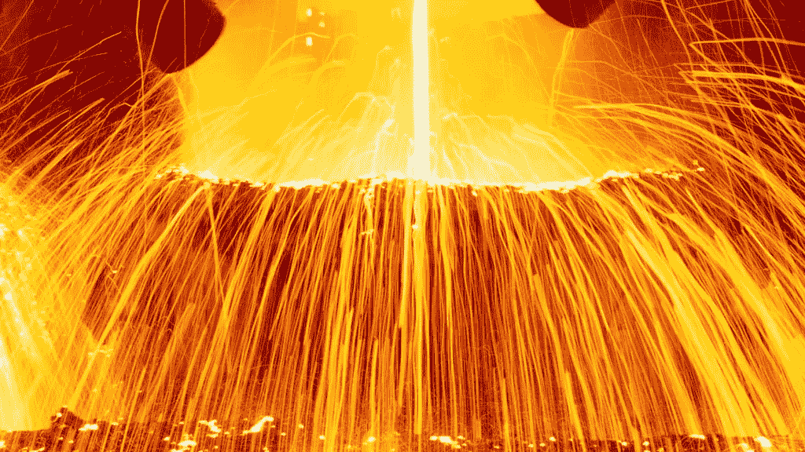
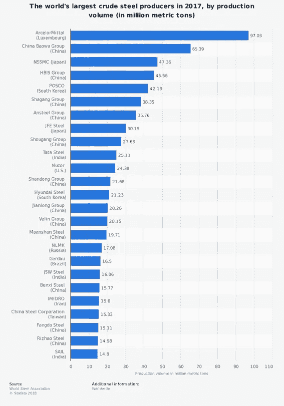
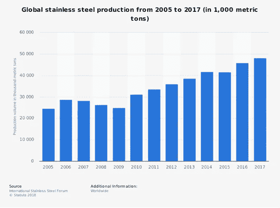
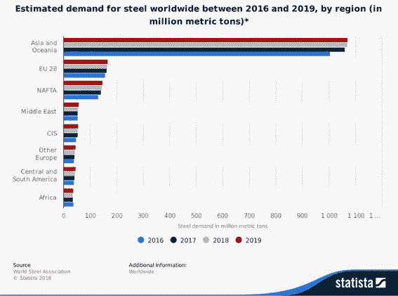
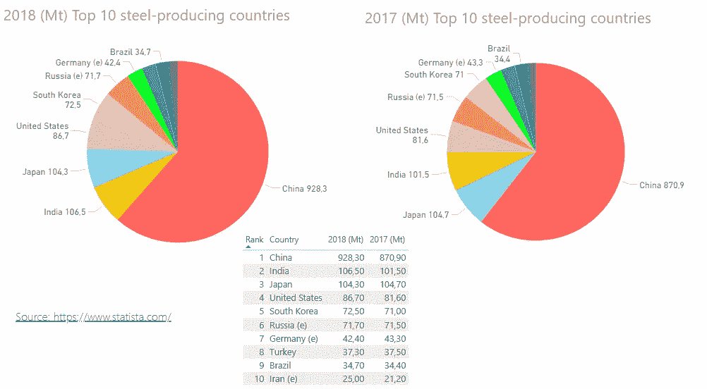
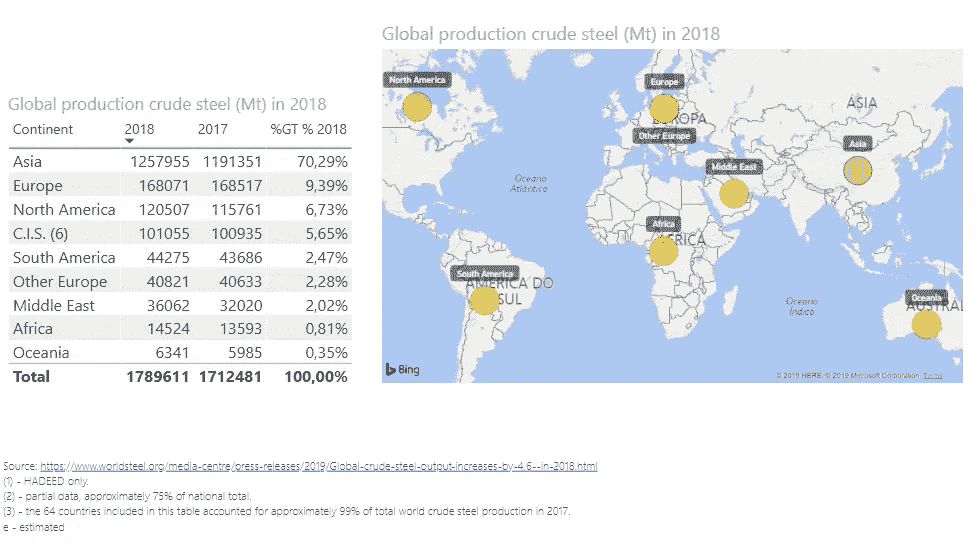
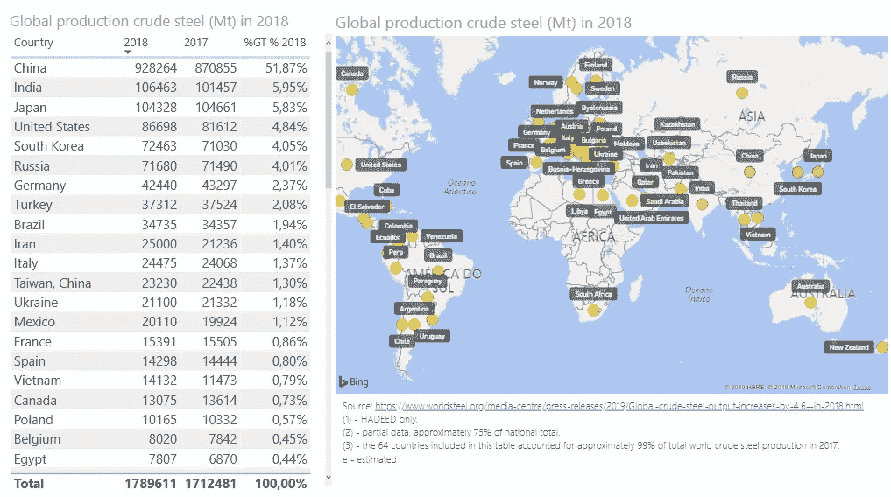

# 2018 年全球粗钢产量

> 原文：<https://medium.datadriveninvestor.com/global-crude-steel-production-in-2018-b3bddc620c4c?source=collection_archive---------15----------------------->

Source: [https://recyclinginternational.com](https://recyclinginternational.com)

本研究的目的是分析全球钢铁产量，并使用可视化工具(如 PowerBI)来展示信息。

钢不仅是最常见的金属合金之一，也是应用最广泛的材料之一，尤其是在造船和汽车制造以及建筑和基础设施开发方面。从 2009 年开始，钢铁行业经历了充满挑战的几年，包括美国金融市场的动荡，中国建筑支出放缓以及中国钢铁过剩，俄罗斯和乌克兰的政治不稳定，以及欧元区主权债务危机，希腊仍处于债务违约和可能退出的边缘。预计 2021 年全球钢铁需求将温和复苏。2017 年，卢森堡的**安赛乐米塔尔**被评为全球最大的钢铁生产商。

为了节约成本并使高耗能的钢铁工业更加环保，废钢从废物流、报废汽车、拆除建筑或其他工业来源中收集，并被熔化成新产品。钢是金属中回收利用率最高的之一。

Source: [https://www.statista.com](https://www.statista.com)

2018 年欧洲领先工业金属公司的收入，据《金融时报》报道，荷兰公司安赛乐米塔尔(Arcelormittal)录得欧洲工业金属和矿业公司最高收入，达 745 亿美元。

下图统计显示了 2005 年至 2017 年间的全球不锈钢产量。2017 年，全球生产了约 4810 万公吨不锈钢。不锈钢不仅用于建筑，还用于建筑、制造和艺术行业。

Source: [https://www.statista.com](https://www.statista.com)

Source: [https://www.statista.com](https://www.statista.com)

2018 年，全球表观钢铁使用量预计将增长至 16 亿公吨左右。北美自由贸易区和欧盟地区的收益以及新兴经济体不断增长的需求可能会推动这一增长。与此同时，预计 2016 年至 2017 年间，中国钢铁表观消费量将持平增长。废钢和钢铁回收的市场预计会给钢铁生产行业带来麻烦。

U 使用 PowerBi 创建一些带有[www.statista.com/](https://www.statista.com/)信息的图表:

2018 年和 2017 年钢铁产量排名前十的国家:

[Source: https://www.statista.com/](https://www.statista.com/)

我们认为中国是世界上最大的钢铁生产国，占全球钢铁产量的 50%以上。

我们看到巴西的产量在 2017 年至 2018 年期间几乎没有变化，在世界产量排名中占据第 9 位。

Source: [https://www.worldsteel.org/media-centre/press-releases/2019/Global-crude-steel-output-increases-by-4.6--in-2018.html](https://www.worldsteel.org/media-centre/press-releases/2019/Global-crude-steel-output-increases-by-4.6--in-2018.html)

南美洲在最大的钢铁生产地区中排名第五，这是因为巴西在世界产量中排名第九。

Source: [https://www.worldsteel.org/media-centre/press-releases/2019/Global-crude-steel-output-increases-by-4.6--in-2018.html](https://www.worldsteel.org/media-centre/press-releases/2019/Global-crude-steel-output-increases-by-4.6--in-2018.html)

按国家来看，德国作为全球领先钢铁生产国的优越地位是欧洲第二大生产国。中国惊人的钢铁产量是这项研究的主要事实之一。

*参考文献:*

https://【www.worldsteel.org/ 

https://【www.statista.com/ 

## 来自 DDI 的相关故事:

 [## 为什么数据会改变投资管理

### 有人称之为“新石油”虽然它与黑金没有什么相似之处，但它的不断商品化…

medium.com](https://medium.com/datadriveninvestor/why-data-will-transform-investment-management-4a60966c1c81)  [## 投资算法快速指南

### 让我们想象一下 30 年前的股市…

medium.com](https://medium.com/datadriveninvestor/a-quick-guide-to-investment-algorithms-628450b9dc55)