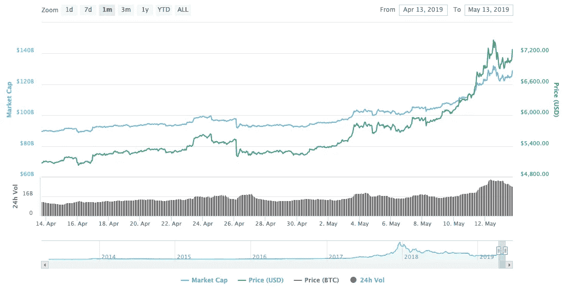
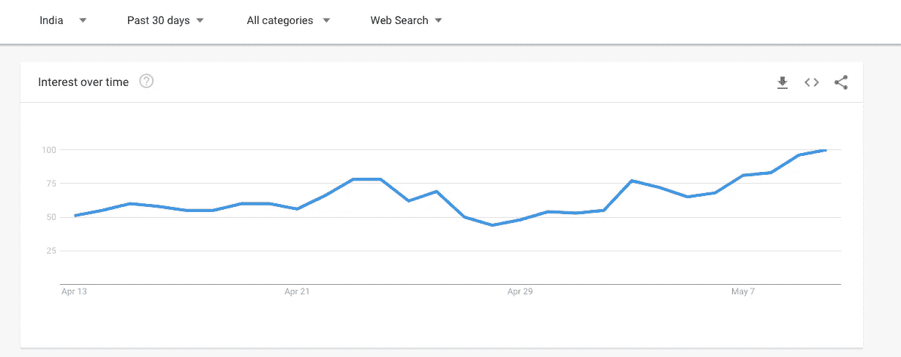

# 全球密码交易所 OKEx 的目标是进入印度市场

> 原文：<https://medium.datadriveninvestor.com/global-crypto-exchange-okex-aims-to-enter-indian-market-bf0f6a0dd86f?source=collection_archive---------8----------------------->

## 宣布免费的 USDT 被分发到诱惑印度密码商人

*免责声明:交易数字资产涉及重大风险，可能会导致您投资资本的损失。你应该确保你完全了解所涉及的风险，考虑你的经验水平、投资目标，并在必要时寻求独立的财务建议。*

虽然现有的印度加密交易所正在努力在印度的监管风暴中生存，但总部位于香港的加密交易所 OKEx 计划在印度加密领域建立据点。意识到印度的潜力，OKEx 于 2019 年 5 月 16 日宣布了他们在 launchpad 上的第二次代币销售——OK jump start。

 [## 总部设在瑞士的 ETP 进入加密交易市场-数据驱动的投资者

### 虽然金融市场几乎没有沉闷的时刻，特别是在引入…

www.datadriveninvestor.com](https://www.datadriveninvestor.com/2019/03/10/swiss-based-etp-enters-the-crypto-trading-market/) 

## OKEx 将从比特币价格飙升中获利

比特币是世界上最大的加密货币，仅在上个月就飙升了近 50%，引起了所有人的关注。比特币已经有一年多没有出现这种价格波动了，比特币打破了 4200 美元的长期阻力，引发了比特币加密表兄弟的看涨势头。

Source: CoinMarketCap

OKEx 进入印度市场的时机再好不过了，因为比特币交易的搜索趋势一直在飙升。

Source: Google Trends

之前的令牌销售是针对 Blockcloud 项目及其原生 BLOC 令牌，这一次在一秒钟内就销售一空，甚至超过了币安交易所 22 秒的取货速度。AI token。

第二次令牌销售针对的是 ALLIVE 令牌，第一次订阅会话将于上述日期的 05:00(欧洲中部时间，世界协调时+1)开始，第二次会话将于 06:00(欧洲中部时间，世界协调时+1)开始。

## 深入探究活着的象征

[ALLIVE](https://allive.io/) 是一个基于区块链技术的智能医疗生态系统。该项目旨在为健康数据集成提供标准化格式，保护数据隐私并支持扩展兼容性。ALLIVE 与 Ontology 合作，Ontology 是一个公共的区块链和分布式信任协作平台，用于数据共享。

ALLIVE 拥有超过 100 万来自传统医疗保健领域的现有用户。在过去的 3 年里，该团队一直在建立一个普通的人工智能医生和一个全面的医疗保健系统，基于三个模块:Olive，Olivia 和 Oleaf。该团队在医疗保健行业拥有超过 15 年的经验。ALLIVE network 在路线图中纳入了 DAPP 集成，一旦完成，将在其网络中引入 20 个医疗保健应用。他们的战略合作伙伴包括区块链科技巨头，如万向区块链实验室和本体论。

## 为什么用 Allive token 进入印度加密市场？

OK Jumpstart 热衷于在该领域具有巨大潜力的区块链项目，而 ALLIVE 是一个正在建立可持续智能健康社区的项目，以增强现有的医疗保健生态系统，使每个人都更容易获得和负担得起。

这次销售的价格宣布为 1 ALV = 0.006 美元，OKB 的价格约为 2 美元。

交易价格将由上市日的 OKB 价格确定。用户最低可订购 10 万 ALV，最高可订购 666，666 ALV。第一届和第二届的供应量为 1.5 亿 ALV。首次超额认购限额为 300，000，000 ALV。该订阅在 OKEx.com 和 OKEx 移动应用程序上都可用。

持有人将能够在 2019 年 5 月 16 日 08:00(欧洲中部时间，世界协调时+1)开始用交易所的 OKB 本地令牌交易 ALV，并在 2019 年 5 月 17 日 08:00(欧洲中部时间，世界协调时+1)开始用 Tether (USDT)交易。为了确保订购过程的公平和安全，订购时不需要验证码。

更多信息请参见“ [OK Jumpstart 项目介绍](http://bit.ly/Quick_Start_Guide_OKJumpstart) — ALLIVE”。加入他们的[印度电报社区](http://bit.ly/OKEx_IN)了解更多关于进入 tokensale 的信息和规则。