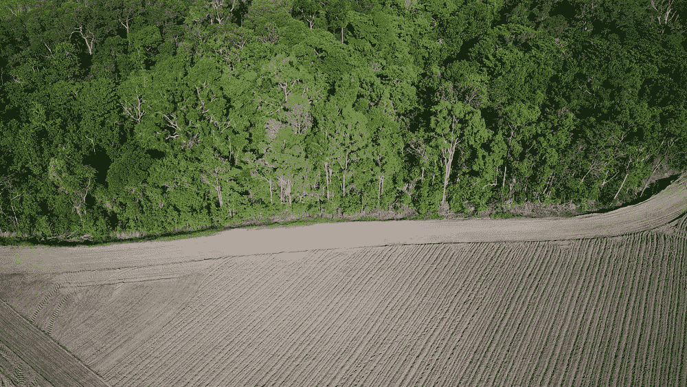
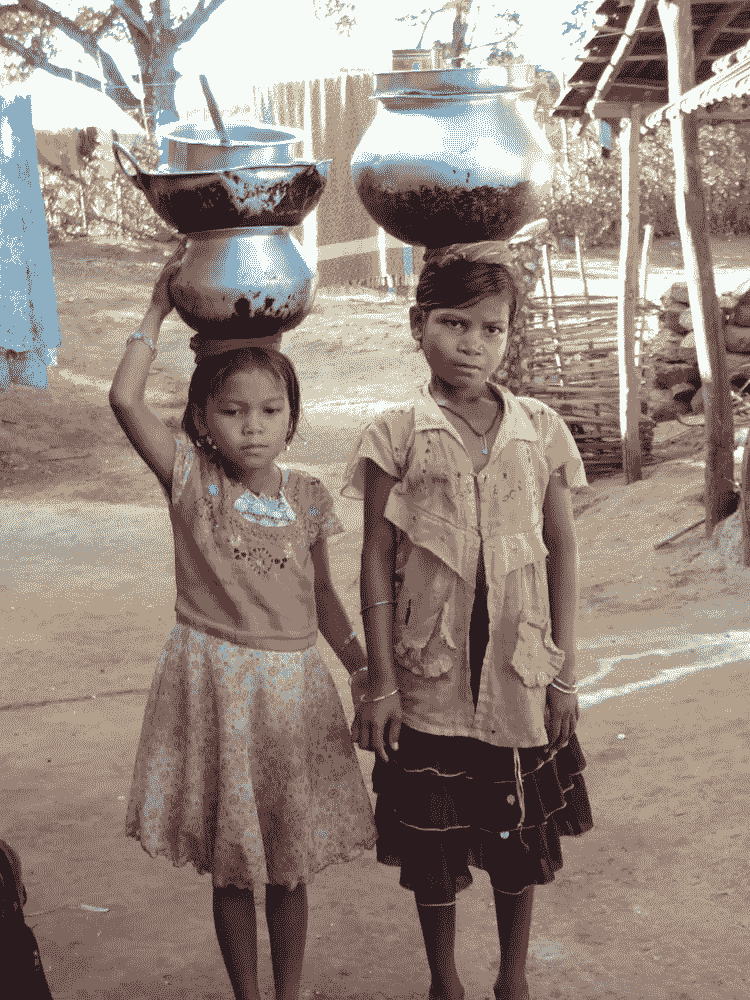

# 全球大挑战:为什么需要你独特的才能！

> 原文：<https://medium.datadriveninvestor.com/global-grand-challenges-why-your-unique-talents-are-in-demand-8c08162a04ef?source=collection_archive---------15----------------------->

我们生活在科技突飞猛进的时代。由于人类不懈的创新和以惊人速度增长的计算能力，今天的可能在几年前还像是小说。然而，与此同时，我们生活在一个大规模砍伐森林、儿童贫困和难民危机的时代。事实是，今天数百万人无法获得水、卫生和教育等基本需求。在接下来的几个月里，我们将深入探讨全球面临的重大挑战，而不仅仅是统计数据，来看看这些挑战中人的一面。

在每篇文章中，我将探索这些挑战之间的复杂关系，因为很难理清因果关系。例如，砍伐森林与集约农业做法有关，同时，农业可能影响土壤和水的质量，导致进一步砍伐森林。同样，贫穷可能是缺乏教育的结果，但在许多社区，女孩被迫辍学到田里工作或帮助从田里取水，进一步扩大了性别平等的差距。这些是“[棘手的问题](https://hbr.org/2008/05/strategy-as-a-wicked-problem)”，并不总是有简单明了的起源或解决方案。

Source: Shutterstock

# 联合国确定了 17 个可持续发展目标(SDG)来应对这些挑战:

[可持续发展目标 1:没有贫困](https://www.un.org/development/desa/disabilities/?page_id=6226&preview=true)

[可持续发展目标 2:零饥饿](http://www.un.org/development/desa/disabilities/envision2030-goal2.html)

[可持续发展目标 3:健康和幸福](http://www.un.org/development/desa/disabilities/envision2030-goal3.html)

[可持续发展目标 4:素质教育](http://www.un.org/development/desa/disabilities/envision2030-goal4.html)

[可持续发展目标 5:性别平等](http://www.un.org/development/desa/disabilities/envision2030-goal5.html)

[可持续发展目标 6:清洁水和卫生设施](http://www.un.org/development/desa/disabilities/envision2030-goal6.html)

[可持续发展目标 7:负担得起的清洁能源](http://www.un.org/development/desa/disabilities/envision2030-goal7.html)

[可持续发展目标 8:体面工作和经济增长](http://www.un.org/development/desa/disabilities/envision2030-goal8.html)

[可持续发展目标 9:工业、创新和基础设施](http://www.un.org/development/desa/disabilities/envision2030-goal9.html)

[可持续发展目标 10:减少不平等](http://www.un.org/development/desa/disabilities/envision2030-goal10.html)

[可持续发展目标 11:可持续发展的城市和社区](http://www.un.org/development/desa/disabilities/envision2030-goal11.html)

[可持续发展目标 12:负责任的消费和生产](http://www.un.org/development/desa/disabilities/envision2030-goal12.html)

[可持续发展目标 13:气候行动](http://www.un.org/development/desa/disabilities/envision2030-goal13.html)

[可持续发展目标 14:水下生命](http://www.un.org/development/desa/disabilities/envision2030-goal14.html)

[可持续发展目标 15:陆地上的生命](http://www.un.org/development/desa/disabilities/envision2030-goal15.html)

[可持续发展目标 16:和平与正义的强大机构](http://www.un.org/development/desa/disabilities/envision2030-goal16.html)

[可持续发展目标 17:实现目标的伙伴关系](http://www.un.org/development/desa/disabilities/envision2030-goal17.html)

在数字时代，科学和技术的普及使得通过民主化和资源的分散化来应对这些挑战成为可能。因此，我想把重点放在正在出现的解决这些挑战的技术和金融创新上。这些文章将利用人们对社会企业家精神、指数技术、创客运动、社区创新和以人为中心的设计思想日益增长的兴趣。例如， [Onesmart.city](http://onesmart.city/innovation/) 利用人工智能，为城市和市民构建工具，为可持续的城市发展创造政策解决方案。另一个例子是联合国儿童基金会如何计划使用区块链来跟踪合作伙伴和一线工作人员的付款，以增加他们资助的项目的透明度。他们[接受建议](http://unicefstories.org/blockchaincall/)在他们的职能中使用区块链的其他用途。

Source: Steve Estvanik/Shutterstock

我的目标是让那些拒绝零和游戏范式、希望看到我们的集体智慧被用来解决我们这个时代的这些问题的人参与进来。底线是——我们被召唤去解决这些棘手的问题，而我们却没有解决这些问题的路线图；解决当今的复杂问题需要创新的合作和积极参与的公民。越来越多的人选择探索个人独特的才能和惊人的潜力，因为他们厌倦了培养被动的演员，而不是主角。因此，无论你是科学家、艺术家、黑客，还是其他一些人，都非常需要你独特的才能和视角来解决这些巨大的挑战。加入我们吧！