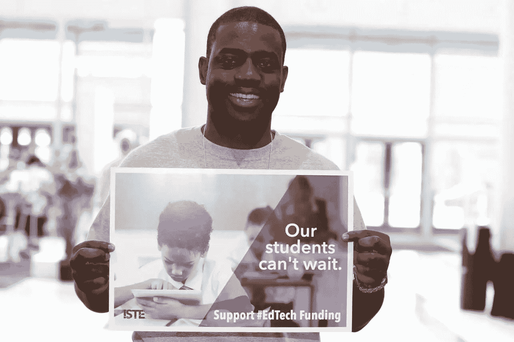

# 全球学习和公民身份在技术上是好的

> 原文：<https://medium.datadriveninvestor.com/global-learning-and-citizenship-are-technically-good-e81a4e2ac284?source=collection_archive---------0----------------------->

## 开始关注世界上发生的一切

技术在课堂上占有一席之地，尤其是在全球学习和数字公民教育方面。它们是由[国际教育技术协会](https://www.iste.org/about/iste-story)关注的[教育技术领域九大热门趋势](https://www.iste.org/explore/articleDetail?articleid=674)之一。这个勇敢的新世界向教育者、学生和家长提出了挑战。

全球学习意味着关注世界上发生的一切。向尽可能多的人传递有用的信息，无论他们在哪里。

“我们都是人类的一部分，这使我们都成为全球社会的一部分，”圣路易斯[互联学习](https://twitter.com/LearningSTL)的领导团队成员、技术培训师 Julie Szaj 说。“现在不同的是，我们有工具在全球范围内进行联系。我们都有机会相互接触、相互学习和成长。”

 [## 如何获得高等教育并避免巨额债务

### 学习他们在学校不教的金钱课程

medium.com](https://medium.com/financial-strategy/how-to-earn-higher-education-and-avoid-massive-debt-d8e1c1912717) 

杰里米·邦德为全球主义带来了另一种视角。

“作为一名家长，我认为全球学习是我们的家庭和我们的社区作为全球公民的责任，”他说。“这意味着无论有没有技术，都要保持消息灵通，与世界上发生的事情保持联系。我喜欢将全球学习视为“真正的”教育，因为我们都已经了解了自己的“世界”。外面有一个完全不同的世界。”

# **更大的展望**

帮助学生成为全球学习者有很多好处。他们可以将自己的视野扩展到远远超出学校的物理范围，给他们一个了解世界的窗口。

“他们代表‘我们’——无论学生来自哪个国家，”邦德说。“他们应该好好代表。任何科技联系都伴随着风险，学生们必须学会驾驭这些风险。父母的角色的确至关重要。13 岁以下使用 Instagram 和 Snapchat 的人比相对年长的人使用 Twitter 的人多得多。”

他补充说，在学校和家里的指导和示范很重要，因为成年人也需要联系。

 [## 信心驱动领导者和教师

### 如何前进和面对挑战

medium.datadriveninvestor.com](/confidence-drives-leaders-and-teachers-6cbb16b3b88e) 

“我面临的挑战是，我如何利用这些全球联系来帮助我自己的社区和我们自己的学校发展？”邦德说。“这是重要的下一步。”

Szaj 很容易讲述从小到大的过程。

“当我在一个小的农村社区教书时，让学生们超越他们父母灌输的刻板印象是一个挑战，”她说。“重要的是，我们首先要帮助孩子们理解我们都是人。

“我们倾向于相信我们知道的东西，而对我们不太熟悉的东西犹豫不决，”她说。“我们需要帮助孩子们理解，了解他人和他们的文化可以减少对他们不了解的东西的恐惧。”

# **平等的声音**

Twitter 和其他社交媒体平台可以帮助教师和学生成为全球学习者。社交媒体对学生的问题提供快速反馈。社交也让他们知道自己的声音与最有影响力的人不相上下，给他们一种自我价值感。

“推特是每个人的个人学习网络，它是无价的，”邦德说。“与你所在领域内外的人联系，甚至是世界各地的名人，对于发展广泛的教育来说，是改变人生的一件事。”

 [## 知情人需要知道更多

### 继续教育对你事业的成功至关重要

medium.datadriveninvestor.com](/those-in-the-know-need-to-know-more-829d8ab77031) 

Szaj 说，利用在线产品很重要。

“社交媒体工具就是这样——让人们轻松联系的工具，”她说。“真正的学习和联系来自使用这些工具时发生的讨论和分享。我们需要帮助孩子们理解如何建立全球关系。

“我们还必须帮助孩子们明白，他们的感知并不是唯一存在的；他们只是其中之一，”她说。"我们需要向他人敞开他们的思想和心灵。"

# **由坏到好**

数字公民也被称为从“做坏事”到“做好事”的转变。

“我喜欢这种转变，”邦德说。“[数字公民峰会](http://digcitsummit.com/)在推动数字媒体对话成为一股向善的力量方面一直处于领先地位。去年秋季峰会的主题实际上是善用科技。学生们展示了他们对科技的积极利用；没有比这更鼓舞人心的了。”

 [## 帮助他人，创造最好的自己

### 导师在那里指导和灌输责任感

medium.datadriveninvestor.com](/help-others-and-create-your-best-self-e1d994549308) 

Szaj 同意这一观点，并提到了教师的作用。

“虽然我仍然认为我们需要教儿童和成人如何避免成为数字学习者的陷阱，但我喜欢将重点转移到通过成为数字学习者可以实现的好的方面上来，”她说。“积极的结果对我们的生活产生了巨大的影响。

Szaj 说:“我可以想象，如果我们现在就为善用技术创造条件，并教会人们如何安全，未来的人们将会取得多么伟大的成就。”“可能性是无穷的。”

国际教育技术学会认为，有一种走向社会公正和公平的数字公民趋势。Szaj 认为这是一件好事。

“它提供了一个很好的机会来帮助打破障碍，驱散我们对不同文化的误解，”她说。“孩子们只知道他们接触了什么。让我们扩大曝光度，开放思维。”

**关于作者**

吉姆·卡扎曼是[拉戈金融服务公司](http://largofinancialservices.com)的经理，曾在空军和联邦政府的公共事务部门工作。你可以在[推特](https://twitter.com/JKatzaman)、[脸书](https://www.facebook.com/jim.katzaman)和 [LinkedIn](https://www.linkedin.com/in/jim-katzaman-33641b21/) 上和他联系。