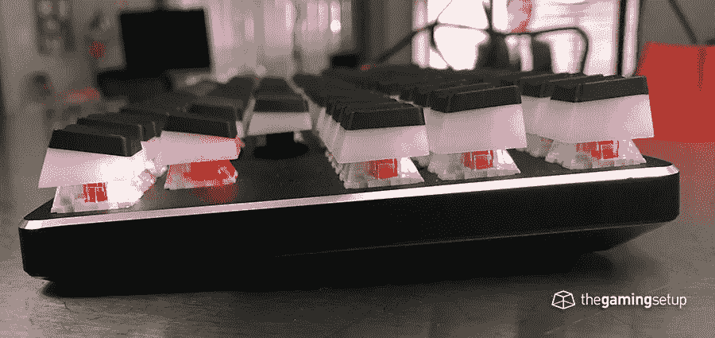
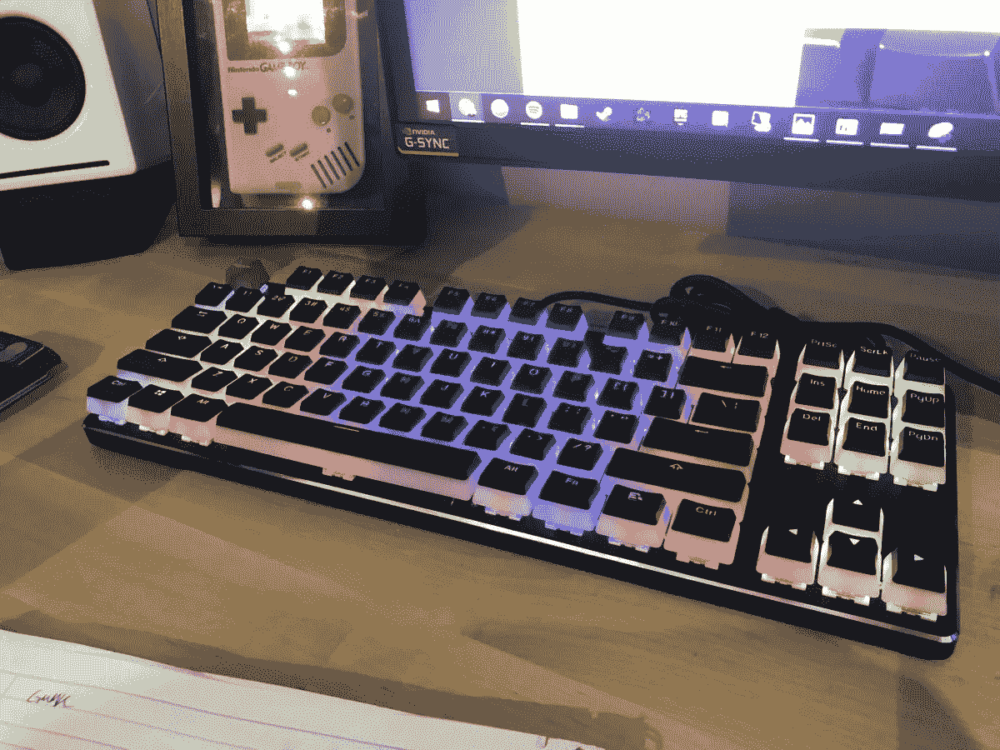

# 辉煌的 GMMK 回顾——主流模块化键盘

> 原文：<https://medium.datadriveninvestor.com/glorious-gmmk-review-mainstream-modular-keyboard-28ff09477ff5?source=collection_archive---------1----------------------->

辉煌的 GMMK 可能是你能得到的最好的启动机械键盘。它能够毫无麻烦地定制你的开关和键帽&让你根据自己的游戏风格或任何特定的游戏来确定自己的偏好。

全套设备的价格约为 100 美元，与一些较大的品牌相比，这是非常物有所值的。

如果你很困惑，不确定你应该用哪种键盘，那么 GMMK 无疑应该是你的第一选择。它可以通过模块化的[开关设计](https://thegamingsetup.com/gaming-keyboards/buying-guides/keyboard-switch-chart)进行超级定制，允许游戏玩家修改他们的键盘开关，而无需进入电路。它带有一个标准的底部行，允许游戏玩家使用他们想要的任何键帽设置。

**开关**

这是我最喜欢的主流开关键盘，不仅因为它们在购买时预先包含了一堆开关选项，而且这种键盘还允许您即插即用任何开关，无需焊接。

以下是在官方商店玩游戏时可以使用的所有开关选项:

凯尔赫

黑色方框

棕色盒子

红色方框

方框白色

速度青铜

高速铜线

极速银

专业紫色

盖特龙

黑色

蓝色

褐色的

清楚的

格林（姓氏）；绿色的

红色

你还可以从亚马逊上买到一辆有红色、棕色或蓝色的[预装 GMMK](https://thegamingsetup.com/gaming-keyboards/reviews/glorious-gmmk) 。

**构建质量**

键盘的制造质量非常好&键盘的外壳是由更轻的塑料制成的。这使得键盘相当轻，我怀疑键盘的外壳里面实际上没有多少东西。

我真的希望 GMMK 能重一点，加固一点，让键盘感觉更结实。感觉还不错，但是绝对没有我日常司机那种 tankier 金属键盘感觉好。

扭曲时，键盘确实会弯曲一点，但幅度不会太大。我没有发现键盘上有任何咯吱声。

该电缆是一种高质量的编织电缆，不会很快磨损。键盘本身的插座和稳定器看起来很坚固，没有理由担心经常开关。

**尺寸&设计**

辉煌的 GMMK，虽然高度可定制，但设计简约，键盘的任何表面都没有品牌或徽章。

键盘有两种主要配置，全 104 键大小和较小的 tenkeyless (TKL)大小。它们都有标准的键行大小，在键本身之外没有太多的框架。这是一个我个人更喜欢的美学设计，保持键盘的主要足迹低。

以下是 GMMK 的官方尺寸:

Tenkeyless

长度:335 毫米

宽度:129 毫米

高度:35.9 毫米

实际大小

长度:440 毫米

宽度:129 毫米

高度:35.9 毫米

推迟所有的定制，键盘的设计具有一些非常标准的脚，一个可移动的 USB 线和最小的大写锁定和滚动锁定 led，没有非标准的按钮，没有专用的媒体键。

# 赞成的意见

模块化开关，无需焊接即可更换开关

标准底行，使用任何键帽设置你想要的

最小设计，小尺寸

具有大量模式的良好 RGB 背光

优质键帽

ten 无钥匙和全尺寸选项

可拆卸微型 USB 连接器

附带定制键帽、开关移除器和键帽移除器，手感不错

平均价格的大量价值

# 骗局

脚步太轻会导致一些滑动

大回声箱

功能键不能重新映射