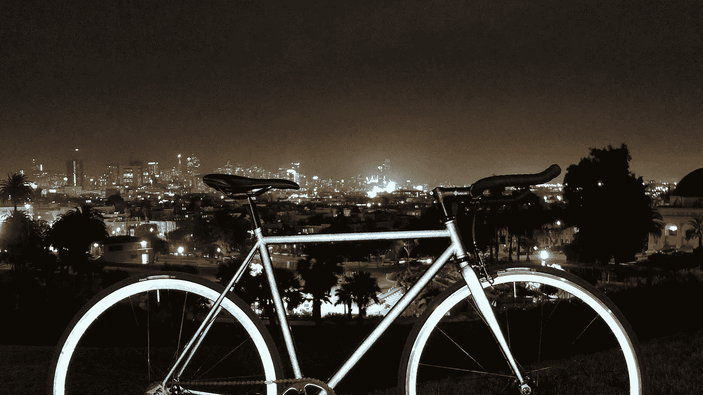

# 夜光踏板动力

> 原文：<https://medium.datadriveninvestor.com/glow-in-the-dark-pedal-power-4dadabeabf1c?source=collection_archive---------19----------------------->

如果通过将前灯的光束反射回司机身上，可以在晚上看到街道标志，那么为什么自行车不能做到这一点呢？

这个问题导致了两轮车 [Lumen](https://www.wired.com/2014/03/lumen-bike/) 的诞生，这款两轮车旨在保护城市自行车骑手在夜间免受分心司机的伤害。

 [## 正在改变行业的 5 个真实世界区块链应用——数据驱动的投资者

### 除非你一直生活在岩石下，否则我相信你现在已经听说过区块链了。而区块链…

www.datadriveninvestor.com](https://www.datadriveninvestor.com/2019/02/13/5-real-world-blockchain-applications/) 

这款自行车由总部位于三藩市的[使命自行车公司](https://www.missionbicycle.com/)制造，其特点是车架和车轮涂有一种反光粉末，可以将光线直接送回其源头。

正常的自行车表面倾向于漫射入射光，而内腔反射更亮更强的光，在 1000 英尺外都能看到。

Mission Bicycle 计划在 8 月份之前将这款手工制造的自行车推向市场，提供单速和多档版本，价格从 1245 美元到 2500 美元不等。

*首次发表于 2014 年的《金融家》。*

