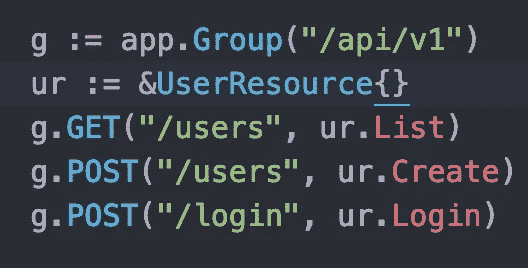
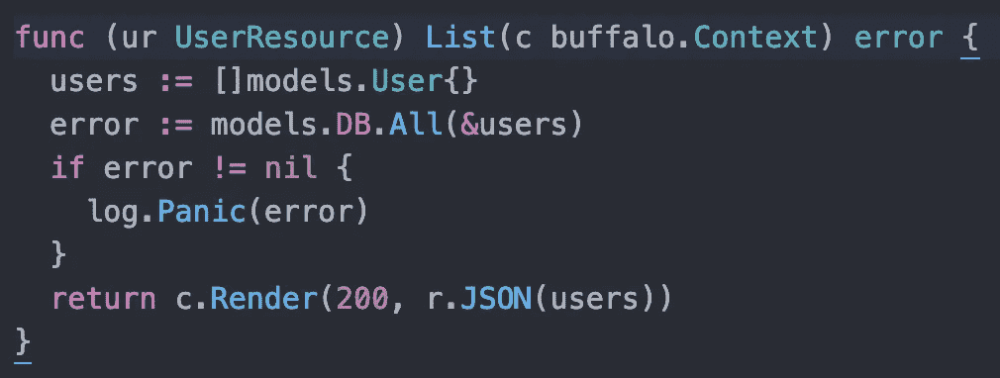
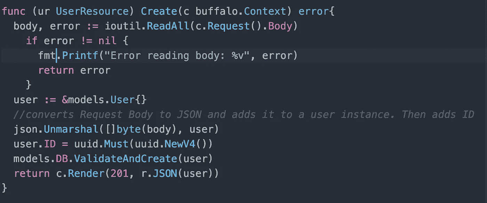
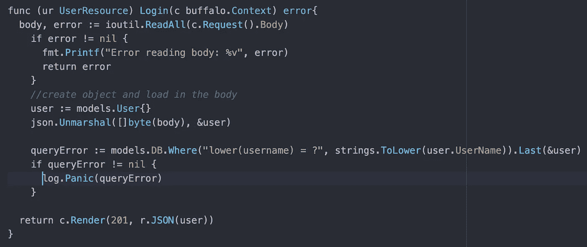

# 用 Postgres 去水牛城休息 API

> 原文：<https://medium.datadriveninvestor.com/go-buffalo-rest-api-with-postgres-9860740b5895?source=collection_archive---------3----------------------->

Youtube.com

如果您来自 Ruby on Rails，并且希望使用 Go，您可能会遇到一些困难。对于 Ruby 来说，Rails 框架是决定性的，虽然 Go 没有通用的东西，但是 Buffalo 是一个很好的介绍。它深受 Rails 的影响。我第一次发现它是在一个 Go meetup 上，当时有人向我推荐它，认为它是开始构建东西的一个好方法。

这是一个障碍。在 Rails 中，我通常只构建一个 REST API，这也是我在 Go 中想要构建的。我找到的大多数构建 REST API 的教程都认为，展示如何在没有数据库的情况下构建 API 是一个好主意，这对我来说没有太大意义。然而，我要感谢他们，因为这确实是一个开端。这里有一个链接，我鼓励你去看看:

 [## 用 Go 和 Buffalo 构建一个 api

### Go 语言已经很快变得非常流行，但是仍然有一些人不愿意使用它来进行…

blog.eleven-labs.com](https://blog.eleven-labs.com/en/build-an-api-with-go-and-buffalo/) 

现在假设你已经按照 gobuffalo.io 上的说明安装了 Go 和 Buffalo，我们就可以开始了。

 [## 雅虎财经 API |数据驱动投资者的 6 种替代方案

### 长期以来，雅虎金融 API 一直是许多数据驱动型投资者的可靠工具。许多人依赖于他们的…

www.datadriveninvestor.com](https://www.datadriveninvestor.com/2019/02/25/6-alternatives-to-the-yahoo-finance-api/) 

您要做的第一件事是在命令行中进入您的 go 路径并运行

布法罗新闻[您的项目名称] — api

您还没有生成 Buffalo API，它的项目比普通项目少。您可以通过进入项目并在终端中运行“buffalo dev”来测试它。然后在浏览器中查看 [http://localhost:3000](http://localhost:3000/) 看它是否工作。

现在我们可以开始使用数据库了。我正在使用 Postgres，database.yml 文件基本上已经为我设置好了。对你来说可能会不一样。因此，首先，我们可以根据您的项目运行以下带有模型名称和标志的代码:

苏打创造-a

soda 生成模型[名称][标志]

我第一次搞砸了，不得不进行单独的迁移来添加列。如果您有同样的问题，请不要担心。另外，如果苏打水对你不起作用，试着用“布法罗汽水”来代替，它会起到同样的作用。

现在，让我们制作一些路线。在 actions/app.go 中，我们已经设置了带有一条路线的功能 app。现在我们可以写出这样的东西:

这与我包含的链接中的说明非常相似。现在在 actions 文件夹中创建一个单独的文件，在这个例子中，我们称它为 users.go。

现在，如果我们使用 Buffalo 中的一些生成器，它将不会为使用 JSON 的 REST API 进行设置。只要记住这一点，如果你使用任何发电机的行动。

我们确实希望这是包操作，我们将从项目中导入一些包和模型的文件夹。我们还想写一个用户资源结构。

下面是列表函数:

users 是从模型中导入的用户结构的数组。模特。DB 来自 init 函数中的 models/models.go 文件。我们也可以用汽水。连接(“开发”)并处理错误，但是直接导入会更快。然后，我们可以使用&users 运行 All 方法，这是一个来自 pop 的方法。这允许我们将数据库查询的结果包含到用户的数组中。然后我们将数组作为 JSON 返回。我们可以转到 localhost:3000/api/v1/users，但它将是一个空数组(假设您已经注释掉了未使用的代码，它可以编译)。我们没有创建任何实例。

下面是创建函数:

这里我导入了几个包，包括“io/iou til”“encoding/JSON”“github . com/gobuffalo/uuid”。我从 Post 请求的主体执行 ReadAll，将主体转换为 json，最后添加 ID。ValidateAndCreate 是 Buffalo 的一部分，它验证用户并将该实例作为新行插入数据库。

在我的例子中，我们正在返回原始实例，但是如果出现问题，将会向前端发送一条错误消息。

最后，还有登录，我们没有授权设置:

这里类似于 create，我们从 Post 请求中提取主体，在本例中只包含用户名。然后，我们获取这些信息，并将其放入一个用户实例中，用它来运行对数据库的查询。在这种情况下，错误将在前端处理，因为定位用户失败将返回错误消息。

我希望这有所帮助。这是我的项目的 github 的链接。