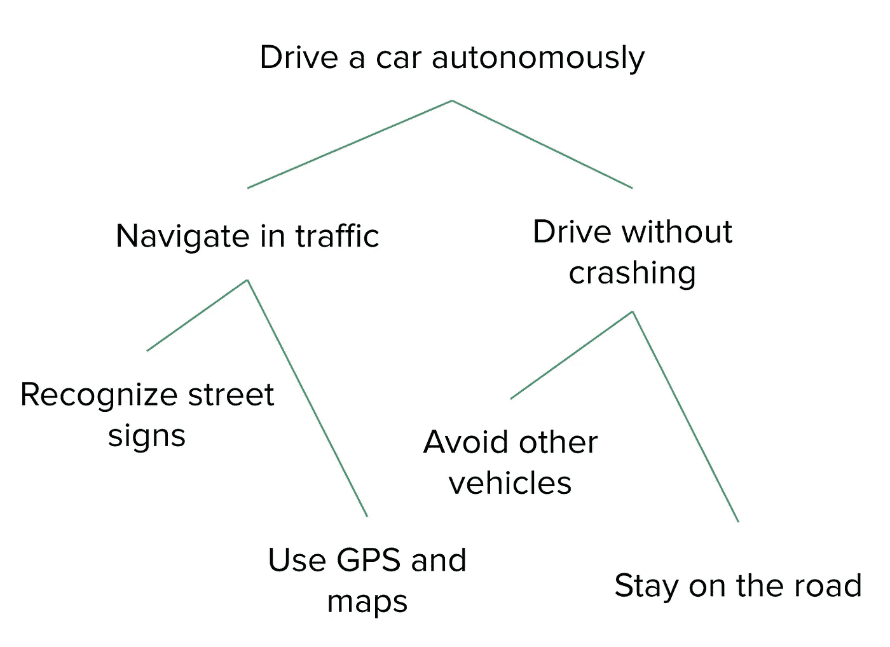
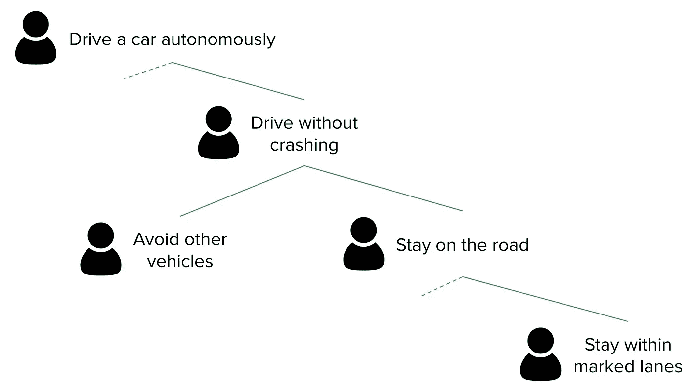
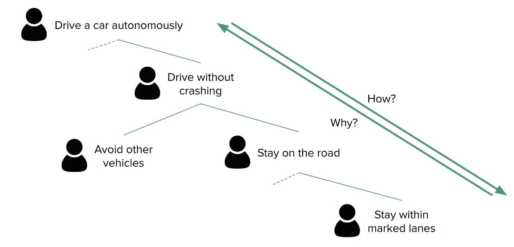

# 强化学习的目标设定课程

> 原文：<https://medium.datadriveninvestor.com/goal-setting-lessons-from-reinforcement-learning-d0c58b321391?source=collection_archive---------2----------------------->

## 我如何帮助我的团队朝着愿景取得有意义的进展？

机器学习和人工智能的魅力在于，有意义的问题可以用更少的资源和更少的人来解决，乐观地看，这意味着更多的人有能力实现他们的愿景，让我们周围的世界变得更好。然而，伟大的领导者知道实现这一愿景的最佳方式是*与*人，与被授权建立解决方案、服务和联盟的个人团队一起实现。即使有最鼓舞人心的愿景，这些团队也很难学会最有效的方法来实现它。有点讽刺的是，我们可以从机器学习和人工智能最强大的工具之一中收集令人信服的经验教训，即如何做到这一点。

# 什么是强化学习？

[强化学习](https://en.wikipedia.org/wiki/Reinforcement_learning)是机器学习的一种形式，用于教会机器如何实现非常复杂的现实世界问题，如[行走](https://www.youtube.com/watch?v=LikxFZZO2sk)或[驾驶汽车](https://www.youtube.com/watch?v=tlThdr3O5Qo)。

Tesla [likely uses reinforcement learning](https://evannex.com/blogs/news/what-can-deepmind-s-starcraft-win-teach-us-about-tesla-s-path-to-full-autonomy) to power its semi-autonomous cars

> 强化学习的基本目标是学习一系列能带来长期回报的行动— *强化学习解释*，O'Reilly

在强化学习中，模型观察周围的世界，并根据所见采取行动。当这些行为实现了我们希望模型实现的目标时，我们给它一个*奖励*。该模型以迭代的方式实现这一点，每次都学习哪些行为给了它最大的回报，并最终通过定向试错法来确定如何最成功地实现其目标。我们如何为哪些行为给予模型多少奖励制定规则，决定了它学习的效率和效果。

# 为什么这与试图实现愿景的团队相关？

强化学习模型远不是一个人类团队的整体表现，但它们有一些重要的相似之处，我们可以从中借鉴来帮助实现愿景。

首先，像大多数强化学习模型一样，团队是相互联系的信息系统，由做出不同决策和做独特工作的个人组成，并有一些共享输出。我们所做的决定、我们所做的工作以及我们成果的质量取决于我们所观察到的周围环境以及我们选择的分享信息的方式。

第二，团队解决问题是突发的；最有效的团队是那些拥有独立解决问题的技能和支持的团队。最接近需要解决的问题的有能力的人在学习解决问题的正确方法时最有效。机器学习从这种观察中诞生，那种自己学习解决问题的团队最好。

最后，复杂的现实世界的问题很难解决，因为在一开始，关于好的和坏的解决方案的信息是有限的。当快速尝试不同的事情并从过去的行动中学习以通知更好的未来决策时，机器和团队都是最有效和高效的。

那么，是什么指导着团队的学习，并告诉我们我们已经制定的解决方案和采取的行动最有可能实现我们的愿景呢？我们相当于强化学习模型的回报是什么？对我和我合作过的团队来说，**设定了很好的目标**。

众所周知目标设定让团队在实现愿景方面获得两倍的成功，但是[设定不当的目标实际上会阻碍成功](https://www.fastcompany.com/3067813/why-setting-goals-can-actually-make-you-less-successful)；不仅要设定目标，而且要设定好目标，这一点很关键。

# 那么强化学习奖励能教会我什么关于如何设定好目标呢？

作为一个例子，让我们使用一个雄心勃勃的愿景，这将需要非凡的团队和机器学习来实现:**自动驾驶汽车**。

## 将问题分解成几个部分

虽然在技术上可以教一个单一的强化学习模型做所有的工作来解决一个复杂的问题，但在许多实际的应用中，将问题分解成不同模型试图解决的组成部分更有意义。这很有帮助，因为:

1.  解决问题的一部分通常比一次解决整个问题更有效
2.  单个模型处理每一个可能的观察并做出每一个可能的决策通常是低效或不可能的

将问题分解成组件使得团队能够有效地做出决策，而这对于个人或团队来说是难以置信的困难。良好设定的目标定义了大型解决方案中那些可实现的组件。

要设定定义更大解决方案的可实现组件的目标，请使用分层目标设定框架，如[目标&关键结果(OKRs)](https://www.slideshare.net/jaymeh13/object-25288039) 或[目标、目的、策略和度量(OGSMs)](https://medium.com/infinite-beta/ogsm-okr-8761dcb50e02) ，并设计它们以使您拥有的团队(或您需要建立的团队)能够最好地解决他们擅长的问题。让你的目标集中在对你的愿景的成功真正必要的结果上；问问你自己“如果我们没有达到这个结果，我们还能实现我们的愿景吗？”

## 定义团队之间的互动

将问题分解成组件可能有助于团队和强化学习模型为较小的问题产生有意义的解决方案，但除非清楚这些部分是如何组合在一起的，否则不太可能有机地产生一个全面的解决方案来实现您更广阔的愿景。

*person icon by Rose Alice Design from the Noun Project*

团队必须清楚，我们工作的成功最终取决于我们的解决方案如何与其他解决方案相互作用，以解决更大的问题。举例来说，如果一个团队教一辆车*停在路上*的方式阻止了另一个团队教一辆车*避开其他车辆*，那么总的来说，我们没有教会一辆车*驾驶而不发生碰撞*，两个团队都失败了。

机器学习也是如此；如果一个超额完成且看似成功的组件只知道如何解决特定的问题，而不知道如何有效地与其他组件交互，那么它可能会使整个模型变得更糟。设定好的目标阐明了较小的解决方案应该如何相互作用以实现更大的愿景。

使用递归目标设置框架来设置目标，使较小的解决方案应该如何相互作用变得清晰。这才是 OKRs 真正发光的地方；使用团队的关键成果作为该团队子团队的目标，可以清楚地了解所有目标之间的相互关系。任何个人或团队都可以看着他们的目标并问“我为什么要这样做”，任何级别的团队领导都可以看着她团队的目标并问“我们要如何去做？”

目标基本上是团队内部和团队之间的沟通工具；越简单越好。目标越复杂，越容易误解其意图，就越难学会如何实现，也越有可能导致意想不到的浪费。

## 恰当地设定目标

目标的结构很重要，但这些目标如何定义成功更重要。对于强化学习模型来说，成功奖励的关键，即引导他们有效学习如何解决问题的关键，是在模型学习时提供持续反馈的激励措施。团队的成功目标有着相同的特征。比目标值更重要的是测量如何向团队提供反馈，告诉他们在试图解决问题时解决得如何。

如果一个目标不够远大(“自动驾驶汽车行驶 1 英里”)，那么它不可能迫使团队解决实现更广阔愿景所必需的基本问题；反馈太浅。此外，如果一个目标没有提供关于团队有多接近的相对反馈(“汽车不再需要司机”)，那么我们就无法辨别我们的解决方案是否让我们更接近成功；反馈太稀疏。重要的一点是:最后一个目标并不坏，因为它太难了，坏是因为它没有用。

一个更好的目标足够令人向往，以至于团队不得不解决基本的挑战，并提供一个反复出现的基准，我们可以根据它来跟踪我们的进展(“自动驾驶汽车 100 万英里”)。设定好的目标提供持续的反馈，将团队推向期望的、可测量的结果。

为了设定目标，提供对期望的、可衡量的结果的持续反馈，关注[领先指标，而不是落后指标](https://www.leadingagile.com/2018/02/leading-lagging-indicators/)。通过问“为了达到这个目标，我们必须解决我们试图解决的问题的基本挑战吗？”来确保目标足够有抱负然后，确保你的团队有足够的个人和时间来实现这些远大目标，或者你的团队专注于更少的目标(而不是满足于更多非远大目标的不满意结果)。

## 针对最重要的内容进行优化

知道如何最好地指导团队学习解决实现愿景的问题会引出一个更重要的问题:为了实现愿景，我们应该解决什么问题？[团队将交付您所衡量的东西](https://hbr.org/2010/06/column-you-are-what-you-measure)，因此衡量合适的东西是关键。在强化学习中，当衡量错误的东西会妨碍有效解决问题时，这被称为[眼镜蛇效应](https://medium.com/@BonsaiAI/deep-reinforcement-learning-models-tips-tricks-for-writing-reward-functions-a84fe525e8e0)，灵感来自这个都市传说:

> 历史上，[德里]政府曾试图激励人们帮助他们清除该地区的眼镜蛇。如果市民带回一条他们杀死的毒蛇，政府会给你一些钱。自然地，人们开始饲养毒蛇。

In trying to teach this robotic arm to pick up and move a block, Bonsai gave this model a reward for moving the block as far from center as possible. They got what they incentivized, not what they needed.

通过引导团队走向成功的真正本质，而不是方便的代理或空洞的胜利，使团队能够有效和自主地解决问题，以实现更广阔的愿景。设定好的目标激励实现愿景的结果，而不管团队选择如何实现它们。

要做到这一点，避免成功剧场和虚荣指标。埃里克·赖斯在他的书《精益创业》中介绍了成功剧场的概念。

> “……许多创新团队投身于成功剧场，有选择地寻找支持其愿景的数据，而不是将愿景的要素暴露在真实的实验中

从目标设定的角度来看，成功剧场通常表现为虚荣指标:

> 虚荣心指标是表层指标。它们通常是给别人留下深刻印象的大指标，比如下载次数…清晰度指标是可操作的指标，比如你的产品每天实际使用的分钟数，或者用户获得服务需要多长时间。这些是推动增长的隐藏齿轮。

使用清晰指标定义目标，特别是那些最能描述你的愿景想要在世界上创造的真实结果的目标。确保目标集中在正确的事情上，通过问“如果我们实现了描述的这个结果，而没有其他，它会让我们更接近我们的愿景吗？”

## 资源受限目标

最后一点:所有的目标都需要设置资源限制，对于大多数目标来说，这是一段时间，但也可能是团队为实现目标而工作，他们可用的资源，等等。无限成功但无限昂贵的解决方案不会让团队比没有解决方案更接近愿景。事实上，当你考虑不追求其他可行的解决方案的机会成本时，他们会使他们远离那个愿景。

# 好的，我如何在我的团队中使用它？

总之，强化学习告诉我们设定好的目标:

*   定义大型解决方案中可实现的组件
*   阐明较小的解决方案应如何相互作用以实现更大的愿景
*   提供持续的反馈，将团队推向有抱负的、可衡量的结果
*   激励实现愿景的结果，不管团队选择如何实现它们
*   资源有限吗

就像强化学习只是庞大且不断发展的机器学习和人工智能工具集中的一个工具一样，这只是设定目标并最终帮助你和你的团队实现愿景的许多不同框架中的一个。你和你周围的人在一起对世界产生有意义的、积极的影响时遇到了什么挑战？强化学习中的这些目标设定课程如何帮助你实现让我们周围的世界变得更美好的宏伟愿景？