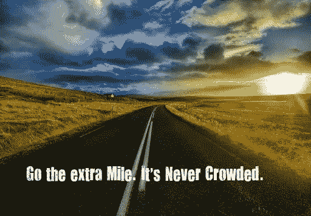

# 多做一点……

> 原文：<https://medium.datadriveninvestor.com/going-the-extra-mile-ab2fe4252f2f?source=collection_archive---------24----------------------->

当你感到累了，并且相信你已经尽了全力，你怎么能再多走一英里呢？一个简单的答案…爱。当一个人出于爱做一件事，因为他对自己所做的事充满热情，那个人就会找到继续下去所必需的能量。这种力量或属性叫做耐力。如果你喜欢你正在做的事情，你会找到忍受的方法。这是效率的起点。每当你做你喜欢的事情时，你可能甚至感觉不到时间在流逝。一个在生活中成功的可靠方法是本着服务的精神做更多的事情。当你热爱做某件事，并且做得比你得到的回报更多的时候，就不会有困难。在这个世界上没有什么东西会丢失。没有什么会被忽视。

你最近有没有走进一家商店，却发现照顾你的那个家伙长着一张派对破坏者的脸？这个人可能不喜欢他的工作。他需要，你可以称之为态度调整。相反，如果他是一个以提供有价值的服务而闻名的人，他无疑会被提升。我看到许多年轻男女进入连锁超市服务，我在那里购买食品杂货。那些超额完成工作的人在几个月内就会被提升为助理经理。我亲眼看到有两个人甚至成为了商店的经理，而就在不久前，他们还在那里打包行李。

那些付出额外努力的人和那些不付出额外努力的人之间的对比非常明显。被关注是你追求成功的关键因素。是的，我明白。这需要努力。这是一场斗争。但是抵抗带来力量。就像举重一样，最后一次重复给你肌肉。所以在生活中。当你觉得可以再走一步的时候。多走一步。

多走一步的习惯是收益递增法则的近亲。几个世纪以来，农民们都知道这条定律。播下的种子会带来多方面的收获。读一读爱默生关于补偿的文章对你来说是件好事。这可能是你能得到的最好的文件之一。它会让你理解自然界中补偿你每一次努力的东西。

不要在生活中磕磕绊绊，跌倒挣扎。不要让失败占据上风。不要因为有障碍要克服而辞职。那就是逃跑。生活只是一系列等待被征服的挑战。记住“力量来自于抵抗”还要注意“小偷从自己身上偷东西”“骗子骗自己。”这些也是来自爱默生的伟大真理。做比你得到的报酬更多的事情。多做一点……