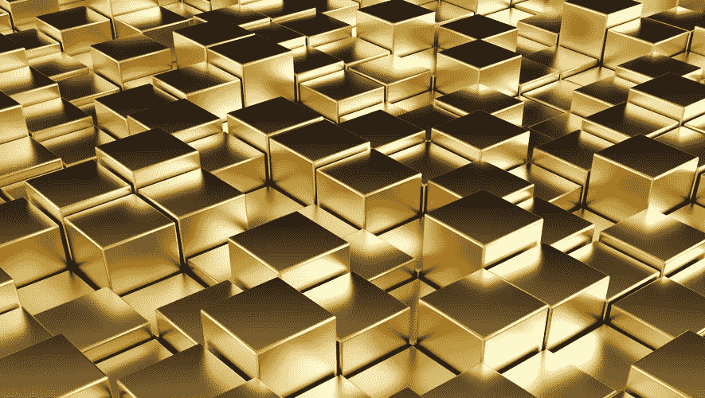
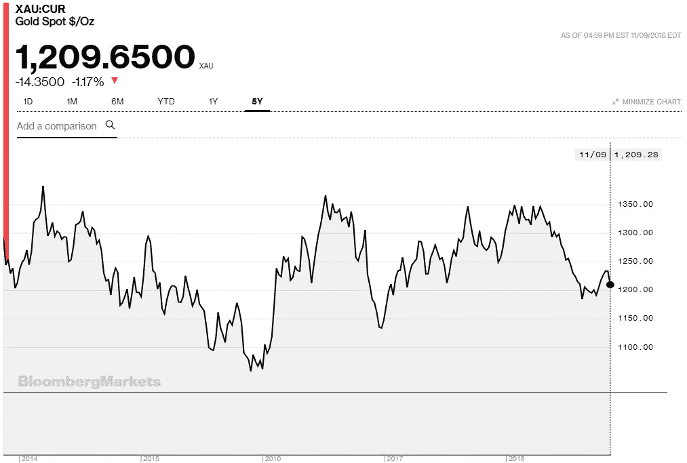

# 积木上的黄金:稳定的硬币(第二部分)

> 原文：<https://medium.datadriveninvestor.com/gold-on-a-block-stablecoins-part-2-7928598b282d?source=collection_archive---------5----------------------->

使用通用价值符号黄金作为支持加密货币的资产在业内并不是一个新想法。与黄金和其他贵金属及工业金属一样，交易所交易商品也在加密货币设计中得到了应用。虽然在设计和功能上与它们的法定支持的亲戚(第 1 部分中描述的[)非常相似，但商品支持的加密货币的价值稳定性预计将来自一种与法定货币根本不同的资产。](https://medium.com/datadriveninvestor/the-little-black-dress-of-crypto-stablecoins-part-1-cb8f10d29a8)

商品是在有组织的市场上交易的可替代资产。与法定货币不同，法定货币的供应由央行监管，理论上是无限的，大宗商品是现实世界中的资产，由于其性质，供应是有限的。商品的有限供应来自于它们的自然稀缺性(如黄金、钻石、铂金)或来自于(国际)生产和贸易协议(如石油的供应)。对于作为另一种金融工具的抵押品或支持资产的商品来说，定期在有组织的市场上交易也很重要。资产的连续交易使得价格为人所知，因为有组织的市场和交易所的主要任务之一是价格发现，并且是资产流动性的指标。

交易所交易商品的稀缺性和有限供应是人们认为其价值不会降至零的原因。虽然它们的价格可能会根据市场需求和报价、生产或工业用途而波动，但很难想象在可预见的未来，黄金或铂金的价值会降至零。

看看黄金的 5 年价格图，就很清楚为什么它是支持这一类稳定货币的最受欢迎的商品。

Chart: [https://www.bloomberg.com/quote/XAU:CUR](https://www.bloomberg.com/quote/XAU:CUR) (2018–11–09)

## 交易所交易商品支持的稳定债券

这类稳定债券的显著特征是，它们由一种或多种交易所交易商品以固定比例提供支持。发行商品支持的稳定债券的概念类似于发行法定支持的稳定债券的过程:客户向发行人存入一定金额，发行人从其供应商处购买所需数量的商品。商品由保管人保管，保管人与发行人一起保证商品的数量足以支付客户支付的金额——这样，稳定的硬币就被铸造出来并转移到客户的账户上。定期审计确保用作稳定硬币支持资产的商品具有足够的质量和数量，以反映硬币的总供应量。在赎回的情况下，客户能够从硬币发行者(或在某些情况下其金融等价物)获得支持资产，同时硬币从供应中被收回(燃烧)。

## 管理

与菲亚特支持的稳定债券类似，商品支持的稳定债券是高度集中的加密资产，因为它们的价值不仅取决于支持资产的价值，还取决于对发行人、托管人和审计师的信任。参与铸造和支持资产托管过程的任何一方未能遵守规定，可能会导致挂钩被打破和价格稳定性丧失。

由于系统中参与者的数量，维持与这些稳定货币挂钩的成本是相当大的，因为它包括稳定货币抵押品的存储成本和审计成本。这些成本中的一部分可以通过定期的滞期费转移给稳定币的持有者。

## 石油实验

发行商品支持的加密货币的最突出尝试之一是委内瑞拉石油公司的案例。委内瑞拉多年来一直徘徊在经济和金融危机中，他们的政府试图通过发行国家商品支持的加密货币来解决这一问题。发行由该国石油储备支持的石油的首次尝试失败了，他们将一篮子商品扩大到包括矿产储备和钻石。由于缺乏一致的白皮书(甚至在硬币公开销售期间也有所改变)，以及整个流程和抵押品估值缺乏清晰度，Petro 仍然不是一种可操作的加密货币。然而，它在这类稳定硬币的故事中是有意义的，因为它说明了信任在参与发行和维持硬币价值稳定的过程中的重要性。

## 提比略硬币

提比略硬币是一种有趣的商品支持稳定的硬币，因为它的支持资产篮子，其中包括工业和贵金属。

提比略硬币支持资产篮子包括:

*   工艺金属:25 克铜，5 克锡
*   电动汽车金属:25 克铝、6 克镍、1 克钴
*   稳定性金属:3 毫克黄金，1.5 毫克铂金

根据该项目的作者，除了黄金之外，篮子中包括的所有金属都有工业用途，它们将总是拥有一些内在价值。提比略还向代币持有人提供实际资产的交付，持有人可以通过“取消代币”来启动这一过程，这本质上是一个赎回和焚烧的过程，通过智能合同执行。鉴于工业金属通常以吨而不是克为单位进行交易，为了实际获得实物资产，提比略硬币的持有者[应该准备好支付 10.000 美元](https://www.bloomberg.com/news/articles/2018-09-27/tiberius-tests-its-metals-in-crypto-backed-by-seven-commodities)。

## Digix 黄金令牌

DGX 代币被认为是“数字化黄金”。以纯度为 99.9%的黄金为支撑，这是一种由交易所交易商品支撑的稳定货币的典型案例。令牌是通过从授权供应商处购买黄金来发行的，黄金存储在可信的存储提供商处。一旦卖主和保管人提供了他们的签名，这个“数字卡”就被传递给智能合同，这个智能合同发行黄金支持的硬币。支持资产的所有权和托管链也通过区块链进行跟踪。兑换过程非常简单 Digix Gold Token 的持有者可以用 1 克黄金兑换他们拥有的每一个 Token。[由声誉良好的审计师每三个月对支持资产的质量和金额进行一次审计。](https://medium.com/@Digix/audit-2-digixs-gold-holdings-independently-audited-100-accounted-for-on-19-october-2018-437b886220c1)在 stablecoin 的世界中很不寻常，尤其是考虑到围绕系绳的[争议，菲亚特支持 stable coin。](https://medium.com/datadriveninvestor/the-little-black-dress-of-crypto-stablecoins-part-1-cb8f10d29a8)

尽管选择支持资产背后有合理的理由，但大宗商品支持的加密货币远不如法定支持的稳定货币那样常用。原因可能在于实物资产的赎回——专业企业对拥有大量工业金属或原油感兴趣，而不是对在加密货币市场投机的个人投资者感兴趣。

类似于法定支持的加密货币，这类稳定货币既不是不可信的，也不是分散的。在发行过程中，价格的稳定很大程度上取决于参与发行过程的各方的可信度。在这种情况下向前迈出的一大步是，至少有一个 stablecoin 项目运行完美——及时交付审计，没有引起怀疑。

*本文表达的观点不是投资建议，也不是推荐。本文包含的事实不一定完整，本文的读者应该在投资前做好自己的尽职调查，包括寻求独立的财务建议。这篇文章不是一个要约，也不是要约邀请，购买或出售这里提到的任何资产。*

这篇文章的文本可以在[爆发区块链](https://www.burst-coin.org/download-wallet)上获得，并且可以使用 CLOUD-PKFV-LKFH-WYJT-GB3ED[CloudBurst ID](https://burstwiki.org/wiki/Burst_Software#CloudBurst)进行检索。