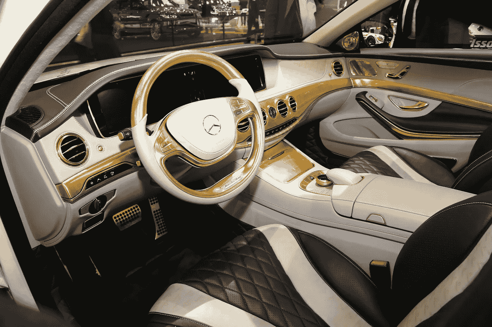

# 镀金换挡

> 原文：<https://medium.datadriveninvestor.com/gold-plated-gear-shifting-72a919ec1f09?source=collection_archive---------12----------------------->

把它归入我们不知道我们需要的那一类:据说是世界上第一辆镀金汽车的 CS50 凡尔赛 T1 是一辆纯粹的车轮闪闪发光的汽车。

受法国政治权力和阴谋中心的启发，德国汽车调校专家 Carlsson 用数千张极薄的金箔装饰了 25 辆新的梅赛德斯-奔驰 S 级豪华轿车。

工匠大师使用特殊的松鼠毛刷子，在大约一半的车身上涂上闪闪发光的金色涂层，包括散热器格栅和门把手。奢华还延伸到了内饰，方向盘和仪表盘的部分被镀上了一层仅价值 16700 美元的黄金。

甚至连轮子都有一个大的反光表面，让人想起路易十四的旧日踩踏场地的镜子厅。卡尔松在本月早些时候的日内瓦车展上发布了厚颜无耻的 CS50，并且已经收到了 10 份订单。

目标市场是中国的超级富豪，但任何有 50 万美元闲钱和一个高度安全车库的人都欢迎购买。

*2014 年首次发表于《金融家》*

【jenserikgould.com】T5**T6**