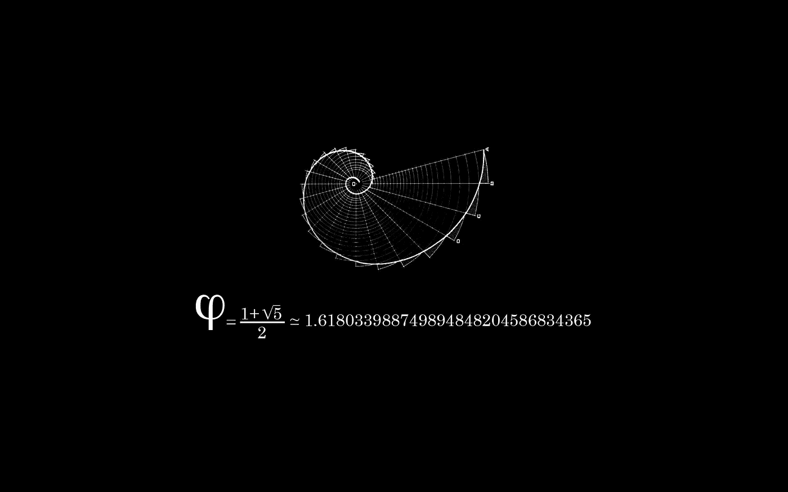
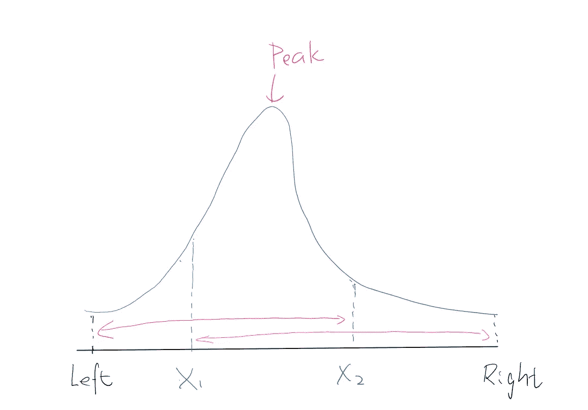
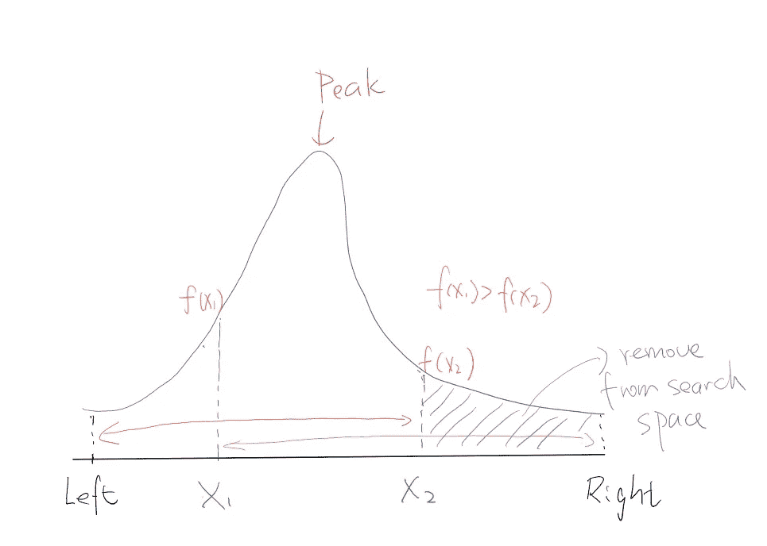
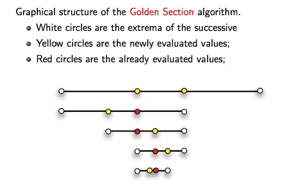

# 黄金分割搜索——山脉中的峰值指数

> 原文：<https://medium.datadriveninvestor.com/golden-section-search-method-peak-index-in-a-mountain-array-leetcode-852-a00f53ed4076?source=collection_archive---------5----------------------->

想象一组只有一个峰值的数字，你如何找到这样的数字和它的指数？顺序搜索可能是我们想到的第一个解决方案。我们能做得更好吗？是的，可能使用二分搜索法将时间复杂度从`O(N)`降低到`log(N)`。这是我们唯一的解决办法吗？不……我们可以使用一种更先进、更精确的方法，叫做“黄金分割搜索”。



[**问题**](https://leetcode.com/problems/peak-index-in-a-mountain-array/description/) **:** 姑且称一个数组`A`一个*山*如果以下性质成立:

*   `A.length >= 3`
*   存在一些`0 < i < A.length - 1`，例如`A[0] < A[1] < ... A[i-1] < A[i] > A[i+1] > ... > A[A.length - 1]`

给定一个绝对是山的数组，返回任何一个`i`使得`A[0] < A[1] < ... A[i-1] < A[i] > A[i+1] > ... > A[A.length - 1]`

**解决方案:** 我们先过一遍开胃菜，再来上主菜。

*   #1)标准线性/顺序搜索方法，找到峰值索引`i`，其中`A[i]>A[i+1]`。`O(N)`时间复杂度，非常直接。

*   # 2)二分搜索法，定义`left`和`right`指针，并为每次迭代计算`mid`。当`A[mid]<A[mid+1]`时，表示数字还在增加，所以峰值应该出现在`mid`的右侧，因此我们更新`left`指针；否则它指示峰值应该出现在`mid`的左侧，我们更新`right`指针。最终，两个指针相遇，峰值索引被定位。`Olog(N)`时间复杂度，如果输入量大，速度会快得多。

*   # 3)黄金分割搜索是一种严格寻找**[**单峰函数**](https://en.wikipedia.org/wiki/Unimodality) 的最小值/最大值的技术(与我们对单峰山的问题定义完全匹配)。为了理解这个算法，我们需要回顾一下黄金比例ϕ (phi ),并推导出它的一些性质，这些将在后面用到。**

****

```
(a+b)/a = a/b = ϕ
1 + 1/ϕ = ϕ
ϕ^2 - ϕ - 1 = 0
Solve for ϕ and given ϕ > 0:
ϕ = (1+sqrt(5))/2 = 1.61803...From 1 + 1/ϕ = ϕ, we get 1/ϕ = ϕ - 1, divided both sides by ϕ:
1/(ϕ^2) = 1 - 1/ϕ
```

**现在让我们借助下图来了解黄金分割搜索是如何工作的。目标是找到最大值(峰值)。给定初始搜索空间的`left`和`right`边界，我们将首先定位两个黄金点`x1`和`x2`，其中`(x2-left)=(right-x1)`和`(right-left)/(x2-left) = (x2-left)/(x1-left)`。这正是我们之前做的推导。因此，我们将`x1`和`x2`表示为:**

```
x1 = right - (right-left)/ϕ
x2 = left + (right-left)/ϕ
```

****

**接下来，我们将比较`f(x1)`和`f(x2)`的值。类似于二分搜索法，搜索空间在每次迭代后减少。如果`f(x1)>f(x2)`，我们知道峰值不能位于`x2`和`right`之间，因此我们缩小搜索范围，将`right`更新为`x2`的值。**

****

**定义了新的`right`后，我们需要重新计算`x1`和`x2`。关于新的`x2`，有一个节省计算的技巧(如下文`x2'`)。**

```
x2' = left + (right'-left)/ϕ,  where right' = x2 = left + (right-left)/ϕsubstitute right' and with some algebra, we get:
x2' = left + (right-left)/(ϕ^2), Recall earlier we proved 1/(ϕ^2) = 1 - 1/ϕ, again with some algebra:
x2' = right - (right-left)/ϕ = x1Amazing! x2' = x1
```

**这里我们已经展示了`x2`的新值将正好是前一次迭代中`x1`的值。这是黄金比例ϕ (phi)的惊人特性之一。类似地，如果`f(x1) < f(x2)`，我们知道峰值不能位于`left`和`x1`之间，因此我们将`left`更新为`x1`和`(left=x1)`的值，并将`x1`更新为前一次迭代中`x2`的值。**

**将所有的部分组合在一起后，我们得到了下面的代码。应用了很少的代码优化技术:1)乘法比除法执行得更好，因此不是应用`phi`的除法，而是乘以它的逆`phi_inv`。2)回到山数组的原始问题，函数`f`实际上是一个**离散的**单峰函数，它将整数索引映射为整数值。因此，整数舍入必须应用于效用函数`cal_x1`和`cal_x2`。搜索收敛后，需要进行一些后期检查和调整，以确保捕获正确的索引。**

**关于在语句`x2=x1`之后计算新的`x1`，可以通过有趣的数学推导来进一步改进算法。这里我来证明`x1' = cal_x1(left,right') = cal_x2(left, x2')`。请注意这里的`x2'`已经在之前的迭代中更新为`x1`的值。**

```
Apply formula for calcualting x1:
x1' = cal_x1(left,right') = right' - (right'-left)/ϕ = x2 - (x2-left)/ϕRecall x2 = left + (right-left)/ϕ, substitute x2 in the above equation & with some algebra
x1' = left + (ϕ-1)(right-left)/(ϕ^2)What about cal_x2(left,x2')?
cal_x2(left,x2') = cal_x2(left,x1) = left + (x1-left)/ϕRecall x1 = right - (right-left)/ϕ, substitute x1 in the above equation & with some algebra
cal_x2(left,x2') = left + (ϕ-1)(right-left)/(ϕ^2)Amazing! x1' = cal_x1(left,right') = cal_x2(left,x1)
```

**难道不是数学中的对称之美吗？类似地，我们可以展示`x2' = cal_x2(left',right) = cal_x1(x1',right)`。因此，它给了我们下面的代码。**

**我发现这张图片最好地总结了我早期的推导。记住，我们所解决的问题是输入和输出都是离散整数值的特殊情况。该算法本身也可以用于搜索连续单峰函数的最小值/最大值。如果注意每次迭代后搜索空间的缩小:收敛速度为常数 1/ϕ = 0.61803(每次迭代搜索空间缩小 38.196%)。而二分搜索法(二分法搜索)以 1/2 的速率线性收敛。**

****

**黄金分割搜索和二分搜索法通常有不同的用例:
1)对于一个排序数组的二分搜索法；2)黄金分割搜索给定范围内的单峰函数。研究一个可以应用两种搜索算法的例子是很棒的。**

**最后，我分享一个不太相关但非常简洁的解决方案来展示 Python 作为编程语言的魅力:**

**参考**

*   **[https://en.wikipedia.org/wiki/Golden-section_search](https://en.wikipedia.org/wiki/Golden-section_search)**
*   **[https://chemicalstatistian . WordPress . com/2013/04/22/using-the-section-method-with-the-golden-ratio-for-numerical-optimization/](https://chemicalstatistician.wordpress.com/2013/04/22/using-the-bisection-method-with-the-golden-ratio-for-numerical-optimization/)**
*   **[https://ECE . uwaterloo . ca/~ dw harder/numerical analysis/11 optimization/golden/](https://ece.uwaterloo.ca/~dwharder/NumericalAnalysis/11Optimization/golden/)**
*   **[http://www . math . UCLA . edu/~ wotaoyin/math 273 a/slides/Lec3a _ 1d _ search _ 273 a _ 2015 _ f . pdf](http://www.math.ucla.edu/~wotaoyin/math273a/slides/Lec3a_1d_search_273a_2015_f.pdf)**
*   **[http://www . ing . unitn . it/~ berto laz/2-teaching/2011-2012/AA-2011-2012-OPTIM/lezioni/slides-m1d . pdf](http://www.ing.unitn.it/~bertolaz/2-teaching/2011-2012/AA-2011-2012-OPTIM/lezioni/slides-m1D.pdf)**
*   **[http://heath.cs.illinois.edu/scicomp/notes/chap06_8up.pdf](http://heath.cs.illinois.edu/scicomp/notes/chap06_8up.pdf)**
*   **[https://www.youtube.com/watch?v=hLm8xfwWYPw](https://www.youtube.com/watch?v=hLm8xfwWYPw)**
*   **[https://www.youtube.com/watch?v=VBFuqglVW3c](https://www.youtube.com/watch?v=VBFuqglVW3c)**
*   **[https://wall.alphacoders.com/big.php?i=270595](https://wall.alphacoders.com/big.php?i=270595)**