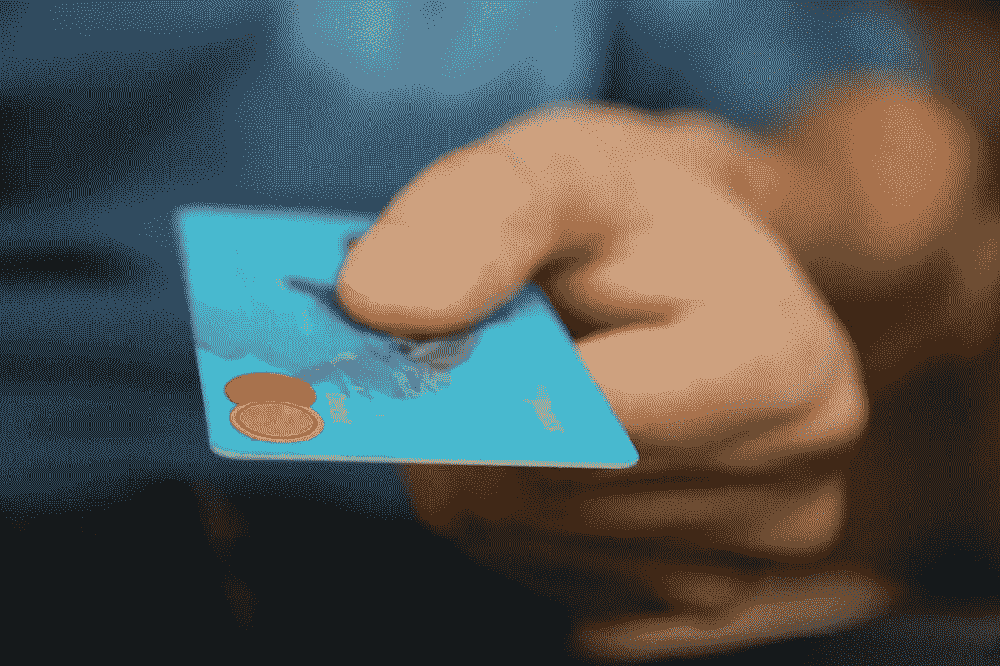

# 好债 vs 坏账。必读

> 原文：<https://medium.datadriveninvestor.com/good-debt-vs-bad-debt-must-read-d552490c317?source=collection_archive---------12----------------------->

当我 22 岁的时候，对个人理财一无所知，我通过抵押贷款买了一辆两轮摩托车。我负债累累。

起初，每月支付抵押贷款看起来很容易。虽然我全年没有遇到任何问题，但在支付抵押贷款时，我曾经对每月定期从我的银行账户中自动扣除固定金额感到难过。

至少我知道好债和坏账的区别。我不得不每月支付抵押贷款，直到明年。一个月又一个月，金额被自动扣除，最终我还清了我所借的全部金额。

我很开心。不再，任何金额将从我的银行账户中扣除。

明年，我决定改变我自己。我意识到，最好的方法就是读书。成吨的书。

> 读书就像读书经历。一个作者在一本书里总结了他的经历，他的错误。当你读一本书的时候，你会体验到一个作者所经历的不同情况，而不是真正经历它们。

我开始看书。最初很难找到我喜欢的主题。我不是一个热心的读者。

偶然看到一些个人理财相关的书籍。我意识到我非常喜欢个人理财话题。我开始看更多的个人理财书籍。

像《富爸爸穷爸爸》、《巴比伦最富有的人》、《聪明的投资者》等等。我过去常常在旅行、等人、排队或任何有空闲时间的时候看书。

当我关注个人理财话题时，我学到了许多由这类书的作者总结的经验教训。其中之一是好债和坏账的区别。

*抵押贷款购买汽车是一个错误。这是一笔坏账。*

> 借钱会让你负债。如果借的钱是用来赚更多的钱，那就是好债。否则就是坏账。

抵押购买机动车辆是一笔坏账。它不会把钱放进你的口袋。它是为了你的方便，加上税、保险、燃油费，它从你的口袋里掏出钱来。

一个**好债**是什么东西，哪个**把钱放进你的口袋**。借钱建公寓并出租，是一笔好债。抵押贷款帮助你建造公寓，把钱放进你的口袋。

所以我们可以说:

> 好债是用来购买资产的债务。其中，坏账是用来购买负债的债务。

我意识到了自己的错误，贷款买了一辆机动车，这是一笔坏账。

就抵押贷款而言，这让我改变了想法。每当我申请抵押贷款时，我都会根据申请抵押贷款的原因，问自己会欠好债还是坏账。

在申请抵押贷款之前，先问问自己。从好债和坏账的角度来考虑这个问题。

> 好债会自己还房贷。坏账会掏空你的口袋。

# **结论**:

1.*好债是用来购买资产的债务*

2.*坏账是用来购买负债的债务*

3.*资产是把钱放进你口袋的东西*

4.*负债是从你口袋里掏钱的东西*

5.*在申请抵押贷款之前，先问问自己，这是一笔好债还是一笔坏账*

6.*良好的债务将有助于自行支付抵押贷款*

7.*坏账会掏空你的口袋*

## 感谢阅读。如果你喜欢这篇文章，请随意点击那个按钮👏帮助其他人找到它。

# 然后..

 [## 通货膨胀和通货紧缩如何影响你和经济

### 为什么所有商品的价格都会随着时间的推移而上涨或下跌？为什么我们不享受我们购买的所有商品的相同价格…

medium.com](https://medium.com/@abhilashgupta8149/how-inflation-and-deflation-can-affect-you-and-economy-998215745e68) 

*原载于* [*FinCalC 博客*](http://fincalc-blog.blogspot.com/2018/10/5-financial-mistakes-to-avoid-in-your-early-20s-fincalc.html)